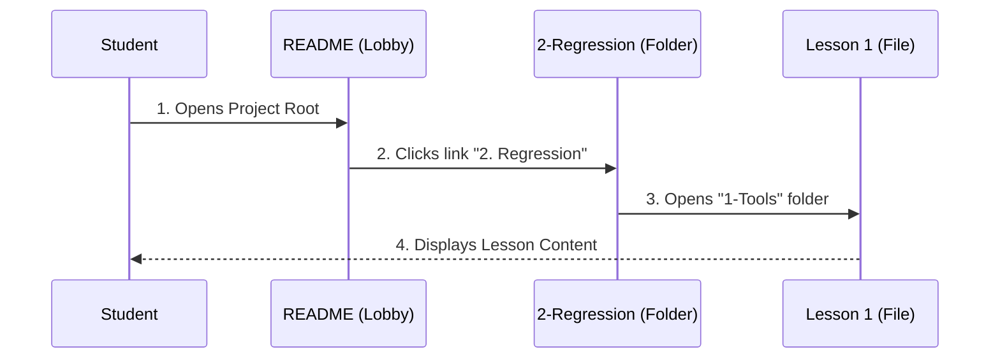

# Chapter 3: Repository Structure

In the previous chapter, [Key Technologies](02_key_technologies.md), we gathered our tools—Python, R, Visual Studio Code, and Git. Now that we have our equipment, we need to enter the workshop.

In technical terms, the "workshop" is the **Repository** (or "repo"). This chapter explains how the files in **ML-For-Beginners** are organized so you don't get lost.

## The Motivation: A Map for the Library

Imagine walking into a massive library where 10,000 books are dumped in a pile on the floor. Finding a cookbook would be impossible. Libraries solve this with **shelves** and **sections**.

A software project is the same. Without structure, it is just a chaotic pile of computer files.

### Central Use Case: "Where is the Regression Lesson?"

Let's say you are ready to learn how to predict pumpkin prices (our goal from Chapter 1). You know the topic is called "Regression."

**The Goal:** Locate the specific files needed for the Regression lesson within the thousands of files in the project.

**The Solution:** You need to understand the **Directory Tree**. This project organizes folders by **Topic** and **Time**, allowing you to drill down to exactly what you need in seconds.

## Key Concepts

The repository is organized like a university campus. There are classrooms (Lessons), administrative offices (Config files), and art galleries (Sketchnotes).

### 1. The Numbered Folders (The Classrooms)
The core curriculum is stored in folders starting with numbers, like `1-Introduction`, `2-Regression`, etc.
*   **Why Numbers?** They force the computer to sort the folders in the correct learning order.
*   **What's inside?** Each folder contains a group of related lessons.

### 2. The Support Folders
These folders hold the assets that make the lessons look good or function correctly.
*   `images`: Stores all the pictures and diagrams.
*   `sketchnotes`: Contains beautiful hand-drawn visual summaries of the lessons.
*   `quiz-app`: Contains the code for the interactive quizzes (we will build this in [Quiz Application Development](07_quiz_application_development.md)).

### 3. The Root Files
These are the files sitting at the very top level (the "Lobby").
*   `README.md`: The main entry point/homepage.
*   `CONTRIBUTING.md`: Rules for how to help fix bugs (covered in [Contribution Guidelines](09_contribution_guidelines.md)).

## How to Navigate the Structure

To "use" the repository structure, you simply click through folders. However, developers often look at the structure as a **Tree**.

Here is a simplified view of what you see when you open the project in Visual Studio Code:

```text
ML-For-Beginners/        <-- The Root
├── 1-Introduction/      <-- Week 1
├── 2-Regression/        <-- Week 2 (Pumpkin Project!)
├── 3-Classification/    <-- Week 3
├── ...
├── images/              <-- Pictures
├── quiz-app/            <-- The Quiz Engine
└── README.md            <-- Start Here
```

### Example: Finding Your Lesson Path

If you are looking for the "Regression" lesson to start coding, you would traverse the path. In Python code, this path looks like a string.

```python
import os

# Define the path to the Regression folder
repo_root = "ML-For-Beginners"
lesson_folder = "2-Regression"

# Combine them to get the full address
full_path = os.path.join(repo_root, lesson_folder)

print(f"Your lesson is located at: {full_path}")
```

*Explanation: `os.path.join` connects folder names. On Windows, it creates `ML-For-Beginners\2-Regression`. On Mac/Linux, it creates `ML-For-Beginners/2-Regression`.*

## Internal Implementation: How Navigation Works

How does the project turn these folders into a navigable course? It relies on a chain of links, starting from the Root.

### The Navigation Flow

When you want to find a specific topic, you act like a browser following links.



1.  **Student** lands on the main `README.md`.
2.  **Root** provides a Table of Contents pointing to numbered folders.
3.  **Folder** provides a list of specific lessons (e.g., Tools, Data Preparation).
4.  **Lesson** provides the actual content.

### Deep Dive: The Table of Contents

The "magic" that holds the structure together is simply Markdown links found in the root `README.md`. This file acts as the directory map.

Here is a snippet of what the `README.md` file actually looks like inside:

```markdown
<!-- Snippet from the main README.md -->

## Curriculum

| Week | Topic | Description |
|---|---|---|
| 1 | [Introduction](1-Introduction/README.md) | Intro to ML concepts |
| 2 | [Regression](2-Regression/README.md) | Predicting number values |
| 3 | [Classification](3-Classification/README.md) | Sorting into categories |
```

*Explanation: The `[Text](link)` syntax creates a clickable bridge. When you click "Regression", the file system takes you into the `2-Regression` folder and looks for its specific `README.md`.*

### The "Hidden" Configuration

There is one more folder that is crucial but often invisible: `.github`.

```text
ML-For-Beginners/
└── .github/
    └── workflows/
        └── main.yml
```

This folder contains the instructions for the "robots" we mentioned in the previous chapter. The `workflows` folder tells GitHub how to automatically check the code in all the numbered folders to ensure it isn't broken.

## Summary

In this chapter, we explored the **Repository Structure**:

*   **Numbered Folders (1-9):** Keep the curriculum in chronological order.
*   **Support Folders:** hold images, quizzes, and translations.
*   **Root Files:** Act as the map (`README.md`) and the laws (`CODE_OF_CONDUCT.md`) of the project.

Now that we know how to find a topic folder (like `2-Regression`), we need to open it up and see what is inside. A lesson isn't just one file; it's a specific collection of items designed to help you learn.

[Next Chapter: Lesson Structure](04_lesson_structure.md)

---

Generated by [Code IQ](https://github.com/adityasoni99/Code-IQ)