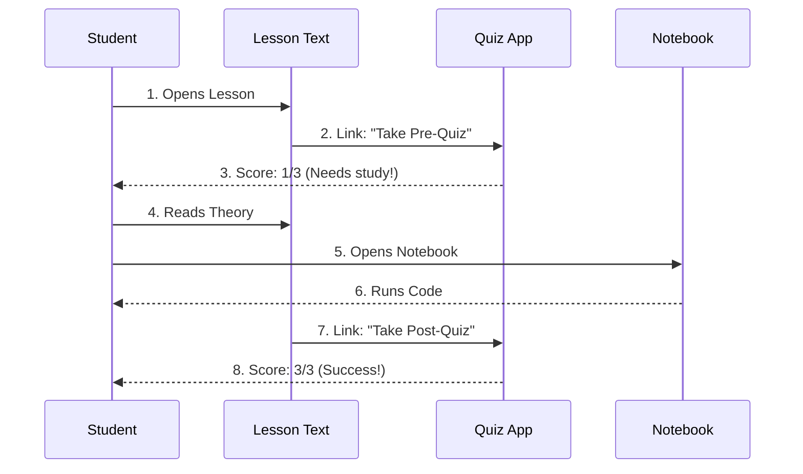

# Chapter 4: Lesson Structure

In the previous chapter, [Repository Structure](03_repository_structure.md), we learned how to navigate the "Library" of folders to find the topic we want.

Now, we are going to pull a book off the shelf and open it. But **ML-For-Beginners** lessons aren't just pages of text. They are interactive experiences. This chapter explains the **Lesson Structure**—the standard recipe used for every single topic in the curriculum.

## The Motivation: avoiding "Wall of Text" Syndrome

Learning a hard subject like Machine Learning by reading a giant PDF is difficult. You might fall asleep, or worse, think you understand it but fail when you try to write code.

To solve this, we use a specific **Learning Pattern**. We break every lesson into small, interactive pieces to keep your brain engaged.

### Central Use Case: "The Pumpkin Lesson Flow"

Let's go back to our goal: Predicting pumpkin prices. When you open the "Regression" folder, you don't just find one file. You find a system designed to guide you.

**The Goal:** Move from "I don't know what Regression is" to "I can write code to predict prices."

**The Solution:** You follow a path: **Test $\rightarrow$ Read $\rightarrow$ Code $\rightarrow$ Test**.

## Key Concepts

Every lesson in the curriculum is built with five distinct components. Think of it like a 5-course meal.

### 1. The Appetizer: Pre-Quiz
Before you start reading, we ask you 3 simple questions.
*   **Why?** To spark your curiosity and show you what gaps you have in your knowledge.
*   **Format:** A link to a web-based quiz.

### 2. The Entrée: The Written Lesson (`README.md`)
This is the main text. It explains the theory without getting bogged down in complex math.
*   **Why?** You need to understand the *concepts* (like "Line of Best Fit") before you code them.

### 3. The Side Dish: The Notebook (`.ipynb`)
This is where the action happens. You switch from reading to running code.
*   **Why?** Theory is useless without practice. You will execute Python or R code to process data.

### 4. The Exercise: The Assignment
At the bottom of the lesson, there is a challenge. It usually asks you to take what you learned and apply it to a slightly different dataset.
*   **Why?** To prove to yourself that you didn't just copy-paste the answers.

### 5. The Dessert: Post-Quiz
Finally, you take another 3-question quiz.
*   **Why?** To validate that you actually learned the material. It feels good to get 100%!

## How to Use This Structure

When you start a lesson, you should follow the flow linearly. Do not skip the code!

### Example: The Student's Loop

Imagine you are a computer program processing a lesson. Your logic would look like this:

```python
# The workflow of a student taking a lesson
def complete_lesson(lesson_name):
    # 1. Warm up
    take_quiz("pre-quiz")
    
    # 2. Learn and Practice
    read_text(lesson_name)
    run_code_notebook()
    
    # 3. Verify
    take_quiz("post-quiz")
```

*Explanation: This pseudo-code shows the linear progression. You start with a quiz, consume the content (text and code), and end with a quiz.*

## Internal Implementation: How It Works

How do we connect a static text file to an interactive quiz and a code notebook? We use **Hyperlinks** and **Folder Conventions**.

### The Interaction Flow

The lesson isn't one big app; it's a collection of files linked together.



1.  **Student** starts in the `README.md`.
2.  **Student** clicks a link to jump to the **Quiz App** (running in the browser).
3.  **Student** comes back to read.
4.  **Student** opens the `.ipynb` file to run the code.
5.  **Student** clicks the final link to validate their knowledge.

### Deep Dive: Inside the Markdown File

If you look at the raw source code of a lesson's `README.md`, you will see how these components are stitched together.

**The Quiz Link:**
At the top of every lesson, there is a special badge or link.

```markdown
<!-- Top of a lesson file -->
# Introduction to Regression

[](https://quiz-app/quizzes/regression)

In this lesson, you will learn how to...
```

*Explanation: This is standard Markdown. It wraps an image in a link. When clicked, it takes you to the quiz website.*

**The Assignment Section:**
At the bottom, there is a standard header for the homework.

```markdown
<!-- Bottom of a lesson file -->
## 🚀 Challenge

Try to use the 'New-York-Data.csv' file instead of the Pumpkin data.
Can you predict prices there?

## [Post-Quiz](https://quiz-app/quizzes/regression)
```

*Explanation: The structure is consistent. Challenge first, then the final link to the Post-Quiz.*

### The Solutions Folder

You might be wondering: "What if I get stuck on the Challenge?"

Inside every lesson folder, there is often a hidden sub-folder called `solution`.

```text
2-Regression/
├── 1-Tools/
│   ├── README.md       <-- The Lesson
│   ├── notebook.ipynb  <-- The Code
│   └── solution/       <-- The Answers
│       └── solution.ipynb
```

This ensures that while we challenge you, we never leave you completely stuck.

## Summary

In this chapter, we unpacked the **Lesson Structure**:

*   **Pre-Quiz:** The warm-up.
*   **README & Notebook:** The learning and coding.
*   **Assignment & Post-Quiz:** The practice and validation.

We have the map (Repository Structure) and the guidebook (Lesson Structure). Now, we need to set up the actual engine that runs the code. It is time to install Python.

[Next Chapter: Python Setup](05_python_setup.md)

---

Generated by [Code IQ](https://github.com/adityasoni99/Code-IQ)