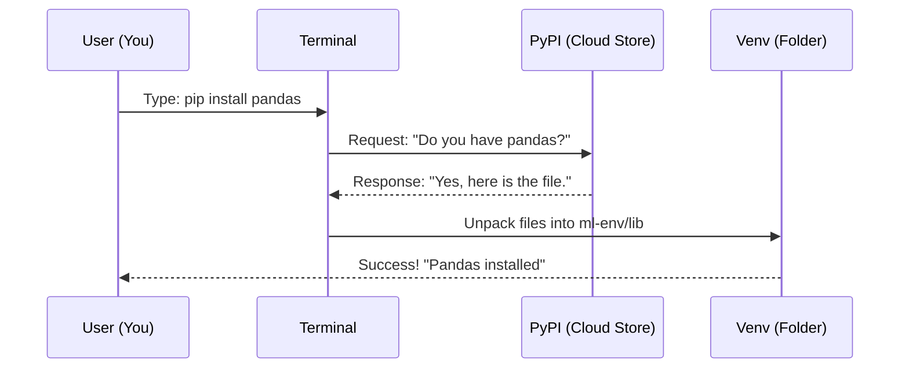

# Chapter 5: Python Setup

In the previous chapter, [Lesson Structure](04_lesson_structure.md), we opened the "Cookbook" and looked at how a lesson is organized. We saw that the core of the learning experience is the **Jupyter Notebook**.

However, a cookbook is useless without a kitchen. If you try to open a Notebook file (`.ipynb`) right now without installing anything, your computer won't know what to do with it.

This chapter guides you through setting up your "Kitchen"—installing **Python** and the necessary tools to run the code.

## The Motivation: Building the Engine

Your computer understands basic commands (like "open file" or "play music"), but it does not understand Data Science out of the box. We need to install a "translator" that turns human-readable code into instructions the processor can understand.

### Central Use Case: "Running the Pumpkin Prediction"

Imagine you have navigated to the Regression lesson (from Chapter 3). You see a file called `notebook.ipynb`.

**The Goal:** You want to double-click this file, write `print("Hello World")`, and see the result on your screen.

**The Solution:** To make this happen, we need to install three layers of software:
1.  **Python:** The language itself.
2.  **Jupyter:** The interface (the notebook viewer).
3.  **Libraries:** The specialized tools (like Pandas) for the specific lesson.

## Key Concepts

Setting up a coding environment can be scary for beginners. Let's simplify the concepts using our kitchen analogy.

### 1. The Language: Python 3
Python is the electricity and gas. It powers everything. Without Python installed, nothing else in this course works. We specifically use **Python 3**, which is the modern standard.

### 2. The Environment: Virtual Environment (`venv`)
Imagine you are cooking a spicy curry in one pot and a delicate dessert in another. You wouldn't want the curry spices to spill into the dessert.

In coding, we use **Virtual Environments**. These are isolated bubbles. We create a specific bubble just for **ML-For-Beginners** so the tools we install here don't mess up other projects on your computer.

### 3. The Package Manager: `pip`
Python comes with a tool called `pip`. Think of `pip` as a personal shopper. You give it a shopping list, and it goes to the internet, finds the tools, and installs them for you.

## How to Set Up Your Environment

To solve our use case (running the notebook), follow these steps.

### Step 1: Install Python
Go to [python.org](https://www.python.org/downloads/) and download the latest version of Python 3.
*   **Important:** When installing on Windows, check the box that says **"Add Python to PATH"**. This ensures your terminal can find Python.

### Step 2: Create a Virtual Environment
Open your command line (Terminal on Mac/Linux, Command Prompt or PowerShell on Windows). Navigate to the folder where you downloaded this project.

```bash
# 1. Go to the project folder
cd ML-For-Beginners

# 2. Create the environment (we'll call it 'ml-env')
python -m venv ml-env
```

*Explanation: `python -m venv` tells Python to make a new virtual environment. We named it `ml-env`. You will see a new folder appear with that name.*

### Step 3: Activate the Environment
Now we need to step *inside* the bubble.

```bash
# On Windows:
ml-env\Scripts\activate

# On Mac / Linux:
source ml-env/bin/activate
```

*Explanation: After running this, your terminal prompt should change to show `(ml-env)`. This means you are now working inside the safe bubble.*

### Step 4: Install the Ingredients
Now we use the "Shopper" (`pip`) to buy the tools listed in [Key Technologies](02_key_technologies.md).

```bash
# Install everything listed in requirements.txt
pip install -r requirements.txt
```

*Explanation: The `-r` flag tells pip to read a file. It looks at `requirements.txt`, sees `pandas`, `scikit-learn`, and `jupyter`, and downloads them all automatically.*

## Internal Implementation: How It Works

What happens when you type that `pip install` command? It triggers a conversation between your computer and the cloud.

### The Installation Flow

Here is the sequence of events that turns a text file into working software.



1.  **User** issues a command.
2.  **Terminal** uses the internet to contact the **Python Package Index (PyPI)**.
3.  **PyPI** sends the code files.
4.  **Terminal** places them inside your specific **Virtual Environment** folder.

### Deep Dive: The `requirements.txt` File

The magic behind the setup is the `requirements.txt` file located in the root of the [Repository Structure](03_repository_structure.md).

We discussed this file in Chapter 2, but let's look at how it relates to the setup process specifically.

```text
# A snippet of requirements.txt
jupyter>=1.0.0
pandas
numpy
scikit-learn
seaborn
```

*Explanation: This is a plain text file. When you run `pip install -r requirements.txt`, pip reads the first line (`jupyter`). It checks if you have it. If not, it downloads it. Then it moves to `pandas`, and so on.*

### Deep Dive: Launching the Lesson

Once everything is installed, the final piece of the puzzle is opening the lesson.

```bash
# Run this command in your terminal
jupyter notebook
```

*Explanation: This command starts a local web server. Your default web browser will pop up showing the file directory. You can now click on `2-Regression` and then `notebook.ipynb`.*

## Verification

To verify that your setup is correct:
1.  Open a notebook in the browser.
2.  Click on a code cell.
3.  Press `Shift + Enter`.

If a number appears next to the cell (e.g., `[1]`) and the code runs, congratulations! Your kitchen is fully operational.

## Summary

In this chapter, we built our Python environment:
*   We installed **Python 3** (the engine).
*   We created a **Virtual Environment** (the safe bubble).
*   We used **pip** to install libraries like Pandas and Scikit-learn (the tools).
*   We launched **Jupyter Notebook** to start coding.

However, not everyone uses Python. Some Data Scientists prefer a language built specifically for statistics. If that sounds like you, or if you just want to see the alternative, read on.

[Next Chapter: R Setup](06_r_setup.md)

---

Generated by [Code IQ](https://github.com/adityasoni99/Code-IQ)