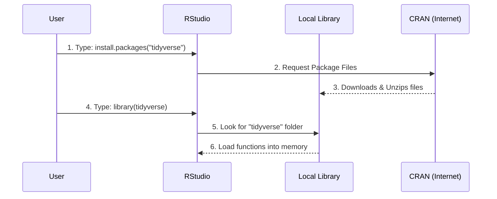

# Chapter 6: R Setup

In the previous chapter, [Python Setup](05_python_setup.md), we set up a "kitchen" for cooking data using Python.

However, not every chef uses the same knives. In the world of Data Science, there is another powerful language designed specifically for statistics and data visualization: **R**.

If you have chosen the **R track** for this curriculum, this chapter is your starting point. It will guide you through installing the necessary tools to run the code in the lessons.

## The Motivation: A Specialized Tool for Data

While Python is a "general-purpose" language (used for websites, games, and data), **R** was born in the world of statistics. It is like a specialized surgical tool designed expressly for analyzing data.

### Central Use Case: "The Pumpkin Plot"

Let's revisit our goal: predicting pumpkin prices.
1.  You have a file `pumpkins.csv`.
2.  You want to load it and draw a graph of price vs. size.

**The Goal:** Configure your computer so you can write R code to visualize this data effortlessly.

**The Solution:** We need to install the **R Language** (the engine), **RStudio** (the dashboard), and the **Tidyverse** (the accessories).

## Key Concepts

Setting up R is slightly different from Python. Here are the three main components you need to understand.

### 1. The Engine: R
This is the computer language itself. It performs the calculations.
*   **Analogy:** The engine of a car. It does the work, but it's hard to use directly.

### 2. The Dashboard: RStudio
This is the interface you will actually look at. It provides windows for your code, your files, your plots, and your data history.
*   **Analogy:** The dashboard and steering wheel. You don't drive the engine; you drive the car via the dashboard.

### 3. The Toolbelt: Tidyverse & Tidymodels
R comes with basic tools, but they can be clunky. We use a collection of modern packages called the **Tidyverse** (for data handling) and **Tidymodels** (for Machine Learning).
*   **Analogy:** Power steering and GPS. They make the drive much smoother.

## How to Set Up Your Environment

To solve our use case, follow these three steps.

### Step 1: Install R (The Engine)
Go to the **CRAN** (Comprehensive R Archive Network) website: [cloud.r-project.org](https://cloud.r-project.org/).
*   Download and install the version for your operating system (Windows, Mac, or Linux).

### Step 2: Install RStudio (The Dashboard)
Go to the **Posit** website: [posit.co/download/rstudio-desktop/](https://posit.co/download/rstudio-desktop/).
*   Download "RStudio Desktop" (the free version).

### Step 3: Install the Packages
Open RStudio. You will see a "Console" window. We need to install the tools we will use in almost every lesson.

Copy and paste this command into the Console and press Enter:

```r
# Install the core collections of tools
install.packages("tidyverse")
install.packages("tidymodels")

# Install specific tools for our lessons
install.packages(c("here", "skimr", "janitor"))
```

*Explanation: `install.packages()` tells R to go to the internet (CRAN), find these tools, and download them to your computer. You only need to do this **once**.*

## How to Use R in This Course

In [Lesson Structure](04_lesson_structure.md), we talked about Notebooks. In R, we use a special file format called **R Markdown (`.Rmd`)**.

### The R Markdown File
An R Markdown file mixes text and code chunks. It allows you to write a report and run code in the same document.

To use the tools you just installed, you must "load" them at the start of every file.

```r
# This goes at the top of your code
library(tidyverse)
library(tidymodels)

# Now we can read data!
print("Libraries loaded successfully.")
```

*Explanation: `library()` is like taking a tool out of the box. You have to do this every time you start a new session.*

### Example: Reading Data
Here is how the "Pumpkin" code looks in R using the Tidyverse.

```r
# Read the pumpkin data
pumpkins <- read_csv("data/US-pumpkins.csv")

# Show the first few rows
glimpse(pumpkins)
```

*Explanation: `read_csv` is a Tidyverse function that is faster and smarter than the default R loader. `glimpse` gives you a neat summary of the data structure.*

## Internal Implementation: How R Finds Tools

When you type `library(tidyverse)`, what happens? How does R know where to look?

### The Package Loading Flow

R relies on a network of servers called **CRAN**.



1.  **User** requests a package installation.
2.  **RStudio** contacts CRAN (the central warehouse of R code).
3.  **Files** are stored in your computer's "Local Library."
4.  **User** runs `library()`.
5.  **R** checks the local folder and activates the code.

### Deep Dive: `sessionInfo()`

If you ever run into trouble where code works on one computer but not another, R has a built-in diagnostic tool.

Run this command in your console:

```r
# Check what is currently running
sessionInfo()
```

It will output text looking like this (simplified):

```text
R version 4.1.0 (2021-05-18)
Platform: x86_64-apple-darwin17.0 (64-bit)
Running under: macOS Big Sur

attached base packages:
[1] stats     graphics  grDevices utils     datasets 

other attached packages:
[1] tidymodels_0.1.3 tidyverse_1.3.1
```

*Explanation: This tells you exactly which version of R and which versions of the packages are currently active. This is crucial for troubleshooting bugs reported in [Contribution Guidelines](09_contribution_guidelines.md).*

## R vs. Python in this Curriculum

You might be wondering, "Do I need to do both?"

**No.** The [Repository Structure](03_repository_structure.md) is designed so that lessons often have parallel tracks.
*   If a folder contains a `.ipynb` file, it is for Python.
*   If a folder contains a `.Rmd` file, it is for R.

You simply open the file that matches the language you installed.

## Summary

In this chapter, we set up the **R Environment**:
*   We installed **R** (the engine).
*   We installed **RStudio** (the dashboard).
*   We installed **Tidyverse & Tidymodels** (the essential tools).
*   We learned how to load these tools using `library()`.

Now that your computer is ready to speak the language of data (whether Python or R), we are almost ready to start the lessons. But first, let's look at how we built the interactive tool that tests your knowledge.

[Next Chapter: Quiz Application Development](07_quiz_application_development.md)

---

Generated by [Code IQ](https://github.com/adityasoni99/Code-IQ)