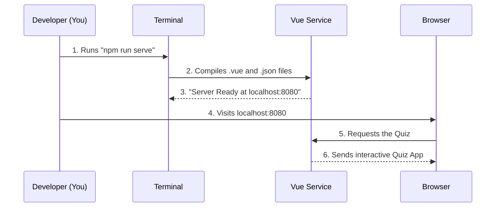

# Chapter 7: Quiz Application Development

In the previous chapters, [Python Setup](05_python_setup.md) and [R Setup](06_r_setup.md), we set up the environment to run the data science code.

However, **ML-For-Beginners** is more than just notebooks. As we learned in [Lesson Structure](04_lesson_structure.md), every lesson includes an interactive **Pre-Quiz** and **Post-Quiz**. These quizzes are not static text files; they are a small software application living inside the repository.

This chapter guides you through the "Engine Room" of the quiz application. If you want to fix a typo in a question or add a translation, you need to know how to turn this engine on.

## The Motivation: A Sandbox for Questions

Imagine you spot a mistake in a quiz question. You change the text file, but how do you know if you broke the code? You can't just "read" the code to see if it works; you have to run it.

We need a way to launch the website on your own computer so you can click the buttons and see your changes instantly.

### Central Use Case: "The Typo Fix"

**The Goal:** You found a spelling error in a quiz question. You corrected the file, and now you want to verify that the quiz still loads correctly in a web browser.

**The Solution:** We will use a tool called **Node.js** to simulate a web server on your laptop. This allows you to "preview" the application before sharing your changes with the world.

## Key Concepts

The quiz app is built using web technologies. It differs from the Python/R code we use for data science.

### 1. Node.js (The Kitchen)
Just as Python is the engine for data science, **Node.js** is the engine for modern websites. It allows us to run JavaScript outside of a browser.
*   **Analogy:** If the quiz app is a meal, Node.js is the stove.

### 2. npm (The Shopper)
**npm** (Node Package Manager) is the cousin of `pip` (which we met in [Python Setup](05_python_setup.md)). It reads a shopping list and downloads the libraries needed to make the website work.

### 3. Vue.js (The Recipe)
The quiz app is built using **Vue.js**. This is a framework that makes web pages interactive. It handles the logic: "If the user clicks 'Submit', check the answer and show the score."

### 4. Linting (The Spellchecker)
Code needs to be tidy. **Linting** is an automated process that scans your code for stylistic errors (like missing semicolons or messy indentation) and warns you about them.

## How to Develop the Quiz App

To solve our use case (previewing a change), we need to go through three phases: **Install**, **Serve**, and **Build**.

### Phase 1: Preparation
First, you need to navigate to the correct folder. As seen in [Repository Structure](03_repository_structure.md), the app lives in a specific directory.

```bash
# Open your terminal and go to the folder
cd quiz-app
```

*Explanation: All commands in this chapter must be run from inside this folder, not the root of the project.*

### Phase 2: Install Dependencies (`npm install`)
Just like we did for Python, we need to buy the ingredients.

```bash
# Ask npm to read the package.json file and install tools
npm install
```

*Explanation: This might take a minute. It creates a massive folder called `node_modules` where it stores thousands of small JavaScript tools needed to build the app.*

### Phase 3: The Development Server (`npm run serve`)
Now, let's start the engine. This command spins up a temporary web server on your computer.

```bash
# Start the local development server
npm run serve
```

**Output:**
```text
  App running at:
  - Local:   http://localhost:8080/ 
```

*Explanation: Your terminal will "hang" (stop accepting commands). This is good! It means the server is running. Open your web browser and go to `http://localhost:8080` to see the quiz app alive.*

## Internal Implementation: How It Works

When you run `npm run serve`, a chain reaction occurs to turn code files into a visual website.

### The Development Flow



1.  **Developer** starts the process.
2.  **Vue Service** reads the quiz data (stored in JSON files).
3.  **Vue Service** creates a live connection. If you edit a file, it instantly updates the browser (Hot Reload).
4.  **Browser** displays the app locally.

### Deep Dive: The Data Source
The quizzes aren't hard-coded into the application logic. They live in data files. This makes it easy for beginners to add questions without being programmers.

Here is what a question looks like in the code:

```json
// quiz-app/assets/translations/en.json snippet
{
  "title": "Introduction to Regression",
  "questions": [
    {
      "questionText": "What allows us to predict values?",
      "answerOptions": [
        { "answerText": "Regression", "isCorrect": true },
        { "answerText": "Classification", "isCorrect": false }
      ]
    }
  ]
}
```

*Explanation: This is JSON (JavaScript Object Notation). It is just structured text. If you fix a typo here while `npm run serve` is running, the website will refresh automatically.*

### Deep Dive: Linting (`npm run lint`)
Before you submit your changes to the project, you must ensure your code is clean.

```bash
# Check for style errors and fix them automatically
npm run lint
```

*Explanation: If you accidentally used double quotes where single quotes were required, this tool will fix it for you. It ensures all developers speak the same "dialect" of code.*

### Deep Dive: Building for Production (`npm run build`)
The development server is for *you*. When we want to publish the website for the *world*, we need to pack it up efficiently.

```bash
# Compress the app into small files
npm run build
```

*Explanation: This creates a `dist` (distribution) folder. This folder contains the optimized, minified version of the app that loads fast on the internet. You usually don't need to run this unless you are deploying the site.*

## Summary

In this chapter, we learned how to control the **Quiz Application**:

*   **`npm install`**: To get the tools.
*   **`npm run serve`**: To verify changes locally (our "Typo Fix" use case).
*   **`npm run lint`**: To clean up the code.
*   **`npm run build`**: To prepare the app for the public.

We have now covered the entire technical ecosystem: the Repository, the Python/R environment, and the Web App environment.

Now, let's look at how we actually work with these tools day-to-day. How do we make a change and send it to the project maintainers?

[Next Chapter: Development Workflow](08_development_workflow.md)

---

Generated by [Code IQ](https://github.com/adityasoni99/Code-IQ)