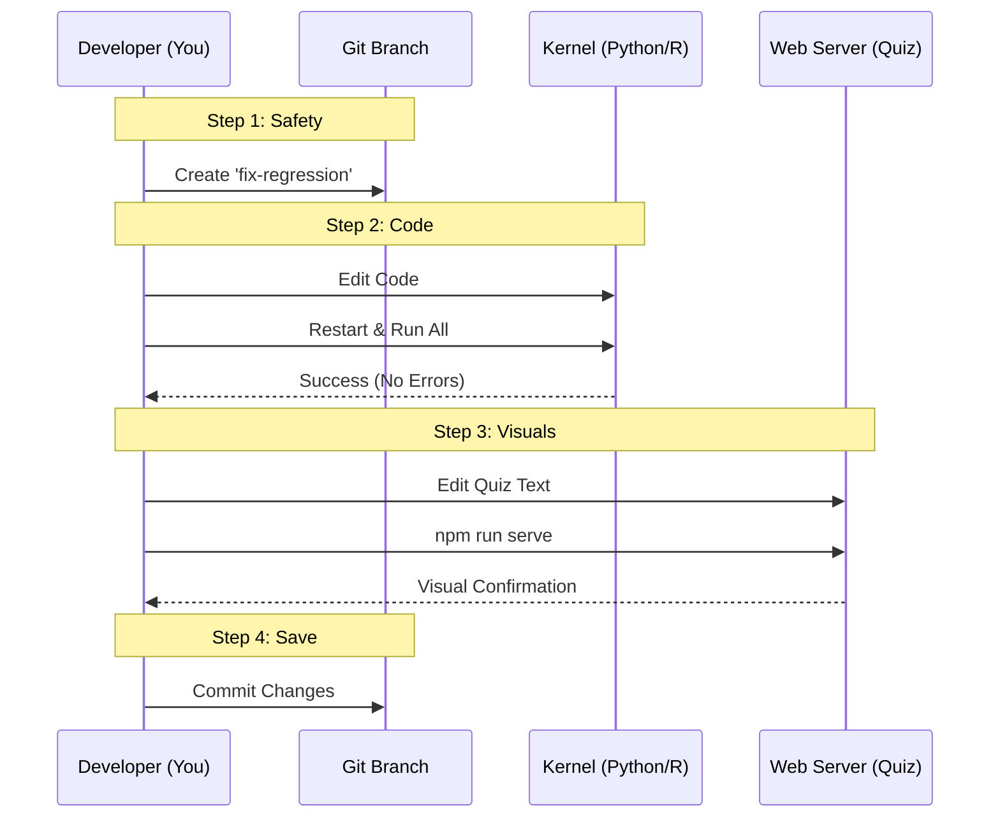

# Chapter 8: Development Workflow

In the previous chapter, [Quiz Application Development](07_quiz_application_development.md), we explored the engine behind the interactive quizzes. Before that, in [Python Setup](05_python_setup.md) and [R Setup](06_r_setup.md), we built our coding environments.

Now that we have all our tools, we need a recipe for how to use them together. This chapter covers the **Development Workflow**—the daily routine of opening the project, making a change, testing it, and saving it.

## The Motivation: Order in the Kitchen

Imagine a busy restaurant kitchen. If every chef threw ingredients into the soup pot whenever they felt like it, the meal would be a disaster. Instead, chefs follow a strict process: **Prep $\rightarrow$ Cook $\rightarrow$ Taste $\rightarrow$ Serve**.

Software development is the same. You cannot just change a file and hope for the best. You need a workflow to ensure your changes are safe and correct.

### Central Use Case: " The Weekend Fix"

Let's say you are studying the Regression lesson and notice two problems:
1.  The Python code has a bug that crashes the notebook.
2.  The Quiz has a typo in Question 3.

**The Goal:** You want to fix both errors on your computer and verify they work before sharing them with the world.

**The Solution:** We follow a cycle called the **Edit-Test Loop**. This chapter guides you through creating a safe workspace, making changes, and validating them locally.

## Key Concepts

To keep your work organized, we rely on three main concepts.

### 1. The Branch (The Safe Workspace)
Imagine you are writing a draft of an important email. You don't type it directly into the "Send" box. You write it in a separate document first.

In Git (our version control system), this "separate document" is called a **Branch**. It is a copy of the project where you can make mistakes without breaking the real website.

### 2. The Clean State (Notebook Hygiene)
Jupyter Notebooks remember things. If you define a variable `x = 5` and then delete that cell, the computer still remembers `x` is 5. This can lead to bugs that only happen on *other people's* computers. We must learn to "Restart and Run All" to ensure the code truly works.

### 3. The Local Server (The Mirror)
We don't edit the live website. We run a "fake" website on our own laptop (Localhost) to see how our changes look.

## How to execute the Workflow

Let's walk through the steps to solve our "Weekend Fix" use case.

### Step 1: Create a Safe Branch
First, tell Git you are starting a new task. Open your terminal in the `ML-For-Beginners` folder.

```bash
# 1. Update your project to the latest version
git checkout main
git pull

# 2. Create a new branch named 'fix-regression'
git checkout -b fix-regression
```

*Explanation: `checkout -b` means "Create a new branch and switch to it." You are now in a safe sandbox named `fix-regression`.*

### Step 2: Fix the Notebook
Open the lesson file (e.g., `2-Regression/1-Tools/notebook.ipynb`) in Visual Studio Code or Jupyter.

1.  Make your code fix.
2.  **Crucial Step:** You must verify the whole notebook works from top to bottom.

In the Jupyter interface menu:
*   Click **Kernel** $\rightarrow$ **Restart & Run All**.

If the notebook runs all the way to the end without errors, your fix is good!

### Step 3: Fix the Quiz
Now, let's fix that typo in the quiz. As we learned in [Quiz Application Development](07_quiz_application_development.md), we need to run the quiz app to see the change.

```bash
# 1. Go to the quiz folder
cd quiz-app

# 2. Start the local preview
npm run serve
```

*Explanation: This starts the web server. You can now open your browser to `http://localhost:8080`, navigate to the quiz, and verify that your typo is gone.*

### Step 4: Save Your Work
Once you have "tasted the soup" (tested the notebook and quiz), you are ready to save.

```bash
# 1. Add the changed files to the "staging area"
git add .

# 2. Save them with a message
git commit -m "Fixed regression bug and quiz typo"
```

*Explanation: `git commit` saves a snapshot of your changes. The message helps others understand what you did.*

## Internal Implementation: The Cycle

What actually happens when you work through this flow? It is a conversation between your text editor, the runtime engines, and the version control system.

### The Edit-Test Diagram



1.  **Safety:** You isolate your environment using a Branch.
2.  **Code:** You interact with the Python/R Kernel to ensure the logic is sound.
3.  **Visuals:** You interact with the Web Server to ensure the UI looks right.
4.  **Save:** You save the state of your branch.

## Deep Dive: Why "Restart and Run All"?

This is the most common mistake for beginners. Let's look at why it happens.

### The "Hidden Variable" Bug

Imagine you write this code in a cell:

```python
# Cell 1
secret_number = 42
print(secret_number)
```

Then you delete Cell 1 and write Cell 2:

```python
# Cell 2
# I deleted Cell 1, but Python still remembers secret_number!
print(secret_number + 10)
```

**The Trap:** On *your* computer, this works because you ran Cell 1 five minutes ago.
**The Crash:** On *my* computer, I never ran Cell 1. When I run Cell 2, it crashes because `secret_number` doesn't exist.

**The Fix:** "Restart & Run All" clears the computer's memory and runs everything from scratch. This guarantees the code works for everyone, not just you.

## Deep Dive: Working with R Markdown

If you are following the R track (setup in [R Setup](06_r_setup.md)), the workflow is slightly different.

R Markdown files (`.Rmd`) are text files that *compile* into HTML. You cannot just save the file; you must "Knit" it.

### The "Knit" Workflow
In RStudio:
1.  Make your changes to the code chunks.
2.  Click the **Knit** button (icon looks like a ball of yarn).

```r
# Internal logic of the Knit button
rmarkdown::render("notebook.Rmd")
```

*Explanation: This command runs every single line of code in a clean environment and produces a result file. If your code has a bug, the Knit will fail immediately, alerting you to the problem.*

## Summary

In this chapter, we established our **Development Workflow**:

*   **Branching:** Always work in a safe copy (`git checkout -b`).
*   **Testing Notebooks:** Always use "Restart and Run All" to avoid hidden bugs.
*   **Testing Quizzes:** Always use `npm run serve` to visually check changes.
*   **Committing:** Save your work frequently.

Now that you have fixed the bug and saved your work locally, how do you send it to the main project so everyone else can benefit? You need to follow the rules of the community.

[Next Chapter: Contribution Guidelines](09_contribution_guidelines.md)

---

Generated by [Code IQ](https://github.com/adityasoni99/Code-IQ)