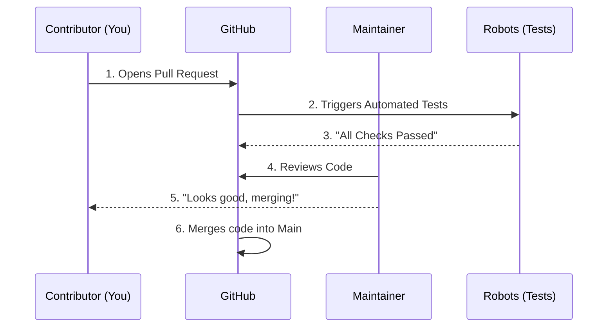

# Chapter 9: Contribution Guidelines

In the previous chapter, [Development Workflow](08_development_workflow.md), we learned how to fix a bug or add a feature on your own computer. We created a "Branch" (a safe workspace), made changes, and saved them.

But right now, those changes only exist on your laptop. If your computer breaks, the work is lost. More importantly, no one else in the world can see or use your improvements.

This chapter explains how to send your work back to the main project so everyone can benefit. This process is called **Contributing**.

## The Motivation: The "Suggestion Box"

Imagine a library with a master encyclopedia. You find a spelling error in Volume 3. You cannot just take a pen and write in the library's book. That would be vandalism!

Instead, you write a note with the correction and hand it to the librarian. The librarian checks your note. If it is correct, *they* make the change in the official book.

### Central Use Case: "Submitting the Typo Fix"

**The Goal:** You fixed a spelling error in the Regression lesson on your laptop. You want the official Microsoft `ML-For-Beginners` repository to include your fix.

**The Solution:** You cannot write to the Microsoft repository directly. You must:
1.  **Fork:** Create your own copy of the library.
2.  **Push:** Upload your changes to your copy.
3.  **Pull Request (PR):** Ask the librarians (maintainers) to copy your work into the main project.

## Key Concepts

Open Source contribution relies on a specific social contract and technical workflow.

### 1. The Fork (The Personal Copy)
A **Fork** is a complete copy of the repository that lives in *your* GitHub account. You have full permission to write, delete, or change anything in your fork without hurting the original project.

### 2. The Pull Request (The Proposal)
A **Pull Request (PR)** is a formal request. You are saying: "I have pulled the code, changed it, and now I want you to **pull** it back."
*   **Analogy:** Handing your homework to the teacher for grading.

### 3. The Maintainers (The Librarians)
These are the people with the keys to the main repository. They review your PR to ensure the code is safe, correct, and follows the rules.

### 4. Code of Conduct (The House Rules)
Because we are working with strangers from all over the world, we need rules for behavior. We follow the **Microsoft Open Source Code of Conduct** to ensure everyone is treated with respect.

## How to Contribute

To solve our use case (sending the typo fix), we follow this standard workflow.

### Step 1: Fork the Repository
You only do this once.
1.  Go to the official `ML-For-Beginners` page on GitHub.
2.  Look for the button that says **Fork** in the top right corner.
3.  Click it. You now have `YourName/ML-For-Beginners`.

### Step 2: Push Your Changes
In [Development Workflow](08_development_workflow.md), we saved changes to our local computer using `git commit`. Now we need to upload them to *your* Fork on GitHub.

```bash
# Push the 'fix-regression' branch to 'origin' (your fork)
git push origin fix-regression
```

*Explanation: `origin` is the nickname for your online Fork. This command uploads your saved work to the internet.*

### Step 3: Open a Pull Request
1.  Go to your Fork on GitHub.com.
2.  You will see a yellow banner: "fix-regression had recent pushes."
3.  Click the green button: **Compare & pull request**.

### Step 4: Fill out the Template
A text box will appear. You need to explain *what* you did.

```markdown
<!-- Example PR Description -->
### Description
I found a typo in the Regression lesson. 
It said "Regresion" instead of "Regression".

### Type of change
- [x] Bug fix
- [ ] New feature
```

*Explanation: Be clear and concise. The maintainers review many PRs a day; help them understand yours quickly.*

## Internal Implementation: The Review Cycle

What happens after you click "Create Pull Request"? Your code enters a review pipeline.

### The Contribution Flow



1.  **Contributor** submits the form.
2.  **Robots** (GitHub Actions) wake up. They run the installation and tests we set up in [Python Setup](05_python_setup.md).
3.  **Maintainer** sees the green light from the robots.
4.  **Maintainer** reads your code.
5.  **Merge:** The maintainer clicks a button, and your code becomes part of the official history.

### Deep Dive: The PR Template

When you opened the Pull Request, text appeared magically in the description box. This comes from a hidden file in the repository structure.

```markdown
<!-- File: .github/PULL_REQUEST_TEMPLATE.md -->

### Description
Please include a summary of the change...

### Type of change
Please delete options that are not relevant.
- [ ] Bug fix
- [ ] New feature
```

*Explanation: GitHub looks for this file automatically. It ensures every contributor answers the same questions (What did you do? Did you test it?), making the maintainers' lives easier.*

### Deep Dive: The Code of Conduct

Before your PR is accepted, you must adhere to the community standards. This is governed by the `CODE_OF_CONDUCT.md` file in the root of the project.

```markdown
<!-- File: CODE_OF_CONDUCT.md -->

# Microsoft Open Source Code of Conduct

This project has adopted the [Microsoft Open Source Code of Conduct]...
Instances of abusive, harassing, or otherwise unacceptable behavior
may be reported.
```

*Explanation: This file is the "Law" of the project. It isn't computer code, but it is executed by humans. If a contributor is rude in the comments of a PR, the maintainers have the right to close the PR and ban the user based on this document.*

## Common Mistakes to Avoid

1.  **Working on `main`:** Always create a branch (see [Development Workflow](08_development_workflow.md)). Never push directly to your main branch.
2.  **Huge PRs:** Do not try to fix 50 different things in one request. Submit 50 small requests instead. It is easier to review.
3.  **Ignoring the Robots:** If the automated tests fail (red X), the maintainers will not look at your PR. Fix the errors first!

## Summary

In this chapter, we learned how to join the community:

*   **Forking:** Creating your personal copy of the project.
*   **Pull Request:** Submitting your changes for review.
*   **Templates:** Using the built-in forms to describe your work.
*   **Code of Conduct:** Treating others with respect during the process.

You have submitted your code, but the maintainer might reject it if it looks "messy." Even if the code works, it needs to be readable. In the next chapter, we will learn the specific style rules for this project.

[Next Chapter: Code Style Guidelines](10_code_style_guidelines.md)

---

Generated by [Code IQ](https://github.com/adityasoni99/Code-IQ)