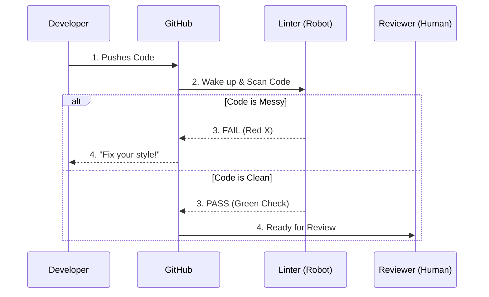

# Chapter 10: Code Style Guidelines

In the previous chapter, [Contribution Guidelines](09_contribution_guidelines.md), we learned how to submit a "Pull Request" to share your work with the community.

However, just because your code *works* doesn't mean it is ready to be shared. Imagine writing a beautiful poem but ignoring all punctuation and capitalization. It would be very hard to read!

In programming, we have "Grammar Rules" called **Code Style**. This chapter explains the specific style rules for **ML-For-Beginners** and how to automatically check if your code follows them.

## The Motivation: Reading is Harder than Writing

In an open-source project, code is read by humans 10 times more often than it is run by computers. If 50 different contributors write code in 50 different styles, the project becomes a messy patchwork that is impossible to maintain.

### Central Use Case: "The Ugly Pull Request"

**The Goal:** You have written a Python function to calculate pumpkin prices. It works perfectly, but the indentation is uneven, and you named your variables `x` and `y`.

**The Problem:** The project maintainers reject your Pull Request because they can't understand what `x` does.

**The Solution:** You need to apply **Linting**. This is the process of using a tool to smooth out your code, fix the spacing, and rename variables to match the project's standard "Uniform."

## Key Concepts

We use different "Uniforms" for different languages.

### 1. Python: PEP 8 (The Law)
**PEP 8** is the official style guide for Python code. It is a long list of rules about how code should look.
*   **Indentation:** Use 4 spaces (not tabs).
*   **Naming:** Use `snake_case` (e.g., `pumpkin_price`) for variables, not `CamelCase`.
*   **Whitespace:** Put spaces around math operators (e.g., `x + y`, not `x+y`).

### 2. JavaScript: ESLint (The Enforcer)
For the Quiz App (covered in [Quiz Application Development](07_quiz_application_development.md)), we use a tool called **ESLint**. Unlike Python's PEP 8 (which is often a guideline), ESLint runs inside the code editor and shouts at you (with red squiggly lines) if you break a rule.

### 3. Markdown: Formatting (The Presentation)
Documentation must be readable. We use standard Markdown rules:
*   Headers (`#`) should have a space after the hash.
*   Lists should be aligned.
*   Code blocks should specify the language.

## How to Apply Code Style

Let's look at how to fix "Ugly Code" to match our guidelines.

### Example 1: Python Style (PEP 8)

**Bad Code (Hard to read):**
```python
def Calc(x,y):
  # No spaces, bad indentation, bad name
  return x*y+100
```

**Good Code (PEP 8 Compliant):**
```python
def calculate_price(quantity, unit_price):
    # 4 spaces indentation, clear names
    base_cost = quantity * unit_price
    return base_cost + 100
```

*Explanation: The logic is the same, but the second version tells a story. We use `snake_case` for the function name and add spaces around the `*` and `+`.*

### Example 2: JavaScript/Vue Style (ESLint)

In the Quiz App, we can use the tools we installed in [Quiz Application Development](07_quiz_application_development.md) to fix errors automatically.

**The Command:**
Open your terminal in the `quiz-app` folder and run:

```bash
# Ask the computer to find and fix style errors
npm run lint
```

**Output:**
```text
DONE  No lint errors found!
```

*Explanation: If you had missing semicolons or messy spacing, this command would either fix them for you or tell you exactly which line number to fix manually.*

## Internal Implementation: The "Robot" Gatekeeper

How do we ensure that *every* contributor follows these rules? We don't trust humans to remember them. We use robots.

### The Automated Check Flow

When you push code to GitHub (as learned in [Contribution Guidelines](09_contribution_guidelines.md)), a "Workflow" triggers.



1.  **Developer** uploads code.
2.  **Linter** scans the text files.
3.  If strict rules are broken (like in the Quiz App), the **Linter** blocks the update.
4.  Only when the Linter is happy does the **Human** review the logic.

### Deep Dive: The Configuration Files

How does the robot know the rules? It reads configuration files hidden in the root of the project folders.

**For JavaScript (`.eslintrc.js`):**
This file tells the linter which rules to enforce.

```javascript
// Inside quiz-app/.eslintrc.js
module.exports = {
  root: true,
  rules: {
    // "warn" means tell me, but don't break the build
    'no-console': process.env.NODE_ENV === 'production' ? 'warn' : 'off',
    // "error" means stop everything if this happens
    'no-debugger': process.env.NODE_ENV === 'production' ? 'warn' : 'off'
  }
}
```

*Explanation: This file is the rulebook. It defines what counts as a "crime" in code style. For example, leaving `debugger` commands in your code is forbidden in production.*

**For Markdown (`.markdownlint.json`):**
Though not always visible, many projects use a JSON file to enforce document structure.

```json
{
  "default": true,
  "MD013": false, 
  "MD033": false
}
```

*Explanation: `MD013` is a rule that says "Lines cannot be too long." We set it to `false` (turn it off) because sometimes paragraphs need to be long.*

## Summary

In this chapter, we learned that **Code Style** is about communication, not just code.

*   **PEP 8:** The standard for Python (Variables like `this_one`, 4 spaces indent).
*   **ESLint:** The tool for the Web/Quiz App (Run `npm run lint`).
*   **Readability:** We write code for humans first, computers second.

Now you have the environment, the workflow, and the style guidelines. But what happens when you follow all the rules and the code *still* doesn't work?

[Next Chapter: Troubleshooting](11_troubleshooting.md)

---

Generated by [Code IQ](https://github.com/adityasoni99/Code-IQ)