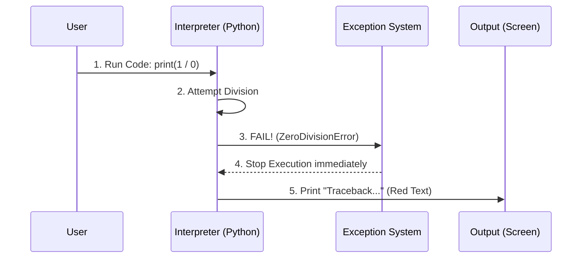

# Chapter 11: Troubleshooting

In the previous chapter, [Code Style Guidelines](10_code_style_guidelines.md), we learned how to write code that looks good and follows the rules.

But here is a hard truth about programming: **You can follow all the rules and your code still might not work.**

You might try to run a notebook, and it crashes. You might try to start the quiz app, and the screen stays blank. This is not a failure; it is part of the process. This chapter is about **Troubleshooting**—the art of reading error messages and fixing the underlying problems.

## The Motivation: Don't Panic

When you are learning a new spoken language, you might say "I want apple" instead of "I would like an apple." People will still understand you.

Computers are not that smart. If you miss a single comma or install the wrong version of a tool, the computer will stop working and print a scary red error message.

### Central Use Case: "The Dead Kernel"

This is the most common issue for beginners using Jupyter Notebooks.

**The Situation:** You open a lesson, click "Run" on the first code cell, and nothing happens. Or worse, a message pops up saying **"The kernel has died, and will restart automatically."**

**The Goal:** You need to revive the "Engine" (Kernel) so you can continue your lesson.

**The Solution:** We need to investigate the **Environment**. Usually, this happens because the Notebook is looking for a tool (library) that isn't installed in the specific "bubble" you are currently working in.

## Key Concepts

Troubleshooting is less about memorizing fixes and more about understanding *where* to look.

### 1. The Stack Trace (The Crime Scene)
When Python crashes, it prints a "Stack Trace." This is a list of exactly what the computer was doing right before it died.
*   **Don't ignore it.** Read the *last line* first. It usually tells you the specific error (e.g., `ModuleNotFoundError`).

### 2. The Kernel (The Engine)
As we learned in [Key Technologies](02_key_technologies.md), the **Kernel** is the engine that runs your code. Sometimes the engine stalls. Sometimes you are trying to drive the car with the wrong engine (e.g., trying to run Python code with an R kernel).

### 3. Dependency Mismatch (The Wrong Parts)
This is like trying to put a diesel truck part into a small electric car. If the project asks for `pandas` version 1.3 but you have version 0.5, things will break.

## How to Troubleshoot Common Issues

Here are the specific fixes for the three main technologies in this course: **Python**, **R**, and the **Web App**.

### Scenario 1: Python Kernel Issues

**Problem:** You see `ModuleNotFoundError: No module named 'pandas'`.

**The Fix:** This means your "Shopper" (pip) didn't buy the ingredient. You need to verify you are in the correct virtual environment.

```bash
# 1. Check which pip you are using
which pip  # (or 'where pip' on Windows)

# 2. If it doesn't say "ml-env", activate it!
source ml-env/bin/activate

# 3. Install the missing tool
pip install pandas
```

*Explanation: Always check if `(ml-env)` is visible in your terminal prompt. If not, you are installing tools into the void, not your project.*

**Problem:** The Kernel keeps dying or won't connect.

**The Fix:** Sometimes Jupyter gets confused about which Python to use. You can force it to recognize your environment.

```bash
# Install the kernel specification helper
pip install ipykernel

# Tell Jupyter to use your 'ml-env' as a kernel named "ML-Kernel"
python -m ipykernel install --user --name=ml-env --display-name "ML-Kernel"
```

*Explanation: After running this, refresh your browser page. Click "Kernel" -> "Change Kernel" and select "ML-Kernel".*

### Scenario 2: R Package Issues

**Problem:** `Error in library(tidyverse) : there is no package called 'tidyverse'`.

**The Fix:** R packages are stored in a local library on your computer. If R can't find it, you just need to install it.

```r
# Run this directly in the R console
install.packages("tidyverse")

# Try to load it again to verify
library(tidyverse)
```

*Explanation: If this fails, you might need to run RStudio as an Administrator, as sometimes R doesn't have permission to write to the folder.*

### Scenario 3: Quiz App (Node.js) Issues

**Problem:** You run `npm run serve` (from [Quiz Application Development](07_quiz_application_development.md)) and get a giant wall of red text saying `npm ERR!`.

**The Fix:** Node.js dependencies can get corrupted easily. The best fix is the "Nuclear Option"—delete the folder and start over.

```bash
# 1. Delete the node_modules folder (The "Nuclear" option)
# On Mac/Linux:
rm -rf node_modules package-lock.json

# 2. Re-install everything fresh
npm install
```

*Explanation: `node_modules` can contain 30,000+ files. Sometimes one gets corrupted. Deleting the folder forces `npm` to download fresh, working copies of everything.*

## Internal Implementation: How Errors Happen

It helps to understand what happens "Under the Hood" when an error appears.

### The Error Lifecycle

When you write bad code, the computer doesn't just stop; it "raises" a flag.



1.  **User** asks for something impossible (like dividing by zero).
2.  **Interpreter** tries to do it.
3.  **Exception System** catches the problem.
4.  **Interpreter** stops the program to prevent the computer from crashing completely.
5.  **Output** displays the "Traceback" so the human knows what happened.

### Deep Dive: Python Exceptions

You can actually write code to handle these errors gracefully so your notebook doesn't crash. This is called `try...except`.

```python
# A safe way to run risky code
try:
    # Try to do the risky thing
    import non_existent_library
except ImportError as e:
    # If it fails, run this instead of crashing
    print(f"Caught an error: {e}")
    print("Please run: pip install non_existent_library")
```

*Explanation: Instead of a red crash screen, the user sees a helpful message. Professional software uses this pattern everywhere.*

## Summary

In this chapter, we learned how to fix things when they break:

*   **Don't Panic:** Read the error message, especially the last line.
*   **Check the Environment:** Most errors happen because you aren't inside your `ml-env` or `node_modules`.
*   **Re-install:** If a tool is missing or broken, reinstalling it is often the fastest fix.

Now that we have fixed our environment and our code is running smoothly, we need to prove that it produces the *correct* answers. It is time to learn about testing.

[Next Chapter: Testing and Validation](12_testing_and_validation.md)

---

Generated by [Code IQ](https://github.com/adityasoni99/Code-IQ)