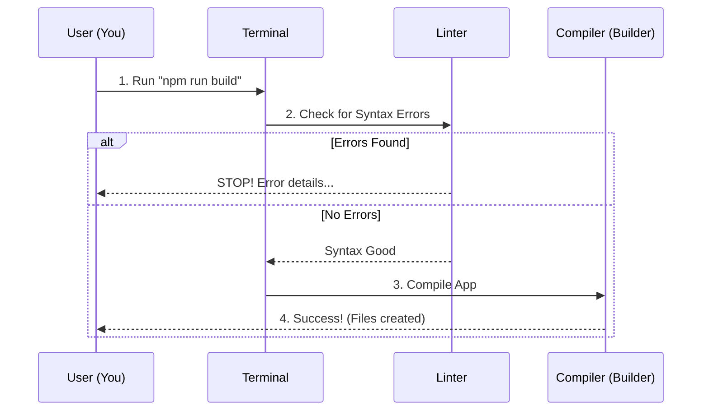

# Chapter 12: Testing and Validation

In the previous chapter, [Troubleshooting](11_troubleshooting.md), we learned how to fix things when they break. We acted like detectives, reading error messages to find the problem.

But wouldn't it be better if we could catch problems *before* they break?

This chapter introduces **Testing and Validation**. This is the process of proving that your code works correctly before you share it with others. It is the difference between hoping a bridge holds your weight and driving a heavy truck over it to verify it is safe.

## The Motivation: The "Safety Inspector"

Imagine you are writing a quiz question for the app. You type the question, save the file, and send it to the project.

Later, a student tries to take the quiz, but the "Submit" button doesn't work because you forgot a comma in the code. The student is frustrated, and the project looks broken.

### Central Use Case: "The Broken Comma"

**The Goal:** You have modified the Quiz Application (perhaps adding a new translation or fixing a typo). You want to be 100% sure that your change won't crash the website.

**The Solution:** We run a series of **Tests**.
1.  **Linting:** Checks if your grammar is correct (e.g., did you forget a comma?).
2.  **Building:** Checks if the app can actually start up without exploding.

## Key Concepts

Testing in this project is divided into two categories: **Manual Validation** (checking with your eyes) and **Automated Validation** (checking with robots).

### 1. Manual Lesson Validation
This is for the text content (`.md` files) and notebooks (`.ipynb`). Computers are bad at judging if a sentence makes sense. Humans are good at it.
*   **The Task:** You act as a student. You read the lesson and click every link to ensure it goes to the right place.

### 2. Automated Linting
We introduced this in [Code Style Guidelines](10_code_style_guidelines.md). In the context of *Testing*, the Linter is the first line of defense. If the Linter fails, the test fails.
*   **The Task:** The computer scans your code for syntax errors.

### 3. Automated Building
This is the ultimate test for the Quiz App. The "Build" process tries to compress the entire application into a package ready for the internet. If there is a serious error deep in the logic, the Build will fail.

## How to Validate Your Work

Let's walk through the steps to solve our "Broken Comma" use case using the tools in the `quiz-app` folder.

### Step 1: Manual Check (The User Experience)
Before running code, just look at what you wrote.
1.  Open your lesson file.
2.  Click the "Pre-Quiz" link. Does it open the web browser?
3.  Click the "Post-Quiz" link. Does it work?

### Step 2: Running the Linter
Now, let's ask the computer to check our syntax. Open your terminal in the `quiz-app` folder.

```bash
# 1. Navigate to the app folder
cd quiz-app

# 2. Run the "Grammar Check"
npm run lint
```

**Expected Output:**
If everything is good, you see: `No lint errors found!`
If you missed a comma, it will shout: `Error: Parsing error: Unexpected token`.

### Step 3: Running the Build Test
This is the stress test. We are asking the computer: "Can you turn this code into a working website?"

```bash
# Run the build command
npm run build
```

**What happens?**
The computer reads every single file, optimizes the images, and creates a `dist` (distribution) folder.

**Expected Output:**
```text
  File                                 Size       Gzipped
  dist/js/chunk-vendors.28s9.js        120.40 KiB 40.20 KiB
  dist/js/app.49a2.js                  15.30 KiB  5.10 KiB
  
  DONE  Build complete.
```

*Explanation: If you see "Build complete," your code is safe! You have passed the test.*

## Internal Implementation: The Testing Pipeline

What actually happens when you run `npm run build`? It triggers a pipeline of checks.

### The Validation Flow



1.  **User** initiates the command.
2.  **Linter** scans for "illegal" code (like variables that are never used).
3.  **Compiler** attempts to link all the files together.
4.  If any step fails, the process stops immediately to prevent a broken app from being created.

### Deep Dive: The `package.json` Scripts

How does the terminal know what `run lint` or `run build` means? These commands are defined in a file called `package.json` inside the `quiz-app` folder.

```json
// Inside quiz-app/package.json
{
  "name": "quiz-app",
  "scripts": {
    "serve": "vue-cli-service serve",
    "build": "vue-cli-service build",
    "lint": "vue-cli-service lint"
  }
}
```

*Explanation: When you type `npm run lint`, npm looks at this list, finds `"lint"`, and actually runs `vue-cli-service lint`. It is a shortcut system.*

### Deep Dive: GitHub Actions ( The Robot Guard)

You might forget to run these tests on your laptop. But the project maintainers (see [Contribution Guidelines](09_contribution_guidelines.md)) have a backup plan.

Every time you send a Pull Request, a robot (GitHub Action) runs these exact commands in the cloud.

```yaml
# Simplified .github/workflows/main.yml
name: Build and Test Quiz App
on: [push, pull_request]

jobs:
  build:
    runs-on: ubuntu-latest
    steps:
      - name: Install dependencies
        run: npm install
      - name: Run Build
        run: npm run build
```

*Explanation: This YAML file is the robot's instruction manual. It says: "When code is pushed, install the tools, and then try to build the app." If `npm run build` fails here, your Pull Request gets a red "X".*

## Summary

In this chapter, we learned how to ensure quality through **Testing and Validation**:

*   **Manual Validation:** Humans checking links and logic.
*   **Linting (`npm run lint`):** Computers checking syntax and grammar.
*   **Building (`npm run build`):** Computers verifying the app works as a whole.
*   **Automation:** How `package.json` and GitHub Actions run these tests for us.

Now that we have validated our lessons and quiz app, we are ready to expand our reach. The world speaks many languages, and we want everyone to learn Machine Learning.

[Next Chapter: Translation Workflow](13_translation_workflow.md)

---

Generated by [Code IQ](https://github.com/adityasoni99/Code-IQ)