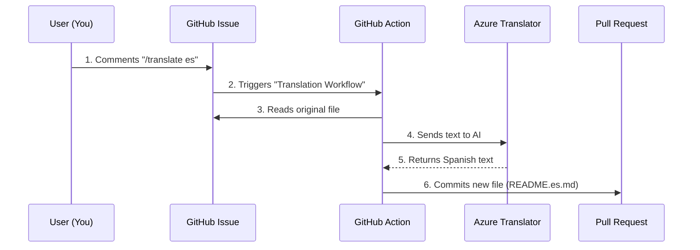

# Chapter 13: Translation Workflow

In the previous chapter, [Testing and Validation](12_testing_and_validation.md), we ensured our code works correctly by running automated tests and linters.

Now that our project is robust, we face a new challenge: **Accessibility**. Not everyone speaks English. To make Machine Learning truly open to the world, we need to translate these lessons into other languages (like Spanish, Chinese, or Hindi).

This chapter explains the **Translation Workflow**—a semi-automated process that helps us maintain this curriculum in over 40 languages without hiring an army of translators.

## The Motivation: Breaking the Language Barrier

Translating a technical project is exhausted.
1.  You have to copy the English text.
2.  Paste it into a translation tool.
3.  Copy the result back into a Markdown file.
4.  Fix the formatting that broke during translation.

If we did this manually for 26 lessons across 40 languages, we would never finish.

### Central Use Case: "The Spanish Lesson"

**The Goal:** You are a native Spanish speaker. You want to translate the "Introduction to Regression" lesson so students in Latin America can learn from it.

**The Solution:** Instead of translating every word manually, you use a **Chat Command**. You type a special message to a robot, and the robot generates a draft translation for you. You then act as an editor, polishing the text to sound natural.

## Key Concepts

We use a combination of human oversight and robot labor.

### 1. GitHub Actions (The Robot)
We have met GitHub Actions in [Contribution Guidelines](09_contribution_guidelines.md) and [Testing and Validation](12_testing_and_validation.md). Here, it acts as our "Digital Assistant." It listens for specific comments in a Pull Request.

### 2. Co-op Translator (The Brain)
This is a specific tool built for this project. It connects GitHub to the **Azure Translator API**. It knows how to read Markdown files, translate the text, but *keep the code intact*.

### 3. The Magic Command (`/translate`)
This is the trigger. Just like asking a smart speaker to "Play Music," we type `/translate` to tell the robot to start working.

## How to Use the Translation Workflow

Let's walk through our use case: Creating a Spanish translation.

### Step 1: Open a Pull Request
First, create a new file for the translation in your branch (e.g., `README.es.md`). You don't need to write the content yet; just creating the empty file (or copying the English one) is enough to start. Open a Pull Request (PR) as described in [Contribution Guidelines](09_contribution_guidelines.md).

### Step 2: Summon the Robot
In the comment section of your Pull Request, type the following command:

```text
/translate es
```

*Explanation: `/translate` is the command. `es` is the language code for Spanish. If you wanted Hindi, you would type `/translate hi`.*

### Step 3: Wait for the Commit
The robot will wake up. It usually takes about 30-60 seconds.
1.  It reads the English `README.md`.
2.  It translates the text to Spanish.
3.  It pushes a new "commit" to your PR with the translated text filled in.

### Step 4: Human Review
**This is the most important step.** Robots are smart, but they don't understand context.
*   *Robot:* "Pumpkins are cool." $\rightarrow$ "Calabazas son frías" (Temperature cold).
*   *Human:* "Calabazas son geniales" (Style cool).

You must read the file and fix these context errors.

## Internal Implementation: How It Works

What happens between the moment you type the command and the moment the text appears? It is a relay race between GitHub, a Server, and an AI.

### The Automated Flow



1.  **User** gives the order.
2.  **GitHub** detects the comment and wakes up the Action.
3.  **Action** scans the folder to find the English source.
4.  **Action** strips out the code blocks (we don't want to translate Python code!) and sends the text to **Azure**.
5.  **Azure** returns the translation.
6.  **Action** rebuilds the Markdown file and saves it to your branch.

### Deep Dive: The Workflow Configuration

The instructions for this robot live in a file named `.github/workflows/translate.yml`.

Let's look at the specific "Trigger" code that makes this possible.

```yaml
# .github/workflows/translation.yml snippet
name: Translation
on:
  issue_comment:
    types: [created]

jobs:
  translate:
    # Only run if the comment starts with /translate
    if: startsWith(github.event.comment.body, '/translate')
    runs-on: ubuntu-latest
```

*Explanation: `on: issue_comment` tells GitHub to watch the chat box. The `if` line checks if the comment is a translation command. If you comment "Great job!", the robot sleeps. If you comment "/translate", the robot wakes up.*

### Deep Dive: The Translation Step

Once the robot is awake, it runs the `co-op-translator` tool.

```yaml
    steps:
      - uses: actions/checkout@v2
      
      - name: Run Translator
        uses: microsoft/co-op-translator@v1
        with:
          token: ${{ secrets.GITHUB_TOKEN }}
          # The command contains the language code (e.g., 'es')
          command: ${{ github.event.comment.body }}
```

*Explanation: `uses: microsoft/co-op-translator` is like importing a library in Python. We give it permission (`GITHUB_TOKEN`) to write to our repository so it can save the translated file.*

## Why We Need Humans

You might wonder, "If the robot does the work, why do I need to open a PR?"

Machine Translation (MT) is a tool, not a replacement. In technical writing, precision is key.
*   **Variable Names:** A robot might translate a variable name `pumpkin_price` to `precio_calabaza`. If the code still uses `pumpkin_price`, the script will crash.
*   **Idioms:** "Sanity check" might be translated literally as "Checking your mental health," which is confusing in a coding context!

Your job in this workflow is not to be the writer, but to be the **Editor**.

## Summary

In this chapter, we learned how to scale our project to the world using the **Translation Workflow**:

*   **Automation:** We use GitHub Actions to do the heavy lifting.
*   **Interaction:** We control the robot using comments (`/translate`).
*   **Hybrid Approach:** We combine AI speed with human accuracy.

Now that we have content in English, Spanish, and many other languages, we need to present it to the students. A folder full of Markdown files is hard to navigate. We need a beautiful website.

[Next Chapter: Documentation Setup](14_documentation_setup.md)

---

Generated by [Code IQ](https://github.com/adityasoni99/Code-IQ)