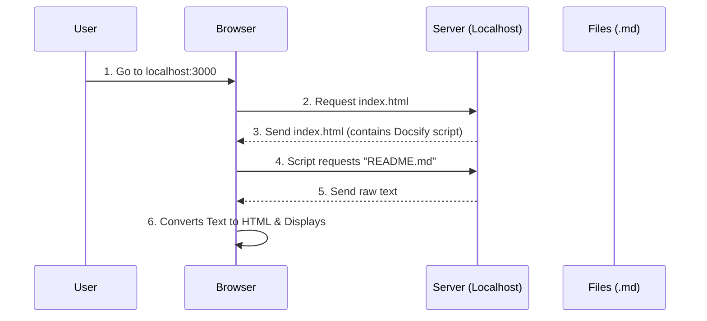

# Chapter 14: Documentation Setup

In the previous chapter, [Translation Workflow](13_translation_workflow.md), we learned how to translate our lessons into many different languages using robots and human editors.

Now we have a pile of text files in English, Spanish, Portuguese, and more. But reading raw text files on GitHub isn't very comfortable. It feels like reading a book manuscript instead of the finished book.

This chapter introduces the **Documentation Engine**. We use a tool called **Docsify** to instantly turn our folder of text files into a beautiful, navigable website.

## The Motivation: From Text to Website

Imagine you have written a cookbook. currently, it is just a stack of loose papers. It is hard to flip through, there is no table of contents, and it looks messy. You want to bind it into a professional book with a cover and an index.

In software, **Documentation** is that book.

### Central Use Case: "The Offline Reader"

**The Goal:** You are going on a long flight with no internet. You want to read the entire `ML-For-Beginners` curriculum on your laptop as a proper website, or print it out as a PDF to read on paper.

**The Solution:** We will install **Docsify**. This tool acts like a magic lens. You point it at your folder, and it displays a professional website on your screen without you having to write any HTML code.

## Key Concepts

We use two specific tools to achieve this "book-like" experience.

### 1. Docsify (The Lens)
Most website builders require you to "compile" code, which takes time. **Docsify** is different. It is a smart script that lives in your browser.
*   **How it works:** It reads your Markdown files (`.md`) on the fly and paints them as a website.
*   **Analogy:** It’s like a pair of glasses that automatically translates scribbles into fancy calligraphy as you look at them.

### 2. The Local Server (The Projector)
For security reasons, web browsers don't like opening files directly from your hard drive (like `file://C:/...`). To use Docsify, we need a tiny **Local Server** to "serve" the files to the browser, pretending to be a website on the internet.

### 3. PDF Converter (The Printer)
Once the website is running, we use a separate tool to take photos of every page and stitch them together into a PDF document.

## How to Set Up Documentation

To solve our use case (reading offline), we need to install the tools and run the server.

### Prerequisites
We need **Node.js**, which we installed back in [Quiz Application Development](07_quiz_application_development.md).

### Step 1: Install the Docsify Tool
Open your terminal (Command Prompt or Terminal). We will use `npm` (Node Package Manager) to install the tool globally so you can use it anywhere.

```bash
# Install docsify-cli (Command Line Interface)
npm i docsify-cli -g
```

*Explanation: `i` stands for install. `-g` stands for global, meaning you are installing this tool for your whole computer, not just this folder.*

### Step 2: Run the Local Server
Navigate to the root of the `ML-For-Beginners` folder. Then, tell Docsify to serve the current directory.

```bash
# 1. Go to the project root
cd ML-For-Beginners

# 2. Serve the current folder (.)
docsify serve .
```

**Output:**
```text
Serving /Users/You/ML-For-Beginners
Listening at http://localhost:3000
```

*Explanation: Your terminal is now acting as a web server. Open your web browser and go to `http://localhost:3000`. You will see the beautiful course website!*

### Step 3: Generate a PDF (Optional)
If you want a physical file, we use a converter tool. (Note: You may need to stop the server with `Ctrl+C` to run this, or open a new terminal window).

```bash
# 1. Install the PDF converter
npm install -g docsify-pdf-converter

# 2. Convert the site to PDF
docsify-pdf-converter
```

*Explanation: The converter browses through the site we just set up, takes screenshots, and saves a file named `docsify.pdf` in your folder.*

## Internal Implementation: How It Works

How does a text file become a website instantly? It relies on a specific file called `index.html`.

### The Rendering Flow

Unlike normal websites where the server builds the page, here the **Browser** does the heavy lifting.



1.  **User** visits the site.
2.  **Server** sends a tiny skeleton page (`index.html`).
3.  **Browser** runs the script inside that page.
4.  **Script** fetches the actual lesson text.
5.  **Script** formats it (adds bold, headers, images) and shows it to the user.

### Deep Dive: The `index.html` Configuration

The heart of the documentation setup is the `index.html` file located at the root of the repository. This is the only "real" HTML file in the whole project.

```html
<!-- index.html snippet -->
<!DOCTYPE html>
<html>
<body>
  <div id="app"></div>
  <script>
    window.$docsify = {
      name: 'ML-For-Beginners',
      repo: 'microsoft/ML-For-Beginners',
      loadSidebar: true
    }
  </script>
  <!-- This loads the engine -->
  <script src="//cdn.jsdelivr.net/npm/docsify/lib/docsify.min.js"></script>
</body>
</html>
```

*Explanation: `window.$docsify` is the settings panel. `loadSidebar: true` tells Docsify to look for a navigation menu. The final `<script>` tag downloads the actual Docsify engine from the internet.*

### Deep Dive: The Sidebar (`_sidebar.md`)

How does the website know the order of the lessons? It looks for a file called `_sidebar.md`. This works exactly like the Table of Contents we discussed in [Repository Structure](03_repository_structure.md).

```markdown
<!-- _sidebar.md snippet -->

* [Home](README.md)
* [1. Introduction](1-Introduction/README.md)
* [2. Regression](2-Regression/README.md)
  * [Tools](2-Regression/1-Tools/README.md)
  * [Data](2-Regression/2-Data/README.md)
```

*Explanation: This is just a Markdown list. Docsify reads this list and turns it into the clickable navigation menu on the left side of the website.*

## Why Use Docsify?

You might wonder why we don't just build a standard website.
1.  **Simplicity:** We don't need to maintain HTML code. We just write lessons in Markdown.
2.  **Speed:** If we correct a typo in a lesson, the "website" is updated instantly because the website *is* the lesson file.
3.  **GitHub Integration:** It works perfectly with GitHub Pages (which we will see in the next chapter).

## Summary

In this chapter, we learned how to visualize our work using **Documentation Setup**:

*   **Docsify:** The engine that turns Markdown into a website.
*   **`docsify serve`:** The command to preview the site on our own computer.
*   **`index.html`:** The configuration file that controls how the site looks.
*   **Sidebar:** The file that controls the navigation menu.

We now have a professional-looking website running on our local computer (`localhost`). But "localhost" only works for you. To share this with the world, we need to put it on the real internet.

[Next Chapter: Deployment](15_deployment.md)

---

Generated by [Code IQ](https://github.com/adityasoni99/Code-IQ)