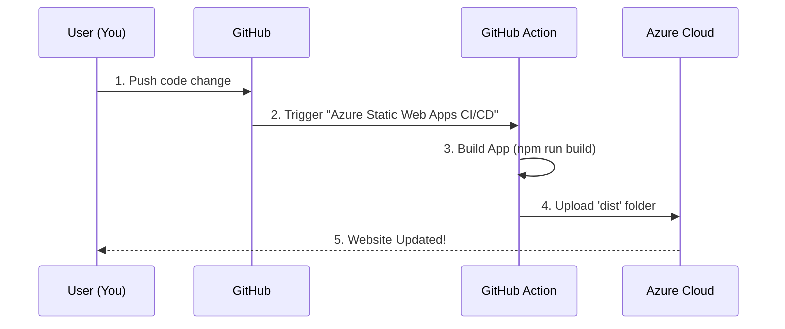

# Chapter 15: Deployment

In the previous chapter, [Documentation Setup](14_documentation_setup.md), we learned how to turn our Markdown files into a beautiful website. We used `docsify serve` to see it on our own computer.

But here is the problem: **"Localhost" only works for you.** If you send the link `http://localhost:3000` to a friend, it won't work for them. Your computer is the server, and unless they are sitting in your room, they can't connect to it.

This chapter is about **Deployment**. This is the process of moving your application from your private laptop to a public server on the internet so the whole world can see it.

## The Motivation: The Grand Opening

Imagine you have spent months building a beautiful model train set in your basement. It is amazing, but only people who visit your house can see it.

Deployment is like moving that train set to a public museum. Now, anyone with a ticket (or a web link) can visit it 24/7, even when you are asleep.

### Central Use Case: "Sharing the Quiz"

**The Goal:** You want your friend in another country to play the Quiz App you built in [Quiz Application Development](07_quiz_application_development.md).

**The Solution:** You need to:
1.  Rent a space on the internet (Cloud Hosting).
2.  Pack up your code.
3.  Ship it to that space automatically every time you make a change.

We will use **Azure Static Web Apps** (the space) and **GitHub Actions** (the shipping company) to do this.

## Key Concepts

Deployment can sound scary, but it is just moving files from Place A to Place B.

### 1. The Cloud (Azure)
The "Cloud" is just a warehouse full of powerful computers that run 24/7. When we "deploy to Azure," we are simply copying our files onto one of Microsoft's computers. This computer serves our website to anyone who asks for it.

### 2. Static Web Apps
Our Quiz App and Documentation site are **Static**.
*   **Dynamic:** A site like Facebook that calculates new things every second.
*   **Static:** A site that delivers pre-made files (HTML, CSS, JavaScript).
Azure Static Web Apps is a service designed specifically to host these types of files cheaply and quickly.

### 3. CI/CD (The Robot Delivery)
**Continuous Integration / Continuous Deployment (CI/CD)** is a fancy term for automation.
*   **Old Way:** You manually upload files using a program like FTP.
*   **New Way:** You push code to GitHub. A robot notices the change, builds the app, and pushes it to Azure automatically.

## How to Deploy Your App

To solve our use case (Sharing the Quiz), we don't need to write code. We need to configure the connection between GitHub and Azure.

### Step 1: Create the Resource
1.  Go to the [Azure Portal](https://portal.azure.com).
2.  Search for **"Static Web Apps"**.
3.  Click **Create**.

### Step 2: Connect to GitHub
Azure needs permission to read your code.
1.  In the setup menu, select **GitHub** as the source.
2.  Select your account, your repository (`ML-For-Beginners`), and the branch (`main`).

### Step 3: Configure the Build Details
This is the most critical step. We need to tell Azure *where* our app lives.

*   **App Location:** `/quiz-app`
    *   *Why:* This is the folder where our `package.json` lives.
*   **Api Location:** (Leave blank)
    *   *Why:* We don't have a backend API for this specific app.
*   **Output Location:** `dist`
    *   *Why:* In [Testing and Validation](12_testing_and_validation.md), we learned that `npm run build` creates a folder named `dist`. That is the folder we want the public to see.

### Step 4: Go Live!
Click **Review + create**. Azure will take a few minutes to set everything up. Once it is done, it will give you a URL like:
`https://agreeable-meadow-0d.azurestaticapps.net`

Click it. Your quiz is now on the internet!

## Internal Implementation: Under the Hood

How does Azure know when you change your code? It installs a "spy" (a Workflow file) in your repository.

### The Deployment Flow



1.  **User** pushes code to GitHub.
2.  **GitHub** sees a specific file in the `.github/workflows` folder.
3.  **Action** wakes up a robot. The robot runs the build commands we learned in [Chapter 12](12_testing_and_validation.md).
4.  **Action** takes the result (the `dist` folder) and sends it to Azure.
5.  **Azure** replaces the old files with the new ones immediately.

### Deep Dive: The Workflow File

When you connected Azure to GitHub in Step 2, Azure automatically created a file in your repository. Let's look at it.

Location: `.github/workflows/azure-static-web-apps-<random-name>.yml`

```yaml
# The Trigger
on:
  push:
    branches:
      - main

jobs:
  build_and_deploy_job:
    runs-on: ubuntu-latest
    steps:
      - uses: actions/checkout@v2
      # The Magic Step
      - name: Build and Deploy
        uses: Azure/static-web-apps-deploy@v1
        with:
          azure_static_web_apps_api_token: ${{ secrets.AZURE_TOKEN }}
          app_location: "/quiz-app" # Where is the code?
          output_location: "dist"   # Where is the built site?
```

*Explanation:*
*   `on: push`: This tells the robot to wake up every time you save changes to the `main` branch.
*   `app_location`: Matches the setting we chose in the Azure Portal.
*   `output_location`: Tells the robot to only upload the final, optimized version of the site.

### Checking the Logs

If your deployment fails, you can see exactly why.

1.  Go to your GitHub Repository.
2.  Click the **Actions** tab at the top.
3.  Click on the workflow run (e.g., "Azure Static Web Apps CI/CD").
4.  Click **Build and Deploy**.

You might see an error like:

```text
App Directory Location: '/quiz-app' was not found.
```

*Explanation: This means you typed the folder name wrong in the configuration. The robot couldn't find your code to build it.*

## Managing Secrets

You might notice this line in the code above:
`azure_static_web_apps_api_token: ${{ secrets.AZURE_TOKEN }}`

**What is a Secret?**
This is like a password. You never want to write your password directly in a file that is public on the internet. GitHub stores this password in a secure vault called "Secrets." The `${{ }}` syntax tells the robot: "Go to the vault, get the token, and use it here."

## Summary

Congratulations! You have reached the end of the **ML-For-Beginners** setup curriculum.

In this chapter, we learned:
*   **The Cloud:** Using Azure to host our files.
*   **Static Web Apps:** The right tool for hosting our Vue.js quiz.
*   **Continuous Deployment:** How GitHub Actions automatically updates the website whenever we push code.

### The Full Journey

Let's look back at what you have accomplished:
1.  You understood the project goals ([Chapter 1](01_project_overview.md)).
2.  You set up your Python/R environment ([Chapter 5](05_python_setup.md)).
3.  You learned how to fix bugs and run tests ([Chapter 11](11_troubleshooting.md)).
4.  You deployed the application to the world ([Chapter 15](15_deployment.md)).

You are no longer just a student reading a book. You are a contributor with a fully functioning Development, Testing, and Deployment environment.

You are now ready to tackle the actual Machine Learning lessons in the numbered folders.

**Happy Coding!**

---

Generated by [Code IQ](https://github.com/adityasoni99/Code-IQ)