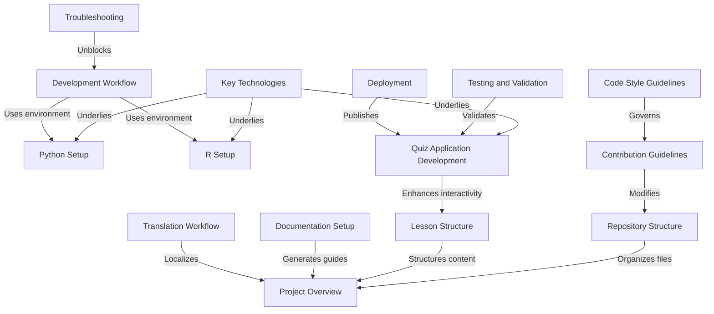

# Tutorial: ML-For-Beginners

This project is a comprehensive **12-week curriculum** designed to introduce **Machine Learning** concepts to beginners. It features a mix of *written lessons*, *code demonstrations* in **Python** and **R**, and an interactive **Vue.js quiz application** to reinforce learning across 26 distinct lessons.

**Source Repository:** [https://github.com/microsoft/ML-For-Beginners](https://github.com/microsoft/ML-For-Beginners)

## Chapters

1. [Project Overview](01_project_overview.md)
2. [Key Technologies](02_key_technologies.md)
3. [Repository Structure](03_repository_structure.md)
4. [Lesson Structure](04_lesson_structure.md)
5. [Python Setup](05_python_setup.md)
6. [R Setup](06_r_setup.md)
7. [Quiz Application Development](07_quiz_application_development.md)
8. [Development Workflow](08_development_workflow.md)
9. [Contribution Guidelines](09_contribution_guidelines.md)
10. [Code Style Guidelines](10_code_style_guidelines.md)
11. [Troubleshooting](11_troubleshooting.md)
12. [Testing and Validation](12_testing_and_validation.md)
13. [Translation Workflow](13_translation_workflow.md)
14. [Documentation Setup](14_documentation_setup.md)
15. [Deployment](15_deployment.md)

---

Generated by [Code IQ](https://github.com/adityasoni99/Code-IQ)