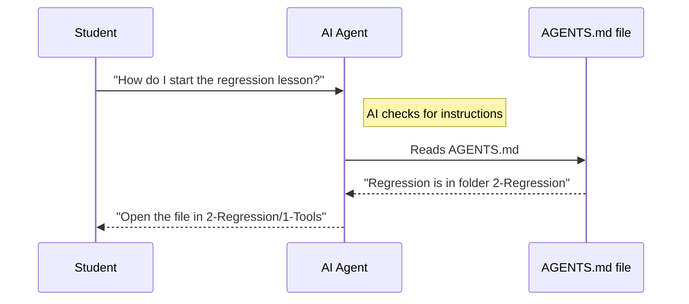

# Chapter 1: AGENTS.md

Welcome to **ML-For-Beginners**! This is the very first chapter of our journey. Before we dive into Python code, regressions, or neural networks, we need to talk about a special file that helps *others* understand our code.

And by "others," we don't just mean humans—we mean **AI Agents**.

## Motivation: The Robot Intern

Imagine you hire a very smart robot intern to help you study Machine Learning. This robot knows everything about Python and Math, but it knows **nothing** about this specific project folder.

If you ask the robot: *"How do I run the quiz?"*, the robot might hallucinate and say *"Run `start_quiz.exe`"*, even though that file doesn't exist here!

**The Problem:** AI agents (like GitHub Copilot, ChatGPT, or Devin) need context to give you good answers.

**The Solution:** `AGENTS.md`. This file is like an **Employee Handbook** written specifically for AI. It explains the project structure, how to run code, and where to find things.

## Key Concept: Context Injection

When you work with AI coding assistants, they look for files that explain the repository. `AGENTS.md` acts as a map. It translates our human-organized folders into instructions the AI can follow.

### How to use this abstraction

You don't usually "run" `AGENTS.md`. Instead, you place it in the root of your project. When you ask your AI assistant a question, it "reads" this file to understand the project's rules.

Here is what a simple section of `AGENTS.md` looks like. It describes the goal of the project to the AI.

```markdown
# AGENTS.md

## Project Goal
This is a 12-week curriculum for Machine Learning.
The goal is to teach beginners using Scikit-learn and Python.
Do not use advanced Deep Learning libraries unless specified.
```

**Explanation:**
1.  We state the **Project Goal**.
2.  We set a **Constraint**: "Do not use advanced Deep Learning libraries."
3.  Now, if you ask the AI to write code, it will stick to simple libraries suitable for beginners!

## The Internal Structure: Under the Hood

What happens when you interact with the repository using an AI agent? Let's visualize the flow.



### Breakdown of the File

Let's look at the specific parts we put inside `AGENTS.md` to make the AI smart.

#### 1. The Directory Map
We need to tell the AI what the folders mean. Otherwise, `2-Regression` is just a random name to it.

```markdown
## Directory Structure

- `1-Introduction`: History of ML and fairness.
- `2-Regression`: Predicting numerical values.
- `3-Web-App`: Building a Flask app.
- `sketchnotes`: Visual notes for the lessons.
```

**What happens:** The AI now creates a mental map. If you ask about "visuals," it knows to look in `sketchnotes`.

#### 2. Workflow Rules
We also teach the AI how we like to work. For example, in this course, we use Jupyter Notebooks (`.ipynb`).

```markdown
## Workflow

- Main content is in `.ipynb` notebooks.
- Use Python 3.
- Always explain code simply for beginners.
```

**What happens:** When the AI generates code for you, it will add comments and simple explanations because we told it to!

## Deep Dive: Connecting the Pieces

The `AGENTS.md` file acts as the central brain linking all other chapters. For example, it tells the AI that the rules for behavior are in another file.

```markdown
## Important References

- For community rules, see: CODE_OF_CONDUCT.md
- For regression examples, see: 2-Regression
- For web apps, see: 3-Web-App
```

*Note: In our tutorial structure, the agent file knows exactly where to look.*

### Example: Helping the Agent Navigate

If you were writing the `AGENTS.md` for this specific tutorial, you might include a snippet like this to help the Agent understand the order of lessons:

```markdown
## Lesson Order

1. Introduction
2. Regression
3. Web App
4. Classification
```

If you ask the AI: *"What comes after Regression?"*, it reads this list and answers: *"Next is building a Web App!"*

## Why this matters for Beginners

You might be thinking, *"I am a human, why do I care about a file for robots?"*

1.  **It helps you too:** Reading `AGENTS.md` is actually the fastest way for a *human* to get a high-level overview of a complex project.
2.  **Better Assistance:** If you use tools like GitHub Copilot while learning this course, this file ensures the suggestions you get are accurate and relevant to the lessons.

## Conclusion

In this chapter, we learned that `AGENTS.md` is a navigation map designed for AI tools. It ensures that any automated assistant understands:
*   **What** this project is (Machine Learning for Beginners).
*   **Where** the files are located (The directory map).
*   **How** to behave (Keep it simple).

Now that the AI knows how to behave, we need to make sure the *humans* know how to behave too!

[Next Chapter: CODE_OF_CONDUCT.md](02_code_of_conduct_md.md)

---

Generated by [Code IQ](https://github.com/adityasoni99/Code-IQ)