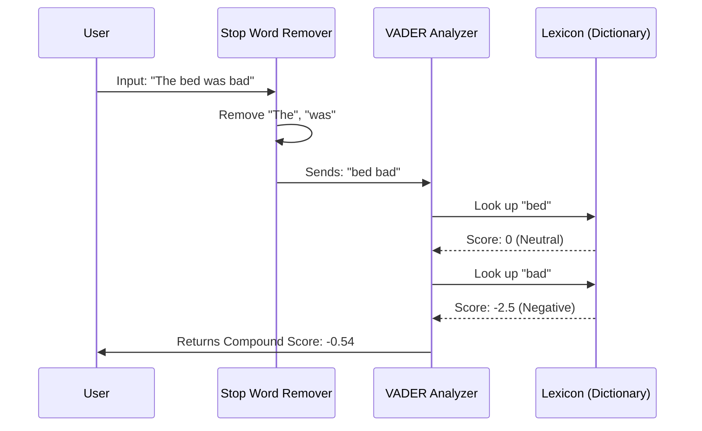

# Chapter 1: translations/ro/6-NLP/5-Hotel-Reviews-2/notebook.ipynb

Welcome to the first chapter of your journey into Natural Language Processing (NLP)! 

In this chapter, we explore a specific notebook from the **ML-For-Beginners** project: the Romanian translation of the Sentiment Analysis lesson. While the file path includes `translations/ro`, the concepts of code and logic we will cover here are universal.

## Motivation: The Hotel Owner's Dilemma

Imagine you are the manager of a large hotel chain. Every day, guests leave hundreds of reviews on your website. 

**The Use Case:** You want to know: "Are our guests happy or angry?"

Reading 5,000 reviews manually would take weeks. You need a way to make a computer read them for you and instantly tell you if a review is **Positive** or **Negative**.

**The Problem:** Computers deal with numbers (0s and 1s), not words or feelings. They don't inherently know that "excellent" is good and "dirty" is bad.

**The Solution:** This notebook teaches you to use **Sentiment Analysis** with a tool called **VADER**. It translates human emotions into a numeric score between -1 (very negative) and +1 (very positive).

## Key Concepts

To understand this notebook, we need to break down a few terms:

### 1. NLP (Natural Language Processing)
This is the field of AI focused on enabling computers to understand human language.

### 2. Stop Words
In any language (English, Romanian, etc.), we use filler words like "the", "is", "at", "in". These are necessary for grammar but usually don't contain the *emotion* of the sentence. In NLP, we often remove them to focus on the important words (like "loved", "hated", "clean").
> **Analogy:** Stop words are like the packing peanuts in a shipping box. They take up space, but the actual item (the meaning) is what matters.

### 3. VADER
**VADER** (Valence Aware Dictionary and sEntiment Reasoner) is a specialized library in Python. It is designed specifically to detect sentiment in social media texts or reviews. It is smart enough to understand that "GOOD" (all caps) is more positive than "good" (lowercase).

## How to Solve the Use Case

Let's look at how the notebook solves the problem of analyzing hotel reviews. We will use the **NLTK** (Natural Language Toolkit) library.

### Step 1: Getting Ready
First, we need to import the tools and download the "dictionary" that VADER uses to understand words.

```python
import nltk
from nltk.sentiment.vader import SentimentIntensityAnalyzer

# Download the VADER lexicon (the dictionary of emotional words)
nltk.download('vader_lexicon')

# Initialize the analyzer
sia = SentimentIntensityAnalyzer()
```

### Step 2: Removing Stop Words (Preprocessing)
Before analyzing, we often clean the data. If we were analyzing the sentence *"The hotel was very clean"*, we might want to focus just on *"hotel very clean"*.

```python
from nltk.corpus import stopwords

# Let's say we have a list of cache words to ignore
# (In the real notebook, we load these from NLTK)
cache_english_stopwords = stopwords.words('english')

def remove_stopwords(text):
    words = text.split()
    # Keep word only if it is NOT in the stopword list
    clean_words = [w for w in words if w not in cache_english_stopwords]
    return " ".join(clean_words)
```
*Explanation:* This code takes a sentence, breaks it into individual words, throws away the "packing peanuts" (stop words), and glues the important words back together.

### Step 3: Calculating Sentiment
This is the magic moment. We ask VADER to read a sentence and give us a score.

```python
# A sample review
review = "I absolutely loved the breakfast!"

# Get the score
score = sia.polarity_scores(review)

print(score)
```

**What happens here?**
The output `score` will look something like this dictionary:
`{'neg': 0.0, 'neu': 0.4, 'pos': 0.6, 'compound': 0.65}`

*   **neg:** How negative it is.
*   **neu:** How neutral it is.
*   **pos:** How positive it is.
*   **compound:** The overall score combined (-1 to +1). A score of **0.65** means the computer thinks this is a very positive review!

## Under the Hood: How VADER Works

How does the computer know "loved" is positive? It doesn't actually "feel" anything. It uses a **Lexicon** (a scored dictionary).

### The Logic
1.  **Tokenization:** The sentence is sliced into words.
2.  **Lookup:** The tool looks up every word in its internal dictionary.
    *   "Loved" might be worth +3.0 points.
    *   "Breakfast" might be 0.0 (neutral).
3.  **Heuristics (Rules):** VADER checks for rules that change the score:
    *   **Capitalization:** "LOVED" gets more points than "loved".
    *   **Negation:** If the word "not" appears before "loved", the score flips to negative.

### Sequence Diagram

Here is a simplified view of the process inside the notebook:



### Internal Implementation Code
In the actual notebook, we apply this logic to a whole column of data (thousands of reviews) using Python's pandas library.

```python
# Assuming 'df' is our table of hotel reviews
# We create a new column 'sentiment' for the results

def get_sentiment(review_text):
    # Get the dictionary of scores
    scores = sia.polarity_scores(review_text)
    # Return just the compound (overall) score
    return scores['compound']

# Apply this function to every review
# df['sentiment'] = df['Review_Text'].apply(get_sentiment)
```
*Explanation:* This creates a loop that goes through every single review in your spreadsheet, calculates the score, and saves it in a new column. You can then compare this `sentiment` score with the user's Star Rating to see if they match!

## Conclusion

In this chapter, we explored `translations/ro/6-NLP/5-Hotel-Reviews-2/notebook.ipynb`. We learned that computers can "read" emotions by treating words as data points with mathematical values.

**Recap:**
1.  **Stop words** are filler words we remove to clean the data.
2.  **VADER** is a tool that assigns positive or negative numbers to words.
3.  We can process thousands of reviews instantly to understand customer sentiment.

You have now taken your first step into Natural Language Processing! In future chapters, we will look at how to train your own models instead of using pre-made dictionaries like VADER.

---

Generated by [Code IQ](https://github.com/adityasoni99/Code-IQ)