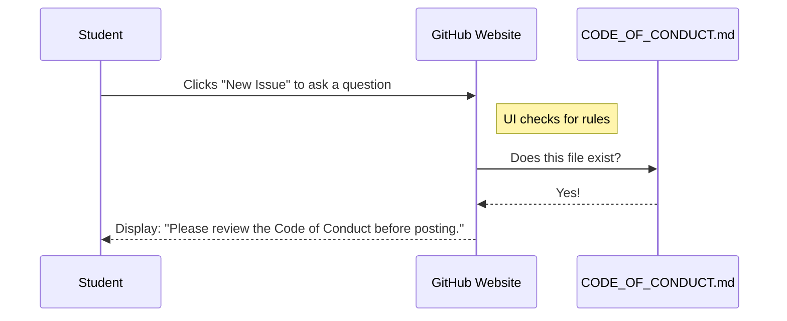

# Chapter 2: CODE_OF_CONDUCT.md

Welcome to the second chapter! In the previous chapter, [AGENTS.md](01_agents_md.md), we learned how to teach **AI robots** to understand our project.

Now, we need to shift our focus to **humans**.

Open Source projects like `ML-For-Beginners` are global classrooms. Anyone from anywhere can come in to learn or teach. But just like a real classroom or a playground, things can get messy if there are no rules.

## Motivation: The Digital Playground

Imagine you are playing a game of soccer in a public park.
*   **The Goal:** Have fun and score goals.
*   **The Problem:** Suddenly, a stranger runs onto the field, picks up the ball with their hands, and refuses to let anyone play.

In software projects, this "stranger" could be someone writing mean comments, spamming the discussion board, or being disrespectful to beginners.

**The Solution:** `CODE_OF_CONDUCT.md`.

This file is the **Rule Book** for the playground. It tells everyone: "You are welcome here, but you must be nice. If you aren't nice, here is what will happen."

## Key Concept: Social Contracts

While most files in this repository contain Python code for machines, `CODE_OF_CONDUCT.md` contains **Social Code** for people.

It establishes three main things:
1.  **The Pledge:** A promise that we will include everyone, regardless of background or skill level.
2.  **The Standards:** Examples of good behavior (being friendly) and bad behavior (insulting others).
3.  **Enforcement:** Who to contact if someone breaks the rules (the "referee").

### Why is this "Microsoft" specific?

Since `ML-For-Beginners` is a Microsoft project, we use the standard **Microsoft Open Source Code of Conduct**. This ensures that the same high standard of safety applies here as it does in huge professional projects.

## How to Use This Abstraction

You don't "run" this file like a script. You simply place it in the root folder of your project.

However, its "usage" happens when a human decides to interact with the community. Let's look at what is inside the file.

### The Content Structure

Here is a simplified view of what the text inside looks like. It is written in Markdown so it looks pretty on the web.

```markdown
# Microsoft Open Source Code of Conduct

## Our Pledge
We are committed to making participation in this project 
a harassment-free experience for everyone.

## Standards
*   **Do:** Use welcoming and inclusive language.
*   **Don't:** Trolling or insulting/derogatory comments.

## Reporting Issues
If you see bad behavior, contact opencode@microsoft.com.
```

**Explanation:**
1.  **Title:** Clearly states what this document is.
2.  **Pledge:** Sets the tone. We are here to learn together.
3.  **Standards:** Gives clear examples so there is no confusion.
4.  **Reporting:** Tells you exactly who the "referee" is so you can get help safely.

## The Internal Structure: Under the Hood

You might wonder, "Does this file actually *do* anything technically?"

Yes! Platforms like GitHub treat this file specially. When you have a `CODE_OF_CONDUCT.md` in your root folder, GitHub integrates it into the user interface.

### The Interaction Flow

Here is what happens when a new student tries to ask a question or report a bug in the project.



Because the file exists, the platform proactively reminds the human to be polite *before* they even type a word.

### Deep Dive: Implementation Details

Technically, this is a static file. However, it acts as a **Governance Anchor**.

In this specific project, the file is located at the top level so it covers every lesson, from [2-Regression](07_2_regression.md) to [9-Real-World](14_9_real_world.md).

Here is how we might link to it if we were building a website for our project:

```html
<!-- Footer of our documentation website -->
<footer>
  <a href="CODE_OF_CONDUCT.md">
    Community Guidelines
  </a>
  <p>Please be respectful.</p>
</footer>
```

**Explanation:**
1.  Because the file is standard, we can link to it from anywhere.
2.  If we were building a bot (like we discussed in [AGENTS.md](01_agents_md.md)), we could program the bot to read this file and automatically warn users who use "banned words" defined in the standards section.

## Why this matters for Beginners

If you are new to coding, you might feel intimidated. You might worry: *"What if I ask a stupid question and people laugh at me?"*

The `CODE_OF_CONDUCT.md` is there to protect **you**.

1.  It guarantees that this is a safe place to fail and learn.
2.  It ensures that experts treat beginners with patience.
3.  It allows us to focus on the Math and Code without drama.

## Conclusion

In this chapter, we learned that `CODE_OF_CONDUCT.md` is the "Constitution" of our project. It defines how we treat each other.
*   **Input:** Human behavior.
*   **Output:** A safe, welcoming community.

Now that we have established the rules for our Robots ([AGENTS.md](01_agents_md.md)) and the rules for our Humans (`CODE_OF_CONDUCT.md`), we are finally ready to start our Machine Learning journey!

Get your Python ready, because we are diving into the history and basics of ML next.

[Next Chapter: 1-Introduction](03_1_introduction.md)

---

Generated by [Code IQ](https://github.com/adityasoni99/Code-IQ)