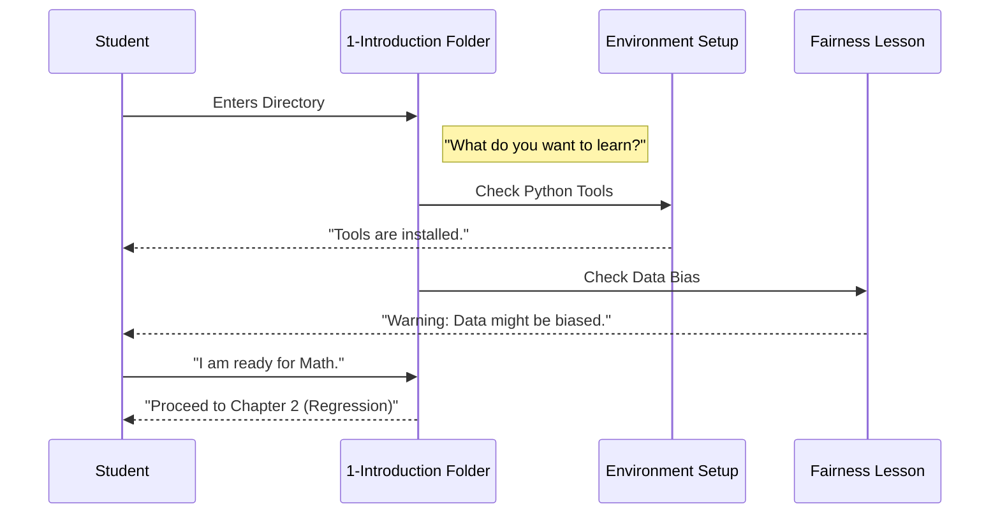

# Chapter 3: 1-Introduction

Welcome to the third chapter! In the previous chapter, [CODE_OF_CONDUCT.md](02_code_of_conduct_md.md), we established the rules for how humans should behave in this community.

Now that the Robots have their instructions and the Humans have their rules, we are finally ready to open the door to the subject matter itself: **Machine Learning**.

But wait! Before we start building complex brains, we need to understand *what* we are building and *why*. This brings us to the folder named `1-Introduction`.

## Motivation: The Foundation

Imagine you want to build a skyscraper.
*   **The Goal:** Build a tall tower (Machine Learning Model).
*   **The Problem:** If you start laying bricks on soft mud without checking the ground, the tower will fall over.
*   **The Missing Piece:** You need a geological survey and a blueprint.

In this project, the directory `1-Introduction` is that survey. It doesn't contain the heavy machinery (that comes later in [2-Regression](07_2_regression.md)), but it contains the essential concepts that keep your models from collapsing.

**The Use Case:** You want to solve a problem using data, but you need to ensure you aren't accidentally creating a harmful or biased AI. You start here.

## Key Concepts: The Three Pillars

This directory isn't just a "Readme". It breaks down Machine Learning into three manageable concepts for beginners.

### 1. The Definition (What?)
Machine Learning is not magic. It is the process of using **data** to find **patterns**.
*   Traditional Programming: You give the computer rules (`if x > 5`).
*   Machine Learning: You give the computer answers, and it figures out the rules.

### 2. The History (When?)
You might think AI is new. It isn't!
*   **1950s:** People dreamed of "Thinking Machines."
*   **Today:** We finally have the computer power (GPUs) and the data (Internet) to make it work.

### 3. Fairness (How?)
This is the most critical part of this chapter. If you teach a robot using "bad" data, it becomes a "bad" robot.
*   **Example:** If you only show an AI pictures of *orange* cats, it might not recognize a *black* cat as a cat. This is called **Bias**.

## How to Use This Abstraction

Technically, `1-Introduction` is a **Directory** (a folder). To "use" it, you navigate into it and set up your Python environment.

This folder teaches you how to prepare your computer. Before we code, we usually check if our tools are ready.

### Example: The Environment Check
Inside this chapter's lessons, you will learn to run a setup check like this. This ensures your computer is ready for the future chapters.

```python
import sys
import sklearn # The Machine Learning library

# Check if we are ready to go
print(f"Python version: {sys.version}")
print(f"Scikit-learn version: {sklearn.__version__}")
print("Ready to learn!")
```

**Explanation:**
1.  We import `sys` (System) and `sklearn` (Scikit-learn, our toolkit).
2.  We print the versions.
3.  **Output:** If you see version numbers, you are ready for [2-Regression](07_2_regression.md). If you get an error, you need to fix your installation!

## The Internal Structure: Under the Hood

What happens when a student enters the `1-Introduction` abstraction? They are routed through a learning path.

Let's visualize how this folder organizes your learning flow.



### Breakdown of the Flow
1.  **Entry:** You enter the folder.
2.  **Tooling:** You verify you have Python and Scikit-learn.
3.  **Ethics:** You learn to ask "Is this data fair?" before writing code.
4.  **Exit:** You leave with a prepared environment and a prepared mind.

## Deep Dive: The Fairness Code

While this chapter is mostly conceptual, the **Fairness** concept has real technical implications. In later chapters, we will use code to visualize data.

Here is a simplified example of how we might detect "imbalance" in data, a core concept taught in this introduction.

Imagine we are building an app to detect if a photo is a "Dog" or "Cat". We look at our data folder.

```python
# A simple list representing our training photos
data_folder = ["cat.jpg", "cat.jpg", "cat.jpg", "dog.jpg"]

# Count the examples
cats = data_folder.count("cat.jpg")
dogs = data_folder.count("dog.jpg")

# Check for fairness/balance
if cats > dogs:
    print(f"Warning: Bias detected! {cats} Cats vs {dogs} Dog.")
```

**Explanation:**
1.  We have a list representing our data.
2.  We count the items.
3.  **The Logic:** We notice we have 3 cats and only 1 dog.
4.  **The Lesson:** This model will be great at spotting cats, but terrible at spotting dogs. The `1-Introduction` chapter teaches us to fix this *before* we train the model.

## Why this matters for Beginners

It is very tempting to skip the "Intro" and jump straight to the "Cool Robots."
*   **Don't do it.**
*   Without `1-Introduction`, you might build a model that doesn't work (because of environment errors) or a model that hurts people (because of unfair bias).

This chapter gives you the **Lens** through which you should view the rest of the course.

## Conclusion

In this chapter, we explored `1-Introduction`. We learned:
1.  **Basics:** ML is just finding patterns in data.
2.  **History:** We are standing on the shoulders of giants from the 1950s.
3.  **Fairness:** We must check our data for bias (like having too many cats and not enough dogs).

Now that our environment is set up and our conscience is clear, we need a place to actually write and run our code experiments.

We don't write ML code in standard text files; we use a special tool called a **Notebook**.

[Next Chapter: notebook.ipynb](04_notebook_ipynb.md)

---

Generated by [Code IQ](https://github.com/adityasoni99/Code-IQ)