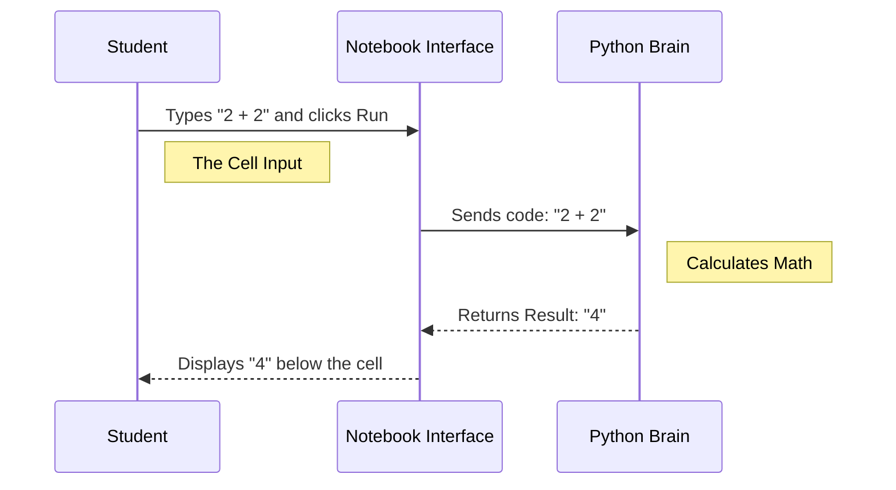

# Chapter 4: notebook.ipynb

Welcome to the fourth chapter! In the previous chapter, [1-Introduction](03_1_introduction.md), we learned the history, definitions, and fairness concepts of Machine Learning. We set the stage for *what* we want to do.

Now, we need to figure out *where* to do it.

If you have done programming before, you might be used to writing a file called `script.py` and running it all at once. In Data Science, we do things differently. We use a special file format called **`notebook.ipynb`**.

## Motivation: The Digital Lab Journal

Imagine you are a scientist in a chemistry lab.
*   **The Goal:** Mix chemicals to create a reaction.
*   **The Old Way:** You mix everything at once, wait an hour, and if it explodes, you have to start all over again from scratch.
*   **The Problem:** You can't "pause" and check if the mixture looks right halfway through.

In Machine Learning, training a model can take a long time. We don't want to run the whole script every time we change one line of code.

**The Solution:** The Jupyter Notebook (`.ipynb`).

This file acts like a **Lab Journal**. It allows you to:
1.  Write a small piece of code.
2.  Run just that piece.
3.  See the result immediately.
4.  Write some notes explaining what happened.
5.  Keep the variables in memory for the next step.

## Key Concepts: Cells

The notebook is built around one simple concept: **The Cell**.

Instead of one long page of text, a notebook is a list of boxes. There are two main types of boxes:

1.  **Code Cells:** Where you write Python.
2.  **Markdown Cells:** Where you write text (like this tutorial!).

### Use Case: "Taste Testing" your Data

Let's say you are loading a dataset of 1,000 dog photos.
*   **Step 1:** Load the photos.
*   **Step 2:** Check if the first photo is actually a dog.

In a standard script, you'd run both steps at once. In a notebook, you run Step 1, wait for it to finish, and then look at the data before moving to Step 2.

## How to Use This Abstraction

To use a notebook, you need a program like VS Code or Jupyter Lab.

### 1. Writing Code
You type your Python code into a cell.

```python
# A simple Code Cell
name = "Robot Intern"
print(f"Hello, {name}!")
```

**Output:**
```text
Hello, Robot Intern!
```

**Explanation:**
When you press the "Play" button (or Shift+Enter), the computer runs *only* these two lines.

### 2. Remembering the Past (State)
This is the magic part. Because we ran the cell above, the computer now *remembers* who `name` is. We can use it in a new cell without typing it again.

```python
# A new cell, later in the notebook
# We don't need to define 'name' again!
print(f"{name} is ready to learn.")
```

**Output:**
```text
Robot Intern is ready to learn.
```

**Explanation:**
The notebook keeps a "State" (memory) alive as long as the kernel (the brain) is running. This allows us to work step-by-step.

## The Internal Structure: Under the Hood

How does a web page (the notebook) talk to Python?

When you run a cell, your browser sends the text to a background process called a **Kernel**. The Kernel executes it and sends the answer back.



### Deep Dive: It's just JSON!

The file extension is `.ipynb`, which stands for **I**nteractive **Py**thon **N**ote**b**ook.

If you try to open this file in a regular text editor (like Notepad), you won't see a pretty interface. You will see raw text formatted as **JSON** (JavaScript Object Notation).

Here is what the actual file looks like inside:

```json
{
 "cells": [
  {
   "cell_type": "code",
   "source": [
    "print('Hello World')"
   ],
   "outputs": [
    {
     "output_type": "stream",
     "text": [
      "Hello World\n"
     ]
    }
   ]
  }
 ]
}
```

**Explanation:**
1.  **`"cells"`**: A list of all the boxes in your notebook.
2.  **`"source"`**: The code you wrote (`print...`).
3.  **`"outputs"`**: The result the computer gave back (`Hello World`).

**Why does this matter?**
Because the *output* is saved inside the file! If you send your `.ipynb` file to a friend, they can see your graphs and results without even running the code. It is a portable report.

## Why this matters for Beginners

Starting with `notebook.ipynb` removes the fear of breaking things.

1.  **Immediate Feedback:** You know instantly if your code works.
2.  **Storytelling:** You can write notes to your future self explaining *why* you wrote that code.
3.  **Visualization:** In the next chapters, we will draw graphs. Notebooks display these graphs right inside the file, which isn't possible with standard code files.

## Conclusion

In this chapter, we learned that `notebook.ipynb` is our interactive canvas. It allows us to mix Code, Text, and Results into one document.

*   **Input:** Code in cells.
*   **Process:** The Kernel runs one cell at a time.
*   **Output:** Immediate results saved inside the file.

Now that we have our digital lab journal ready, it helps to understand concepts visually before we code them. Sometimes, a drawing is worth a thousand lines of code.

[Next Chapter: sketchnotes](05_sketchnotes.md)

---

Generated by [Code IQ](https://github.com/adityasoni99/Code-IQ)