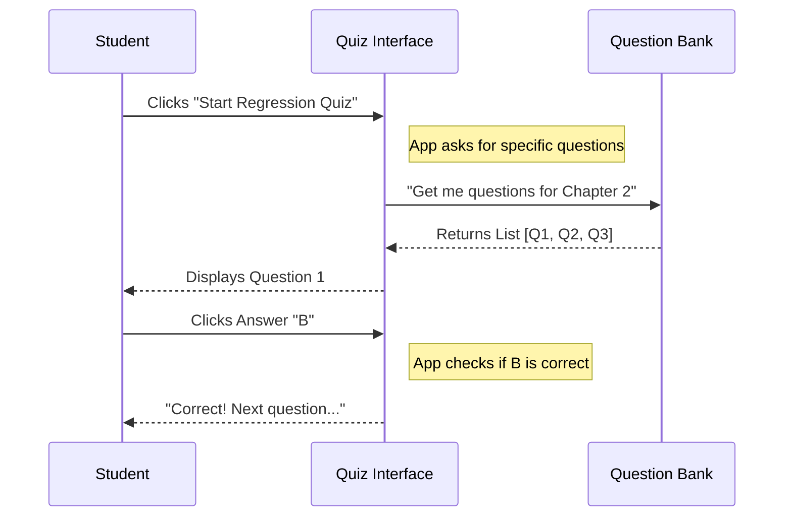

# Chapter 6: quiz-app

Welcome to the sixth chapter! In the previous chapter, [sketchnotes](05_sketchnotes.md), we explored how to use visual drawings to understand complex concepts. We learned that pictures help build a mental map before we write code.

But how do you know if your mental map is actually *correct*?

You might think you understand how a "Neural Network" works by looking at a drawing, but until you are tested, you can't be sure. This brings us to the **`quiz-app`** directory.

## Motivation: The Self-Check

Imagine you are studying for a driver's license.
*   **The Goal:** Drive a car safely.
*   **The Method:** You read the manual (Introduction) and look at diagrams of road signs (Sketchnotes).
*   **The Problem:** You feel confident, but you might have misunderstood what a "Yield" sign means. If you get in the car now, you might crash.
*   **The Solution:** You take a practice test.

In `ML-For-Beginners`, we don't want you to crash your Python code. The `quiz-app` is a standalone folder containing a website designed to test your knowledge before and after every lesson.

**The Use Case:** Before you start the hard math in the next chapter, you want to verify you understand the basics of Machine Learning history. You open the Quiz App to check your score.

## Key Concept: The Web Application

Unlike the other folders we have seen so far (which contain Python code or images), this folder contains a **Web Application**.

It is built using a technology called **Vue.js**. You don't need to learn Vue.js to learn Machine Learning, but it helps to understand that this folder is a "Machine" that processes your answers.

### 1. The Engine (Vue.js)
Think of this as the robot that runs the game show. It handles the logic:
*   Displaying the question.
*   Detecting which button you clicked.
*   Calculating your score.

### 2. The Fuel (JSON Data)
The robot needs questions to ask. The questions are not "hard-coded" into the robot's brain; they are stored in separate text files called JSON files. This means we can add new quizzes without rebuilding the robot.

## How to Use This Abstraction

Technically, this directory is a software project on its own. If you are just *taking* the course, you usually visit the live website. However, if you are a developer, you can run this quiz locally on your computer.

To "use" this directory, you treat it like a mini-website server.

### Example: Running the Quiz Locally
(Note: You need Node.js installed for this, which is different from Python).

```bash
# 1. Enter the quiz folder
cd quiz-app

# 2. Install the robot's parts (dependencies)
npm install

# 3. Turn the robot on
npm run serve
```

**Output:**
```text
  App running at:
  - Local:   http://localhost:8080/ 
```

**Explanation:**
1.  We go into the folder.
2.  `npm install` downloads the tools needed to build the website.
3.  `npm run serve` starts a local web server. You can now open your web browser to that address and play the quiz!

## The Internal Structure: Under the Hood

What happens when you click "Start Quiz"? Let's look at the flow of information between you and the application.



### Breakdown of the Flow
1.  **Selection:** You choose a topic.
2.  **Fetching:** The App looks into its data folder to find the text for that topic.
3.  **Interaction:** You interact with the buttons.
4.  **Feedback:** The App immediately tells you if you are right or wrong.

## Deep Dive: The Data Structure

As a Machine Learning student, the most interesting part of this folder is **how the data is stored**.

In Machine Learning, we love data. The `quiz-app` stores questions in a format called JSON. It looks very similar to a Python dictionary.

Here is a simplified example of what a question file looks like inside the `quiz-app` data folder:

```json
{
  "questionText": "What acts as a 'Lab Journal' for code?",
  "answerOptions": [
    { "answerText": "A script.py file", "isCorrect": false },
    { "answerText": "A notebook.ipynb file", "isCorrect": true },
    { "answerText": "Microsoft Excel", "isCorrect": false }
  ]
}
```

**Explanation:**
1.  **`questionText`**: The string the user reads.
2.  **`answerOptions`**: A list of possible buttons the user can click.
3.  **`isCorrect`**: A simple boolean (`true`/`false`) flag.

**Why is this cool?**
Because the logic is separated from the data! If we wanted to translate the quiz into Spanish, or fix a typo, we don't touch the complex code. We just edit this simple text file. This is a principle we will use in Machine Learning too: **Keep your Data separate from your Model.**

## Why this matters for Beginners

You might ask, "I am here to learn Python, why do I care about a Vue.js web app?"

1.  **Active Recall:** Reading code is passive. Answering a quiz forces your brain to retrieve information, which strengthens your memory.
2.  **Confidence:** Passing the quiz gives you the green light to move to the next chapter.
3.  **Project Structure:** It shows you that a real-world project involves more than just data scripts—it often involves a user interface (UI) to interact with that data.

## Conclusion

In this chapter, we explored the `quiz-app`. We learned that:
*   **What:** It is a directory containing a website engine (Vue.js) and question data (JSON).
*   **Why:** It provides a mechanism to test our knowledge actively.
*   **How:** It works by loading question data and checking our inputs against the "correct" flags.

We have now finished setting up our entire ecosystem. We have our rules, our environment, our notebooks, our visual aids, and our testing tool.

We are finally ready. No more setup. No more history. It is time to predict the future with numbers.

[Next Chapter: 2-Regression](07_2_regression.md)

---

Generated by [Code IQ](https://github.com/adityasoni99/Code-IQ)