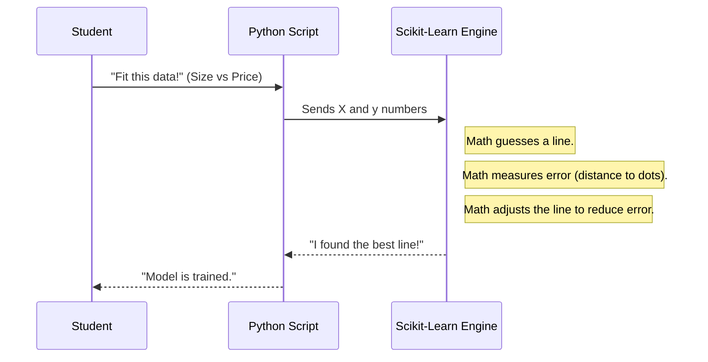

# Chapter 7: 2-Regression

Welcome to Chapter 7! In the previous chapter, [quiz-app](06_quiz_app.md), we built a tool to test our knowledge. We ensured our brains were ready.

Now, we are finally ready to do **Real Machine Learning**.

Up until now, we have been setting up our environment, installing tools, and learning history. In this chapter, we open the folder **`2-Regression`** to write our first true AI model.

## Motivation: The Digital Crystal Ball

Imagine you are a pumpkin farmer.
*   **The Goal:** You want to know how much your pumpkins will sell for next month so you can plan your budget.
*   **The Problem:** You can't see the future.
*   **The Solution:** You look at your sales notebooks from the last 10 years. You notice a pattern: *As pumpkins get bigger, the price goes up.*

**Regression** is the fancy word for "finding the relationship between things."
*   If we know the **Size** (Input), can we predict the **Price** (Output)?

The `2-Regression` directory contains the code that turns your historical data into a mathematical "Crystal Ball" that can predict numbers.

## Key Concepts: The Line of Best Fit

Inside this folder, we aren't writing magic spells; we are drawing lines.

### 1. The Data (X and y)
In Regression, we usually talk about two variables:
*   **`X` (Feature):** The thing we know (e.g., Pumpkin Size).
*   **`y` (Label):** The thing we want to predict (e.g., Price).

### 2. The Model
Imagine taking a piece of spaghetti and throwing it onto a graph of your data.
*   If the spaghetti touches all the dots perfectly, that's a perfect model.
*   Usually, the dots are messy. The computer uses math to wiggle the spaghetti until it is as close to all the dots as possible. This is called **Fitting the Model**.

### 3. Prediction
Once the spaghetti (the line) is glued down, we can pick a new size on the graph, look at where the line is, and guess the price.

## How to Use This Abstraction

The `2-Regression` folder is a collection of Notebooks (remember [notebook.ipynb](04_notebook_ipynb.md)?).

To "use" this folder, you open the notebooks and run the code cells. Let's look at the core workflow used in this chapter.

### Step 1: Loading the History
First, we need to load our "Pumpkin Sales Ledger" (a CSV file) into Python using a library called **Pandas**.

```python
import pandas as pd

# Load the data file from the folder
pumpkins = pd.read_csv('../data/US-pumpkins.csv')

# Show the first 5 rows so we can check it
# This is like opening the ledger book
print(pumpkins.head())
```

**What happens:**
You see a table of data appear on your screen. You can check if the columns "City", "Price", and "Size" exist.

### Step 2: The Machine Learning
This is the moment we have been waiting for. We use **Scikit-learn** to train the robot.

```python
from sklearn.linear_model import LinearRegression

# 1. Create the empty robot brain
model = LinearRegression()

# 2. Train the robot (Fit the line to the data)
# X = Size, y = Price
model.fit(X_train, y_train)

# 3. Ask the robot a question
prediction = model.predict([[450]]) # Size 450
print(f"Predicted Price: ${prediction[0]}")
```

**Output:**
```text
Predicted Price: $8.50
```

**Explanation:**
1.  **`LinearRegression()`**: We create a new, empty model. It knows nothing.
2.  **`fit()`**: We force the model to look at our training data. It adjusts its internal math to find the "Line of Best Fit."
3.  **`predict()`**: Now that it has learned, we ask: "How much is a size 450 pumpkin?" It calculates the answer based on the line it drew.

## The Internal Structure: Under the Hood

What actually happens when we type `model.fit()`? Does the computer actually draw a line?

Mathematically, yes. It calculates a slope (how steep the line is) and an intercept (where the line starts).



### Deep Dive: Testing the Student

In the `2-Regression` lessons, you will learn a critical concept: **Splitting**.

If we show the robot *all* the answers, it might just memorize them (cheating). To prevent this, we hide some data.

1.  **Training Set (80%):** The data the robot studies.
2.  **Test Set (20%):** The exam questions we hide to see if the robot actually learned.

```python
from sklearn.model_selection import train_test_split

# Split our data into two piles: Study Material and Exam Questions
X_train, X_test, y_train, y_test = train_test_split(X, y, test_size=0.2)

# Train ONLY on the Study Material
model.fit(X_train, y_train)

# Test on the Exam Questions
score = model.score(X_test, y_test)
print(f"Accuracy Score: {score}")
```

**Explanation:**
*   **`train_test_split`**: Randomly shuffles our pumpkin data and cuts it into two piles.
*   **`fit(X_train...)`**: The robot only sees the study pile.
*   **`score(X_test...)`**: We see how well the robot predicts prices for pumpkins it has *never seen before*.

## Why this matters for Beginners

You might be thinking, *"Why don't I just use Excel?"*

1.  **Scale:** Excel crashes with millions of rows. Python Regression handles it easily.
2.  **Automation:** Once you write this script, you can run it every day automatically to predict stock prices, weather, or sales.
3.  **Foundation:** Regression is the "Hello World" of AI. If you understand how to fit a line to data, you understand the core principle behind even the most complex Deep Learning models (like ChatGPT). They are just much, much more complex regressions!

## Conclusion

In this chapter, we explored `2-Regression`. We learned that:
*   **Input:** Historical data (Pumpkin sizes and prices).
*   **Process:** The computer draws a "Line of Best Fit" through the data.
*   **Output:** A predicted number (Price) for the future.

We now have a working mathematical brain in our notebook. But right now, only *we* can use it. How do we share this prediction tool with the rest of the world?

We need to build a website around it.

[Next Chapter: 3-Web-App](08_3_web_app.md)

---

Generated by [Code IQ](https://github.com/adityasoni99/Code-IQ)