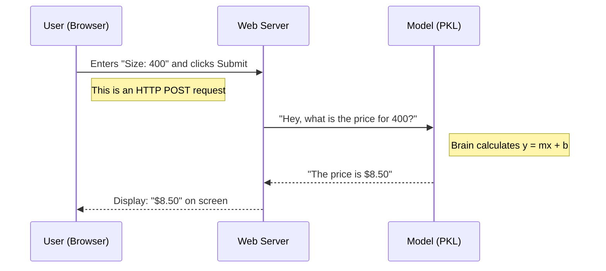

# Chapter 8: 3-Web-App

Welcome to Chapter 8! In the previous chapter, [2-Regression](07_2_regression.md), we successfully built a Machine Learning model. We taught a computer how to predict the price of a pumpkin based on its size.

But we have a problem.

Right now, our "Robot Brain" only lives inside a Jupyter Notebook ([notebook.ipynb](04_notebook_ipynb.md)). If a pumpkin farmer wants to use your prediction tool, they have to install Python, install Scikit-learn, open the notebook, and run code cells. That is not very user-friendly!

This brings us to the **`3-Web-App`** directory.

## Motivation: The Pumpkin Dashboard

Imagine you are the farmer in the field.
*   **The Goal:** You find a huge pumpkin. You want to know immediately: *"How much can I sell this for?"*
*   **The Problem:** You only have your smartphone. You can't run Python code on your phone.
*   **The Solution:** A website. You type the size into a box, click "Predict," and the website tells you the price.

This directory contains a **Flask Web Application**. It takes the math we learned in the previous chapter and wraps it in a website that anyone can use.

## Key Concepts: The Three Layers

To turn a math equation into a website, we need three layers working together.

### 1. The Saved Brain (`model.pkl`)
When we trained our model in the notebook, it learned a pattern. If we close the notebook, the model forgets everything.
We need to **Save** (or "serialize") the model into a file so we can open it later. In Python, this process is often called **Pickling**.
*   *Analogy:* It’s like freeze-drying a meal. You prepare it once, pack it up, and then "rehydrate" it when you are hungry later.

### 2. The Server (`app.py`)
This is the manager of the website. It waits for users to visit, takes their input (Pumpkin Size), and asks the Saved Brain for an answer. We use a tool called **Flask** for this.

### 3. The Interface (`index.html`)
This is what the farmer sees. It uses HTML to draw the text boxes and buttons on the screen.

## How to Use This Abstraction

To use this folder, you generally follow a two-step process: **Save** the model, then **Run** the server.

### Step 1: "Pickle" the Model
First, we go back to our code from [2-Regression](07_2_regression.md). We add a few lines to save our hard work into a file called `model.pkl`.

```python
import pickle

# Imagine 'model' is the robot we just trained
# We open a file named 'model.pkl' in write-binary (wb) mode
with open("model.pkl", "wb") as f:
    pickle.dump(model, f)

print("Robot brain saved successfully!")
```

**Output:**
A new file named `model.pkl` appears in your folder. This file contains the "intelligence" of your model.

### Step 2: Unpack the Model in the Web App
Now, inside our website code (`app.py`), we load that file back into memory.

```python
import pickle

# We open the file in read-binary (rb) mode
with open("model.pkl", "rb") as f:
    model = pickle.load(f)

# Now 'model' is ready to predict again!
print("Robot brain loaded and ready.")
```

**Explanation:**
The website starts up, reads the `.pkl` file, and suddenly knows everything the notebook knew about pumpkins.

## The Internal Structure: Under the Hood

How does a click on a website turn into a Python prediction? Let's visualize the flow of data.



### Deep Dive: The Flask Application

The core of this directory is the file `app.py`. This file uses **Flask**, a lightweight web framework for Python.

Here is a simplified version of what the code looks like inside:

```python
from flask import Flask, render_template, request
import pickle

app = Flask(__name__)
model = pickle.load(open('model.pkl', 'rb'))

@app.route("/predict", methods=['POST'])
def predict():
    # 1. Get the size from the website form
    size = int(request.form['size'])
    
    # 2. Ask the model for the price
    prediction = model.predict([[size]])
    
    # 3. Send the result back to the user
    return render_template('index.html', result=prediction[0])
```

**Explanation:**
1.  **`@app.route`**: This tells the server, "When someone clicks the Predict button, run this function."
2.  **`request.form['size']`**: We grab the number the farmer typed into the box.
3.  **`model.predict`**: We use our loaded robot brain to do the math.
4.  **`render_template`**: We update the website HTML to show the dollar amount.

## Why this matters for Beginners

You might think, *"I am a Data Scientist, not a Web Developer!"*

However, a model that stays in a notebook is useless to the real world.
1.  **Usability:** Your boss, your clients, or your grandma probably don't know how to run a Jupyter Notebook. They *do* know how to use a web browser.
2.  **Integration:** This is how real apps work. When Netflix suggests a movie, a web app is sending your watch history to a model and getting a prediction back.
3.  **Portfolio:** Showing a hiring manager a working website is much more impressive than showing them a code file.

## Conclusion

In this chapter, we explored `3-Web-App`. We learned that:
*   **Pickling:** We can freeze our trained models into files (`.pkl`) to move them around.
*   **Flask:** We use a web server to accept user inputs.
*   **Deployment:** We connect the user interface to the model to solve real-world problems.

Now that we have mastered predicting *numbers* (Regression) and building apps for them, it's time to learn a new type of Machine Learning. What if we don't want to predict a price, but instead want to predict a *category* (like "Cat" or "Dog")?

[Next Chapter: 4-Classification](09_4_classification.md)

---

Generated by [Code IQ](https://github.com/adityasoni99/Code-IQ)