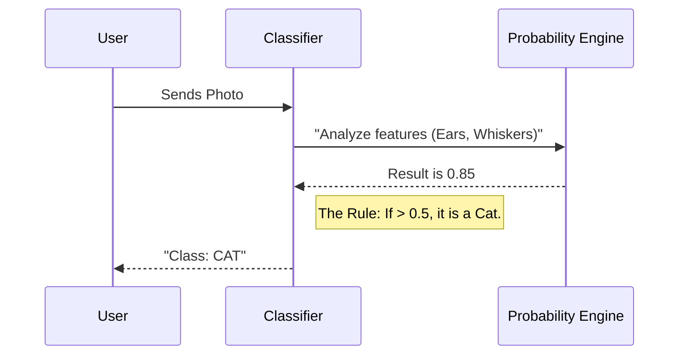

# Chapter 9: 4-Classification

Welcome to Chapter 9! In the previous chapter, [3-Web-App](08_3_web_app.md), we took our regression model and put it on the web. We learned to predict **numbers**, like the price of a pumpkin.

But not every question in life has a number for an answer.

Sometimes, we don't want to know "How much?"; we want to know "**Which one?**"
*   Is this email **Spam** or **Not Spam**?
*   Is this photo a **Cat** or a **Dog**?
*   Is this cuisine **Japanese** or **Indian**?

This brings us to the folder **`4-Classification`**.

## Motivation: The Robotic Chef

Imagine you are building a robot helper for a kitchen.
*   **The Goal:** The robot looks at a pile of ingredients on the counter and guesses what kind of dinner you are cooking.
*   **The Clues (Features):** Soy sauce, ginger, garlic, and rice.
*   **The Problem:** If you use the Regression tool from the last chapter, it might output a number like `3.5`. That doesn't make sense! You want a label, like "Asian Cuisine."

**Classification** is the process of sorting data into distinct groups or "Classes."
The `4-Classification` directory contains the lessons that teach our robot how to sort the world into categories.

## Key Concepts: Drawing Lines

While Regression was about fitting a line *through* data points to find a trend, Classification is about drawing a line *between* data points to separate them.

### 1. The Classes (Labels)
These are the buckets we want to put our data into.
*   **Binary Classification:** Only two buckets (e.g., Yes/No, Spam/Ham).
*   **Multiclass Classification:** More than two buckets (e.g., Indian, Thai, Japanese, Chinese).

### 2. Logistic Regression (The Confusing Name)
Inside this folder, you will often use a tool called **Logistic Regression**.
*   *Wait, didn't we just do Regression?*
*   Yes, the name is confusing! Even though it says "Regression," it is used for **Classification**.
*   Instead of predicting a raw number (like price), it predicts a **Probability** (a percentage).
    *   "There is a 95% chance this is a Cat." -> Therefore, classify as **Cat**.

## How to Use This Abstraction

To use this folder, you will likely be working in a notebook (remember [notebook.ipynb](04_notebook_ipynb.md)). We will use **Scikit-learn** again, but with a different algorithm.

### Step 1: Prepare the Ingredients
Let's imagine we have a dataset of recipes. We want to predict the `Cuisine`.

```python
import pandas as pd
from sklearn.linear_model import LogisticRegression

# 1. Load our recipe book
data = pd.read_csv("cuisines.csv")

# 2. Separate Clues (Ingredients) from Answers (Cuisine)
X = data[['rice', 'soy_sauce', 'ginger', 'curry_powder']]
y = data['cuisine'] # This contains labels like "Japanese", "Indian"
```

**Explanation:**
We split our spreadsheet. `X` is what the robot sees (ingredients). `y` is what we want the robot to guess (cuisine type).

### Step 2: Train the Classifier
Now we teach the robot to recognize patterns.

```python
# Create the classifier robot
classifier = LogisticRegression()

# Train the robot on our data
classifier.fit(X, y)

print("Robot is trained to sort food!")
```

**Explanation:**
Just like in the Regression chapter, we use `.fit()`. The robot looks at thousands of recipes and learns: *"Hey, every time I see Curry Powder, it is usually Indian food."*

### Step 3: Classify a New Meal
Now for the magic moment. We give the robot a mystery box of ingredients.

```python
# New ingredients: Rice (1), Soy Sauce (1), Ginger (1), Curry (0)
mystery_meal = [[1, 1, 1, 0]]

# Ask the robot to classify
prediction = classifier.predict(mystery_meal)

print(f"I think this dinner is: {prediction[0]}")
```

**Output:**
```text
I think this dinner is: Japanese
```

**Explanation:**
The robot looked at the inputs, calculated the probability for every cuisine it knows, and picked the one with the highest score.

## The Internal Structure: Under the Hood

How does the computer actually decide? It uses a "Threshold."

Imagine the computer calculates a score between 0 and 1.
*   0 = Definitely a Dog.
*   1 = Definitely a Cat.



### Deep Dive: The Confusion Matrix

In Regression, we measured error by "distance" (how far off was the price?). In Classification, that doesn't work. Being "a little bit Japanese" isn't a useful error metric.

Instead, we use a **Confusion Matrix**. This is a table that shows us exactly where the robot got confused.

Inside the `4-Classification` lessons, you will write code to visualize this:

```python
from sklearn.metrics import confusion_matrix

# Let the robot take a test exam
y_pred = classifier.predict(X_test)

# Compare the Robot's answers (y_pred) vs Real answers (y_test)
matrix = confusion_matrix(y_test, y_pred)
print(matrix)
```

**What this tells us:**
It might show that the robot is perfect at identifying **Italian** food, but it keeps confusing **Chinese** food with **Thai** food. This helps us understand *how* to fix the robot (maybe we need to feed it more data about basil vs. cilantro).

## Why this matters for Beginners

Classification is arguably the most common use of AI in the real world today.

1.  **Safety:** Banks use it to classify transactions as "Normal" or "Fraud."
2.  **Health:** Doctors use it to classify tumors as "Benign" or "Malignant."
3.  **Organization:** Your email provider uses it to classify "Inbox" or "Junk."

Understanding how to group data into buckets is a superpower.

## Conclusion

In this chapter, we explored `4-Classification`. We learned that:
*   **What:** It is the process of predicting a Category (Label), not a Number.
*   **How:** We use algorithms like Logistic Regression to draw boundaries between groups of data.
*   **Measurement:** We check accuracy by seeing how often the robot puts items in the correct bucket.

Now we can predict numbers (Regression) and predict labels (Classification). But in both cases, we gave the robot the answers to study first (Labeled Data).

What happens if we have a pile of data with **no labels** and no answers? Can the robot teach itself to find patterns?

[Next Chapter: 5-Clustering](10_5_clustering.md)

---

Generated by [Code IQ](https://github.com/adityasoni99/Code-IQ)