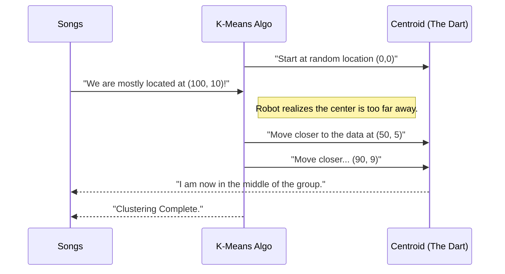

# Chapter 10: 5-Clustering

Welcome to Chapter 10! In the previous chapter, [4-Classification](09_4_classification.md), we taught a robot how to sort data into specific buckets (like "Cat" or "Dog"). To do that, we had to show the robot thousands of examples that were already labeled.

But what if we have a huge pile of data with **no labels**?

What if we have a list of music listeners, but we don't know what "Genre" they like? We just know what songs they played. Can the robot organize this messy pile for us without a teacher?

This brings us to the folder **`5-Clustering`**.

## Motivation: The Music Playlist

Imagine you run a music streaming service.
*   **The Goal:** You want to create 3 new playlists: "Energetic," "Calm," and "Jazz."
*   **The Data:** You have 1,000 songs. You know their **Tempo** (speed) and **Loudness**.
*   **The Problem:** You don't have time to listen to all 1,000 songs to label them.
*   **The Solution:** Clustering.

**Clustering** is a type of Machine Learning where the robot looks at the data and says, *"Hey, these points look like they belong together."*

It groups similar items into "blobs" or **Clusters**.

## Key Concepts: Unsupervised Learning

In Classification (Chapter 9), we used **Supervised Learning** (we acted as the teacher).
In Clustering, we use **Unsupervised Learning**.

### 1. K-Means
This is the most popular algorithm in this folder.
*   **"K"**: The number of groups you want (e.g., 3 playlists).
*   **"Means"**: The center point of the group (the average).

### 2. Centroids
Imagine throwing a dart at a map. That dart is a **Centroid**. The algorithm moves this dart around until it sits perfectly in the middle of a group of data points.

## How to Use This Abstraction

To use this folder, we use **Scikit-learn** inside a notebook (remember [notebook.ipynb](04_notebook_ipynb.md)?).

### Step 1: Create Dummy Data
Let's pretend we have 6 songs. The first number is Speed (BPM), the second is Loudness.

```python
import pandas as pd

# Data: [Speed, Loudness]
songs = [
    [120, 10], [125, 9], [130, 8],  # Fast & Loud (Techno?)
    [60, 2], [65, 3], [55, 1]       # Slow & Quiet (Lullabies?)
]

# Create a DataFrame for easier viewing
df = pd.read_csv(songs, columns=['Speed', 'Loudness'])
print("Music Data Ready!")
```

**Explanation:**
We created a small list. To a human eye, there are clearly two groups here: the "120s" and the "60s". Let's see if the robot sees it too.

### Step 2: The Clustering Robot
We will use `KMeans`. We have to tell it how many groups we want (`n_clusters`).

```python
from sklearn.cluster import KMeans

# 1. Initialize the robot
# We ask for 2 groups (clusters)
kmeans = KMeans(n_clusters=2)

# 2. Train the robot on our songs
kmeans.fit(songs)

# 3. Get the labels
print(kmeans.labels_)
```

**Output:**
```text
[0 0 0 1 1 1]
```

**Explanation:**
The robot looked at the data.
*   It gave the first three songs the label `0`.
*   It gave the last three songs the label `1`.
*   It successfully separated the Techno from the Lullabies without knowing what "Techno" is!

### Step 3: Predicting a New Song
Now we have a new song. Is it Techno or a Lullaby?

```python
# New Song: Speed 128, Loudness 9
new_song = [[128, 9]]

# Ask the robot which group it belongs to
prediction = kmeans.predict(new_song)

print(f"This song belongs to Group: {prediction[0]}")
```

**Output:**
```text
This song belongs to Group: 0
```

**Explanation:**
Since Group `0` was our fast/loud group, the robot correctly assigned the new song to that playlist.

## The Internal Structure: Under the Hood

How does `KMeans` figure this out? It uses a process of "Guess and Check."

1.  It picks 2 random spots on the chart.
2.  It asks every song: "Which spot are you closer to?"
3.  It moves the spots to be closer to their new friends.
4.  It repeats this until the spots stop moving.



### Deep Dive: The Elbow Method

One of the hardest parts of clustering is picking **K**.
*   Should we have 2 playlists? 3? 10?

In the `5-Clustering` lessons, you will learn a technique called the **Elbow Method**. You run the robot multiple times with different K values and measure how "messy" the groups are (this is called **Inertia**).

```python
import matplotlib.pyplot as plt

inertia_list = []

# Try different numbers of clusters (from 1 to 10)
for i in range(1, 11):
    km = KMeans(n_clusters=i)
    km.fit(songs)
    inertia_list.append(km.inertia_)

# We would plot this list to find the "Elbow"
print("Inertia calculated for all K values.")
```

**Explanation:**
*   **Inertia:** A score of how far the songs are from their group center. Lower is better.
*   **The Elbow:** When you plot this, the line goes down quickly and then flattens out. The point where it bends (the elbow) is usually the perfect number of clusters.

## Why this matters for Beginners

Clustering is powerful because data is expensive to label.
*   **Marketing:** You have 1 million customers. You can cluster them into "Big Spenders," "Window Shoppers," and "New Users" automatically.
*   **Biology:** Grouping plants or animals based on genetic traits.
*   **Anomalies:** If a credit card transaction doesn't fit into any of your usual clusters, it might be fraud!

## Conclusion

In this chapter, we explored `5-Clustering`. We learned that:
*   **Unsupervised Learning:** We don't need labels to learn.
*   **K-Means:** The most common way to find groups in data.
*   **Usage:** We can organize messy data into clean groups automatically.

We have covered numbers (Regression), categories (Classification), and groups (Clustering). But humans don't just communicate in numbers; we communicate in words.

How do we teach a computer to read a book or understand a sentence?

[Next Chapter: 6-NLP](11_6_nlp.md)

---

Generated by [Code IQ](https://github.com/adityasoni99/Code-IQ)