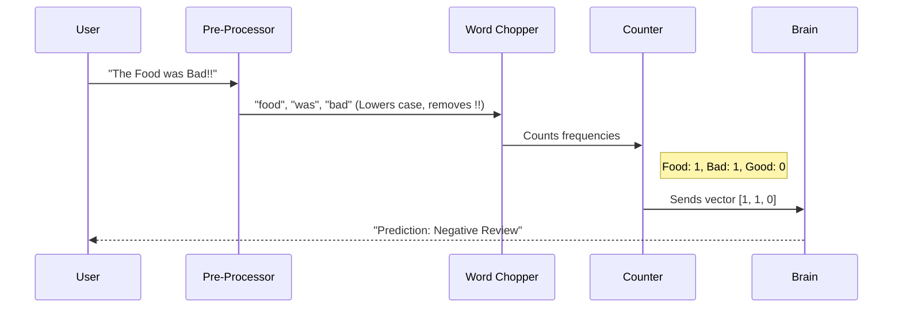

# Chapter 11: 6-NLP

Welcome to Chapter 11! In the previous chapter, [5-Clustering](10_5_clustering.md), we learned how to group similar data points together even if we didn't know what they were.

We have now mastered numbers. We can predict prices (Regression) and sort categories (Classification). But there is one type of data that humans generate more than anything else, and it is very messy for computers: **Language**.

Computers speak in `1`s and `0`s. Humans speak in words, slang, sarcasm, and emojis. How do we bridge this gap?

This brings us to the folder **`6-NLP`** (Natural Language Processing).

## Motivation: The Hotel Reviewer

Imagine you own a hotel.
*   **The Goal:** You want to know if your guests are happy.
*   **The Data:** You have 10,000 reviews written in a guest book.
    *   *"The bed was soft but the coffee was cold."*
    *   *"Best stay ever!!!"*
    *   *"I hated the noise."*
*   **The Problem:** You cannot read 10,000 reviews yourself. It would take weeks.
*   **The Solution:** NLP. You teach the computer to read the text and decide if the emotion is **Positive** or **Negative**.

**Natural Language Processing (NLP)** is the branch of AI that gives computers the ability to understand text and spoken words in much the same way human beings can.

## Key Concepts: Words to Numbers

A computer cannot do math on the word "Cat." It needs to turn that word into a number first.

### 1. Tokenization (Chopping)
Imagine a sentence is a Lego castle. To understand it, we first smash it apart into individual bricks.
*   **Sentence:** "I love coding."
*   **Tokens:** `["I"]`, `["love"]`, `["coding"]`, `["."]`.

### 2. Stop Words (Cleaning)
Some words are like filler in a sandwich. Words like "the", "is", "and", or "a" appear everywhere but don't carry much meaning. We usually throw these away to save space.

### 3. Bag of Words (Counting)
This is the magic trick. We don't try to teach the computer grammar. Instead, we just count how many times a word appears.
*   If the word "Good" appears 5 times, the review is probably positive.
*   If the word "Bad" appears 5 times, the review is probably negative.

## How to Use This Abstraction

In this chapter, we will use our trusty toolkit **Scikit-learn** to turn text into numbers. This process is called **Vectorization**.

### Step 1: The Raw Text
Let's pretend we have three short reviews.

```python
# Our dataset of reviews
reviews = [
    "I love this hotel",
    "I hate this hotel",
    "The hotel is okay"
]
```

**Explanation:**
This is a simple list of strings. Computers can't analyze this yet.

### Step 2: The Vocabulary Builder
We use a tool called `CountVectorizer`. It looks at all the reviews and builds a dictionary of every unique word it sees.

```python
from sklearn.feature_extraction.text import CountVectorizer

# 1. Create the tool
vectorizer = CountVectorizer()

# 2. Teach the tool our vocabulary
vectorizer.fit(reviews)

# 3. Print the dictionary it learned
print(vectorizer.vocabulary_)
```

**Output:**
```text
{'love': 2, 'this': 5, 'hotel': 1, 'hate': 0, 'is': 3, 'okay': 4, ...}
```

**Explanation:**
The computer assigned an ID number to every word. "Hate" is word #0. "Hotel" is word #1.

### Step 3: converting Text to Numbers
Now we convert our sentences into "Vectors" (lists of numbers).

```python
# Transform the reviews into numbers
numbers = vectorizer.transform(reviews)

# Show the array (The Matrix)
print(numbers.toarray())
```

**Output:**
```text
[[0 1 1 0 0 1]   <-- "I love this hotel"
 [1 1 0 0 0 1]   <-- "I hate this hotel"
 [0 1 0 1 1 0]]  <-- "The hotel is okay"
```

**Explanation:**
Look closely at the first row `[0 1 1 0 0 1]`.
*   The first `0` means: Does "Hate" appear? No.
*   The second `1` means: Does "Hotel" appear? Yes.
*   The third `1` means: Does "Love" appear? Yes.

We have successfully turned English into Math! Now we can feed these numbers into a classifier (like we learned in [Chapter 9](09_4_classification.md)) to predict if the review is happy or sad.

## The Internal Structure: Under the Hood

How does the machine read? It uses a pipeline.



### Deep Dive: Frequency-Inverse Document Frequency (TF-IDF)

Counting words (Bag of Words) is great, but it has a flaw.
*   If the word "Hotel" appears in *every* review, it isn't very special, is it? It doesn't help us decide if the review is good or bad.

In the `6-NLP` lessons, you will learn about **TF-IDF**. This is a math equation that upgrades our counting.

1.  **TF (Term Frequency):** How often does the word appear in *this* sentence? (High count = Important).
2.  **IDF (Inverse Document Frequency):** How often does the word appear in *all* sentences? (High count = Boring/Common).

```python
from sklearn.feature_extraction.text import TfidfTransformer

# We use the counts from the previous step
tfidf = TfidfTransformer()

# Calculate the new weighted scores
weighted_numbers = tfidf.fit_transform(numbers)

# Print the new math
print(weighted_numbers.toarray())
```

**Explanation:**
Instead of simple `1`s and `0`s, you will now see decimal numbers like `0.54` or `0.21`.
*   The word "Hotel" will get a **low score** because it is everywhere.
*   The word "Hate" will get a **high score** because it is rare and meaningful.

## Why this matters for Beginners

You interact with NLP every single day.

1.  **Spam Filters:** Your email provider reads the subject line. If it sees "Win Money Now," it converts those words to numbers, sees the pattern, and throws it in the Junk folder.
2.  **Voice Assistants:** When you talk to Siri or Alexa, your voice is converted to text, and NLP figures out if you want to "Play Music" or "Turn on Lights."
3.  **Translation:** Google Translate looks at the statistical patterns of how words in English relate to words in Spanish.

## Conclusion

In this chapter, we explored `6-NLP`. We learned that:
*   **Tokenization:** We chop sentences into word-bricks.
*   **Vectorization:** We turn those bricks into arrays of numbers.
*   **Context:** We use math to figure out which words are important (Love/Hate) and which are just noise (The/Is).

Now that we can analyze numbers, categories, groups, and text, we have one final frontier. All of our data so far has been static. But the real world moves and changes over time.

How do we predict the weather for tomorrow or the stock price for next week?

[Next Chapter: 7-TimeSeries](12_7_timeseries.md)

---

Generated by [Code IQ](https://github.com/adityasoni99/Code-IQ)