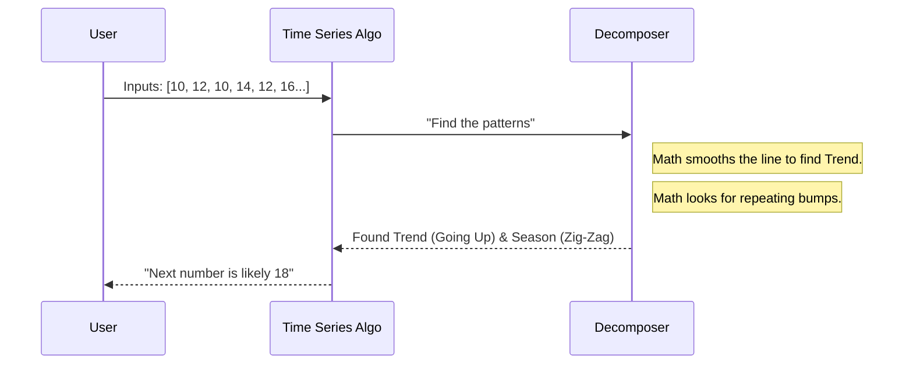

# Chapter 12: 7-TimeSeries

Welcome to Chapter 12! In the previous chapter, [6-NLP](11_6_nlp.md), we learned how to teach computers to read and understand human language. We dealt with words, sentences, and emotions.

But there is one dimension we haven't touched yet: **Time**.

In all our previous lessons, the order of data didn't matter much. A photo of a cat is a photo of a cat, whether you took it yesterday or today. But in the real world, **when** something happens is often just as important as **what** happens.

This brings us to the folder **`7-TimeSeries`**.

## Motivation: The Future Teller

Imagine you are the manager of a local electricity power plant.
*   **The Goal:** You need to decide how much coal to burn tomorrow to generate electricity.
*   **The Problem:** If you burn too little, there is a blackout (bad). If you burn too much, you waste money and pollute the air (also bad).
*   **The Data:** You have a logbook showing exactly how much electricity the city used every day for the last 5 years.

You notice a pattern: *People use more electricity in the Winter (heating) and Summer (AC), but less in the Spring.*

**Time Series Forecasting** is the technique of predicting future events by analyzing the trends of the past. It is the closest thing we have to a mathematical time machine.

## Key Concepts: It's About Order

In [2-Regression](07_2_regression.md), we predicted pumpkin prices based on size. The order didn't matter.
In **Time Series**, the order is everything. Today's temperature depends heavily on yesterday's temperature.

### 1. Trend
This is the general direction of the data over a long period.
*   **Example:** The price of a movie ticket has generally gone **UP** over the last 20 years. That is a positive trend.

### 2. Seasonality
These are patterns that repeat at regular intervals.
*   **Example:** Ice cream sales always spike in **July** and drop in **January**. This happens every single year. This is a seasonal pattern.

### 3. Noise
This is the random messiness that we can't predict.
*   **Example:** A squirrel chews through a power line, causing a sudden drop in electricity usage. This is noise.

## How to Use This Abstraction

To use the `7-TimeSeries` folder, we usually use a library called `statsmodels` alongside our usual `pandas`. The most common tool for beginners is a model called **ARIMA**.

### Step 1: Handling Dates
Computers love numbers, but they often struggle with dates (Is it Day/Month or Month/Day?). We must first teach the computer that our data is a Time Series.

```python
import pandas as pd

# 1. Load the data
df = pd.read_csv('electricity_usage.csv')

# 2. Convert the text column to real Dates
df['Date'] = pd.to_datetime(df['Date'])

# 3. Make the Date the "Index" (the spine of the book)
df.set_index('Date', inplace=True)
print(df.head())
```

**Explanation:**
By setting the index to the Date, we tell Python: *"Don't treat these as row numbers (1, 2, 3). Treat them as timeline points (Jan 1, Jan 2, Jan 3)."*

### Step 2: The ARIMA Model
ARIMA stands for **A**uto**R**egressive **I**ntegrated **M**oving **A**verage. Don't worry about the long name; think of it as a machine that looks at its own past to guess its future.

```python
from statsmodels.tsa.arima.model import ARIMA

# 1. Initialize the Time Machine
# The order=(1,1,1) are settings knobs (p,d,q) we tune later
model = ARIMA(df['Usage'], order=(1,1,1))

# 2. Train the machine on history
model_fit = model.fit()

# 3. Predict the next day's usage
forecast = model_fit.forecast(steps=1)
print(f"Tomorrow's predicted usage: {forecast[0]}")
```

**Output:**
```text
Tomorrow's predicted usage: 450.2 kWh
```

**Explanation:**
1.  **`ARIMA(...)`**: We create the model.
2.  **`fit()`**: The model looks at the "wiggle" of the line in the past.
3.  **`forecast(steps=1)`**: It extends that line by one step into the future.

## The Internal Structure: Under the Hood

How does the computer separate the "Trend" from the "Season"? It uses a process called **Decomposition**.

Imagine you are listening to a song. Your brain separates the **Lyrics** (Trend) from the **Beat** (Seasonality). The computer does the same with data.



### Deep Dive: Stationarity

In the `7-TimeSeries` lessons, you will encounter a difficult concept called **Stationarity**.

Most statistical models (like ARIMA) struggle to predict data if the mean (average) keeps changing.
*   If a stock price goes up $10 every day forever, the average is constantly changing.
*   To fix this, we use **Differencing**.

Instead of predicting the *Price* ($100, $110, $120), we predict the *Change* (+$10, +$10, +$10).
The list `[10, 10, 10]` is flat and easy to predict!

```python
# Create a new column showing only the change from yesterday
# This removes the "Trend" and makes the data stationary
df['stationary_data'] = df['Usage'].diff()

# Look at the first few rows
print(df['stationary_data'].head())
```

**Explanation:**
*   **`.diff()`**: Subtracts today's value from yesterday's value.
*   By training on this "Difference," the model becomes much more accurate.

## Why this matters for Beginners

You might think Time Series is only for Stock Brokers, but it is everywhere.

1.  **Supply Chain:** A grocery store must predict how many bananas to buy so they don't rot on the shelf.
2.  **Web Traffic:** Netflix needs to predict how many people will watch movies on Saturday night so their servers don't crash.
3.  **Health:** Predicting heart rate trends can alert doctors before a patient has a heart attack.

## Conclusion

In this chapter, we explored `7-TimeSeries`. We learned that:
*   **Time Matters:** The order of data points contains the secret to the prediction.
*   **Components:** Data is made of Trends, Seasonality, and Noise.
*   **Forecasting:** We can use models like ARIMA to project these patterns into the future.

We have covered almost every type of static and historical data. But what if we want to build a robot that learns by *doing*? What if we want to train an AI to play a video game, where it fails, tries again, and gets better?

This requires a completely different approach called **Reinforcement Learning**.

[Next Chapter: 8-Reinforcement](13_8_reinforcement.md)

---

Generated by [Code IQ](https://github.com/adityasoni99/Code-IQ)