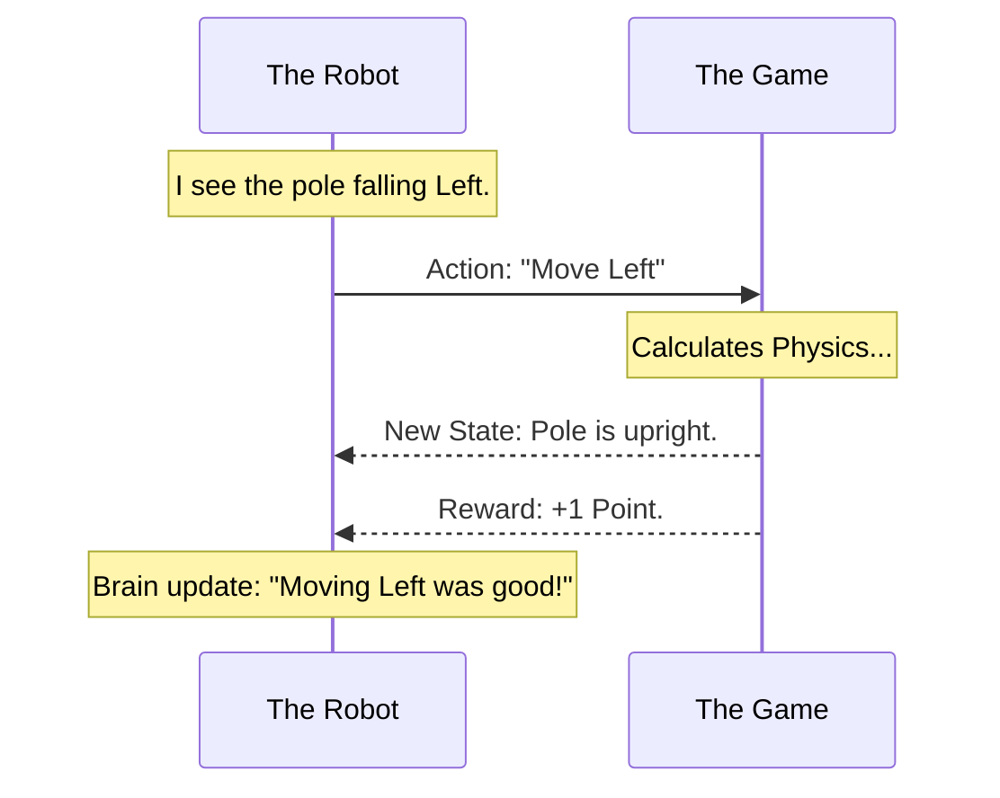

# Chapter 13: 8-Reinforcement

Welcome to Chapter 13! In the previous chapter, [7-TimeSeries](12_7_timeseries.md), we learned how to predict the future by analyzing the history of the past. We looked at static logs of data to guess tomorrow's weather or stock prices.

But what if you aren't just *watching* the world? What if you are *acting* in it?

In the previous chapters, we gave the computer the answers (Labels) to study. But in real life, nobody gives you an answer key. You have to try things, fail, and try again.

This brings us to the folder **`8-Reinforcement`**.

## Motivation: The Video Game Player

Imagine you want to teach a computer to play a video game, like Super Mario Bros.
*   **The Goal:** Reach the flag at the end of the level.
*   **The Problem:** You cannot use a dataset of "correct moves" because every game is slightly different. You can't write `if enemy_is_here then jump` for every pixel on the screen.
*   **The Solution:** Reinforcement Learning.

You let the computer play the game.
*   If it runs into a Goomba, it loses points (Punishment).
*   If it collects a coin, it gains points (Reward).

Over time, the computer figures out: *"Hey, jumping makes my score go up, and running into things makes my score go down."* It learns by **doing**.

## Key Concepts: The Loop

Reinforcement Learning (RL) is different from everything else we have learned. It is a loop of interaction between two things:

### 1. The Agent (The Robot)
This is the learner. It is the entity making decisions.

### 2. The Environment (The World)
This is the game or the maze. It is everything outside the agent.

### 3. The Action
This is what the Agent does (e.g., Move Left, Move Right, Jump).

### 4. The Reward
This is the feedback.
*   **Positive Reward:** Good job! (e.g., +10 points).
*   **Negative Reward:** Bad job! (e.g., -5 points).

## How to Use This Abstraction

To use this folder, we typically use a Python library called **Gymnasium** (formerly Gym). It provides standard "Environments" (games) for our agents to play in.

### Step 1: Setting up the World
Let's pretend we are training a robot to balance a pole on a cart (a classic problem called "CartPole").

```python
import gymnasium as gym

# 1. Create the environment
# "render_mode" lets us see the game on screen
env = gym.make("CartPole-v1", render_mode="human")

# 2. Reset the world to start a new game
# "state" tells us where the pole is right now
state, info = env.reset()

print("Game Started!")
```

**Explanation:**
We don't need to code the physics of gravity or the graphics of the cart. The library handles the "World." We just need to control the "Agent."

### Step 2: Taking a Random Action
Before the robot learns, it knows nothing. It acts like a baby, flailing its arms randomly.

```python
# 1. Pick a random move
# 0 = Push Left, 1 = Push Right
action = env.action_space.sample()

# 2. Tell the environment to perform that move
observation, reward, terminated, truncated, info = env.step(action)

print(f"I took action: {action}")
print(f"I got reward: {reward}")
```

**Output:**
```text
I took action: 1
I got reward: 1.0
```

**Explanation:**
*   **`env.step(action)`**: This is the magic command. We send an action to the game.
*   **`reward`**: The game tells us if that was a good move. In CartPole, you get +1 point for every second the pole stays upright.

### Step 3: The Learning Loop
In a real RL script, we put this inside a loop.

```python
# Play for 1000 steps
for _ in range(1000):
    
    # Take a random action (because we haven't learned yet!)
    action = env.action_space.sample()
    
    # Step forward
    observation, reward, terminated, truncated, info = env.step(action)
    
    # If the pole falls over, restart the game
    if terminated or truncated:
        observation, info = env.reset()
```

**Explanation:**
Right now, the robot is just guessing. To make it *smart*, we need a way for it to remember which actions led to rewards.

## The Internal Structure: Under the Hood

How does the Agent actually learn? It creates a **Policy**.

A Policy is a strategy. It maps a **State** (Situation) to an **Action**.
*   *Situation:* Pole is falling to the left.
*   *Action:* Move cart to the left to catch it.



### Deep Dive: Q-Learning (The Cheat Sheet)

One of the simplest ways to implement this "Brain" is using a technique called **Q-Learning**.

Imagine a giant cheat sheet (a table).
*   **Rows:** Every possible location in the game.
*   **Columns:** Every possible action (Left, Right, Up, Down).

The Agent looks at the table to decide what to do. Initially, the table is empty (all zeros).

```python
import numpy as np

# Create a generic Q-Table with zeros
# Imagine 10 possible states and 2 actions
q_table = np.zeros((10, 2))

# ... After taking an action and getting a reward ...

# Update the Cheat Sheet
# Old Value + Learning Rate * (Reward + Future Guess - Old Value)
# Ideally, we increase the score for that action
q_table[state, action] = new_value
```

**Explanation:**
This code represents the "Memory" update.
1.  The Agent tries an action.
2.  If it gets a Reward, it goes back to the Q-Table cell for that specific State/Action pair.
3.  It increases the number in that cell.
4.  **Next time:** When the Agent is in that State again, it looks at the table, sees the high number, and chooses that action again!

## Why this matters for Beginners

Reinforcement Learning is the frontier of AI. It allows computers to solve problems we don't know the answer to yet.

1.  **Robotics:** You don't program a robot dog to walk by telling it exactly which motor to move every millisecond. You use RL to let it "learn" to walk without falling over.
2.  **Self-Driving Cars:** The car learns to stay in the lane by getting "rewards" for smooth driving and "punishments" for going off-road in simulations.
3.  **Cool Factor:** This is the technology behind AlphaGo (the AI that beat the world champion at Go) and AIs that play Dota 2 or StarCraft.

## Conclusion

In this chapter, we explored `8-Reinforcement`. We learned that:
*   **No Labels:** We don't need a teacher; we just need a game to play.
*   **The Loop:** We Observe -> Act -> Get Reward -> Update Memory.
*   **Trial and Error:** The machine learns by failing thousands of times until it finds a strategy that works.

We have now covered the entire spectrum of Machine Learning! We have set up tools, visualized data, predicted numbers, classified images, grouped music, read text, forecasted time, and taught robots to play games.

So... what now?

How do we take these cool experiments and actually use them in our daily lives or careers?

[Next Chapter: 9-Real-World](14_9_real_world.md)

---

Generated by [Code IQ](https://github.com/adityasoni99/Code-IQ)