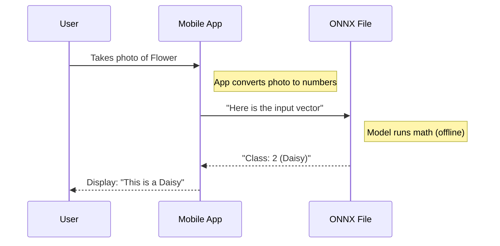

# Chapter 14: 9-Real-World

Welcome to Chapter 14! In the previous chapter, [8-Reinforcement](13_8_reinforcement.md), we reached the cutting edge of AI, teaching computers to learn by trial and error in video games.

We have now covered the "Big Three" of Machine Learning:
1.  **Supervised Learning:** (Regression, Classification) - Teaching with answers.
2.  **Unsupervised Learning:** (Clustering) - Learning without answers.
3.  **Reinforcement Learning:** (Games) - Learning by doing.

But there is one final gap. We have been working in a "Laboratory" (our Notebooks). In the real world, code doesn't live in a notebook; it lives in apps, phones, and websites.

This brings us to the folder **`9-Real-World`**.

## Motivation: Leaving the Lab

Imagine you are a chef.
*   **The Lab (Notebooks):** You are in a cooking school. You have perfectly chopped ingredients, a clean counter, and unlimited time to make one dish.
*   **The Real World:** You are running a busy food truck. The ingredients are messy, customers are yelling orders, and you have to serve food in 30 seconds.

In `ML-For-Beginners`, the `9-Real-World` directory explores what happens when we take our models out of the classroom and put them into production.

**The Use Case:** You want to build an app for a park ranger that identifies flowers.
*   **Problem:** The ranger doesn't have a laptop with Python. They only have a smartphone.
*   **Solution:** We need to take our heavy Python model and make it light, fast, and portable.

## Key Concepts: The Deployment Pipeline

Real-world ML is less about "Math" and more about "Engineering."

### 1. Portability (ONNX)
When we trained models in [2-Regression](07_2_regression.md), we used Python. But many phone apps are written in Java, Swift, or C#.
We need a universal language for models. We often use **ONNX** (Open Neural Network Exchange). Think of it like a **PDF for AI**. You can write a document in Word, save it as PDF, and open it on any device.

### 2. The Edge vs. The Cloud
*   **The Cloud:** You send a photo to a massive server, it thinks, and sends the answer back. (Slow, needs internet).
*   **The Edge:** The model lives *inside* your phone. It thinks instantly. (Fast, works offline).

### 3. Interpretability
In the real world, trust matters. If your AI denies someone a bank loan, you legally have to explain *why*. We use tools to "explain" the model's decision making.

## How to Use This Abstraction

In this chapter, we don't just write code; we "export" code.

### Step 1: Exporting the Brain
Let's look at how we take a model we trained in Scikit-learn and convert it to the universal **ONNX** format.

```python
from skl2onnx import to_onnx

# Imagine 'model' is our Flower Classifier from Chapter 9
# We convert it to the universal format
onx = to_onnx(model, X_train[:1])

# Save the file ("The PDF of AI")
with open("flower_model.onnx", "wb") as f:
    f.write(onx.SerializeToString())

print("Model exported to ONNX!")
```

**Explanation:**
1.  **`to_onnx`**: This function takes our specific Python model and translates it into generic math operations.
2.  **`f.write`**: We save a file named `.onnx`.
3.  **Result:** We can now delete Python! We can load this file into a C# app or a JavaScript website.

### Step 2: Running on the Edge (JavaScript)
Now, imagine we are building a website. We don't need Python anymore. We can use JavaScript to run the model right in the user's browser!

*(Note: This is JavaScript, not Python!)*

```javascript
// Load the "Universal" model file
const session = await onnx.InferenceSession.create('./flower_model.onnx');

// Run the prediction
const outputMap = await session.run(inputs);
const outputTensor = outputMap.values().next().value;

console.log(`Predicted Flower ID: ${outputTensor.data}`);
```

**Explanation:**
The browser reads the `.onnx` file and does the math locally. The user data never leaves their computer (which is great for privacy!).

## The Internal Structure: Under the Hood

What happens when a Park Ranger takes a photo?



### Deep Dive: Transfer Learning

Another huge concept in the `9-Real-World` folder is **Transfer Learning**.

In the real world, you rarely train from scratch. It takes too long. Instead, you take a model that Google or Microsoft already spent millions of dollars training (to recognize everything), and you teach it *one* new trick.

*   **Teacher Model:** Knows how to see edges, colors, shapes, leaves, and eyes.
*   **Student Task:** Learn to tell the difference between a Rose and a Tulip.

```python
# A conceptual example of Transfer Learning
from tensorflow import keras

# 1. Download a genius brain (MobileNet) trained by experts
base_model = keras.applications.MobileNetV2(weights='imagenet')

# 2. Freeze the brain (Don't let it forget what it knows)
base_model.trainable = False

# 3. Add our small "Flower" layer on top
model = keras.Sequential([
    base_model,
    keras.layers.Dense(2, activation='softmax') # Rose or Tulip
])

print("Ready to fine-tune!")
```

**Explanation:**
We stand on the shoulders of giants. We use `MobileNet` (a famous model) to do the hard work of seeing "Shapes," and we only train the very last layer to name the flower. This makes training hours faster.

## Why this matters for Beginners

This chapter bridges the gap between "Student" and "Developer."

1.  **Employability:** Companies don't pay for Notebooks; they pay for Apps. Knowing how to deploy models makes you hireable.
2.  **Ethics:** Understanding "Interpretability" ensures you build fair tools that don't discriminate.
3.  **Efficiency:** Understanding "Edge" computing helps you build apps that are fast and cheap to run.

## Conclusion

In this chapter, we explored `9-Real-World`. We learned that:
*   **Notebooks are not enough:** We need to export models to be useful.
*   **ONNX:** The universal file format for sharing AI models.
*   **The Edge:** Running AI on phones and browsers is the future of apps.

**Congratulations!** You have completed the main curriculum of **ML-For-Beginners**.

You started by setting up your computer, learned the history, mastered Regression and Classification, organized data with Clustering and NLP, predicted the future with Time Series, played games with Reinforcement Learning, and finally deployed your model to the Real World.

But the learning doesn't stop here. You can check the solutions to see how others solved these problems.

[Next Chapter: solution/R/](15_solution_r_.md)

---

Generated by [Code IQ](https://github.com/adityasoni99/Code-IQ)