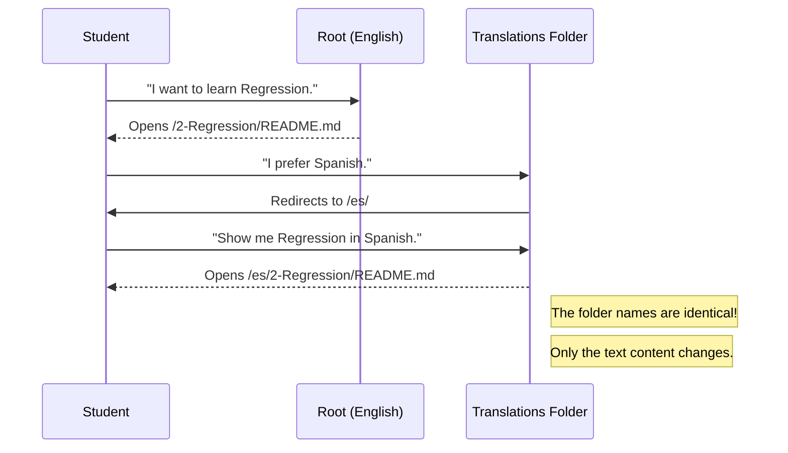

# Chapter 16: translations

Welcome to Chapter 16! In the previous chapter, [solution/R/](15_solution_r_.md), we learned that Data Science can be done in different programming languages, like **Python** or **R**. We saw that logic is universal, even if the syntax changes.

But there is a bigger barrier than programming syntax: **Human Language**.

Most technical documentation is written in English. However, billions of people around the world speak Spanish, Chinese, Hindi, Arabic, and dozens of other languages. If we want to democratize AI, we cannot force everyone to learn English first.

This brings us to the folder **`translations`**.

## Motivation: The Global Classroom

Imagine you are a teacher giving a lecture to a stadium full of students.
*   **The Goal:** Teach Machine Learning.
*   **The Problem:** You speak English, but half the stadium only understands Portuguese.
*   **The Manual Way:** You hire 50 translators to rewrite your textbook. But every time you fix a typo in English, you have to call all 50 translators to fix it in their versions too. It’s a nightmare!
*   **The Solution:** An organized `translations` directory managed by a community (and robots).

In this project, the `translations` folder is the gateway to the "Multiverse" of `ML-For-Beginners`. It contains the entire curriculum replicated in over 40 languages.

## Key Concepts: Localization

This folder isn't just a pile of files. It follows a strict structure called **Localization** (often abbreviated as **L10n**).

### 1. Language Codes (The ISO Standard)
Computers prefer short codes over long names. We don't name folders "Spanish" or "Japanese." We use standard **ISO 639-1** codes.
*   **`es`**: Spanish (Español)
*   **`zh-cn`**: Chinese (Simplified)
*   **`hi`**: Hindi
*   **`pt`**: Portuguese

### 2. Mirroring
The structure inside a translation folder must exactly match the main English folder.
*   If the English lesson is at `2-Regression/README.md`...
*   The Spanish lesson must be at `translations/es/2-Regression/README.md`.

This "Mirroring" ensures that links and images still work, no matter which language you are reading.

## How to Use This Abstraction

Technically, this is a directory navigation task. You don't "run" the translations; you explore them.

### Step 1: Finding your Language
If you look inside the `translations` folder, you will see a list of sub-folders.

```text
ML-For-Beginners/
└── translations/
    ├── bn/  (Bengali)
    ├── es/  (Spanish)
    ├── fr/  (French)
    ├── hi/  (Hindi)
    ├── ja/  (Japanese)
    └── ...  (Plus 30 more)
```

**Explanation:**
Each folder is a self-contained world. If you enter `es/`, everything inside will be in Spanish.

### Step 2: Reading a Lesson
Let's say you want to read the Introduction (Chapter 3) in Hindi.

1.  Navigate to `translations/hi/`.
2.  Look for the folder `1-Introduction/`.
3.  Open the `README.md` file inside.

**Visualizing the Content:**
Instead of seeing:
> "Machine Learning is the study of computer algorithms..."

You will see:
> "मशीन लर्निंग कंप्यूटर एल्गोरिदम का अध्ययन है..."

## The Internal Structure: Under the Hood

How do we keep track of all these files? Let's visualize the "Mirror" concept.



### Deep Dive: The README Map

How does a user know which languages are available without clicking every folder?

Usually, the root `README.md` of the project (or the `README.md` inside `translations/`) acts as a **Switchboard**. It contains a table of links managed by the community.

Here is a simplified example of what that file looks like:

```markdown
# Available Translations

| Language | Code | Link |
| :--- | :--- | :--- |
| 🇨🇳 Chinese | `zh-cn` | [Click Here](./zh-cn/) |
| 🇪🇸 Spanish | `es` | [Click Here](./es/) |
| 🇮🇳 Hindi | `hi` | [Click Here](./hi/) |
```

**Explanation:**
1.  **Flag/Name:** Helps the human identify the language.
2.  **Code:** Helps the developer identify the folder name.
3.  **Link:** A relative path (e.g., `./es/`) that takes the user directly to that mirrored world.

## The Automation Hint

You might be wondering: *"Who writes all this?"*

In the early days of Open Source, volunteers did it manually. But `ML-For-Beginners` is huge.
*   If we change one sentence in Chapter 1, do we really wait for 40 volunteers to update 40 files?

**No.**

This project uses a special **AI Agent** (a GitHub Action) to help.
1.  When we update the English file...
2.  The robot detects the change.
3.  The robot uses Azure AI to translate the new text into 40 languages automatically.
4.  It creates a "Pull Request" (a suggestion) for human speakers to review.

This means the `translations` folder is actually a collaboration between **Human Volunteers** and **AI Robots**.

## Why this matters for Beginners

1.  **Accessibility:** You can learn faster in your native language.
2.  **Community:** Contributing a translation is often the *best* way for a beginner to make their first Open Source contribution. You don't need to be a Python expert to translate English to your native tongue!
3.  **Global Scale:** It shows that code is a universal bridge that connects us all.

## Conclusion

In this chapter, we explored the `translations` directory. We learned that:
*   **L10n:** We organize files by ISO language codes (like `es`, `hi`).
*   **Mirrors:** The folder structure mimics the English version exactly so nobody gets lost.
*   **Hybrid Effort:** This folder is maintained by a mix of human native speakers and AI automation.

Speaking of AI automation... how exactly does that translation robot work? How do we program a GitHub repository to "wake up" when a file changes and automatically translate it?

To answer that, we need to look at the final piece of our puzzle: the workflow file.

[Next Chapter: .github/workflows/co-op-translator.yml](17__github_workflows_co_op_translator_yml.md)

---

Generated by [Code IQ](https://github.com/adityasoni99/Code-IQ)