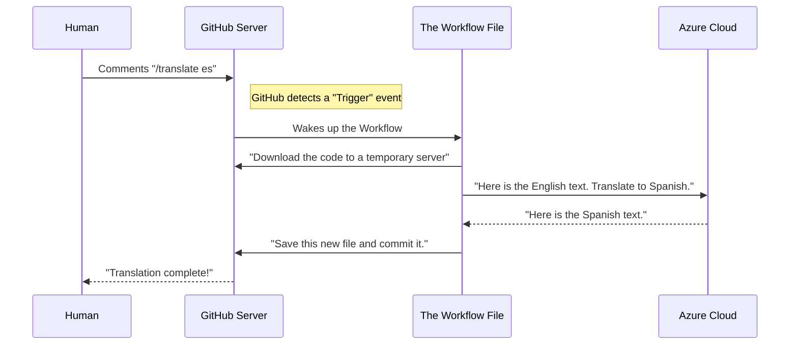

# Chapter 17: .github/workflows/co-op-translator.yml

Welcome to the final chapter! In the previous chapter, [translations](16_translations.md), we explored the massive directory that holds this course in over 40 different languages.

We learned that maintaining so many languages is hard work. If we change one sentence in the English version of [1-Introduction](03_1_introduction.md), do we really expect 40 human volunteers to rush in and update their files immediately?

That would be impossible. Humans sleep. Humans take vacations.

This brings us to the final file in our journey: **`.github/workflows/co-op-translator.yml`**.

## Motivation: The Night Shift Robot

Imagine you run a newspaper.
*   **The Goal:** Publish news in English, Spanish, Hindi, and Chinese simultaneously.
*   **The Problem:** Your human translators are slow and expensive. You can't wake them up at 3 AM to translate a typo fix.
*   **The Solution:** You hire a robot that lives inside the printing press. It never sleeps. It watches your English text, and the moment you finish writing, it automatically rewrites it in every other language.

This file is a **GitHub Action**. It is a set of instructions that tells GitHub's servers to wake up and do work for us automatically.

**The Use Case:** A contributor updates a lesson. Instead of waiting for a human, they type a magic command in a comment, and this workflow runs a Python script to translate the changes instantly using Azure AI.

## Key Concepts: Automation pipelines

This file isn't Python code, and it isn't data. It is **YAML** (Yet Another Markup Language). It is a configuration file that defines a "Pipeline" or an "Assembly Line."

### 1. The Trigger (`on`)
Just like a burglar alarm, the robot needs to know *when* to wake up.
*   Does it wake up every hour?
*   Does it wake up when we push code?
*   **In this case:** It wakes up when someone writes a specific comment (like `/translate`) in a discussion.

### 2. The Job (`jobs`)
Once the robot is awake, what should it do?
1.  Download the repository.
2.  Install Python.
3.  Run a translation script.
4.  Save the new files.

### 3. The Brain (Azure AI)
The GitHub server doesn't know Spanish. So, inside the job, it connects to **Azure Cognitive Services**. It sends the English text to the cloud, and the cloud sends back the translated text.

## How to Use This Abstraction

Unlike the Python scripts in [2-Regression](07_2_regression.md), you don't run this file on your computer. It runs in the cloud (on GitHub's computers).

However, you trigger it through human interaction.

### Example: The Magic Command
Let's say you just fixed a typo in the English README. You want to update the Hindi version.

1.  You open a **Pull Request** on GitHub with your change.
2.  In the comment box, you type:
    ```text
    /translate hi
    ```
3.  **What happens:**
    *   The `.github/workflows/co-op-translator.yml` file "hears" this comment.
    *   It sees the code `hi` (Hindi).
    *   It runs the translation machine.
    *   A few minutes later, a robot account commits the new Hindi file to your Pull Request.

**Output:**
Your Pull Request now contains two files: the English one you wrote, and the Hindi one the robot wrote!

## The Internal Structure: Under the Hood

How does a text comment turn into a new file? Let's visualize the "Event Loop."



### Breakdown of the Flow
1.  **Listen:** The file waits for the `issue_comment` event.
2.  **Environment:** It creates a temporary virtual computer (a Runner).
3.  **Execution:** It runs a Python script (similar to the ones we learned in [6-NLP](11_6_nlp.md)) to process the text.
4.  **Commit:** It acts like a user and saves the changes back to the project.

## Deep Dive: The Configuration Code

Let's look at the actual YAML code inside the file. We will simplify it to show the most important parts.

### Part 1: The Alarm Clock
This section tells GitHub when to start.

```yaml
name: Co-op Translator

# Trigger on comments in Pull Requests
on:
  issue_comment:
    types: [created]
```

**Explanation:**
*   **`on: issue_comment`**: This means "Run this file every time someone posts a comment."

### Part 2: The Conditions
We don't want to run the robot for *every* comment (like "Good job!"). We only want to run it for the magic command.

```yaml
jobs:
  translate:
    # Only run if the comment starts with '/translate'
    if: startsWith(github.event.comment.body, '/translate')
    runs-on: ubuntu-latest
```

**Explanation:**
*   **`if:`**: This acts like a filter. It checks the text body of the comment. If it sees `/translate`, it proceeds. If not, it goes back to sleep.
*   **`runs-on: ubuntu-latest`**: This tells GitHub to rent a Linux computer for a few minutes to do the work.

### Part 3: The Steps
Now we give the Linux computer a checklist of things to do.

```yaml
    steps:
      # 1. Download our project code
      - uses: actions/checkout@v2

      # 2. Install Python (just like we did in Chapter 3)
      - uses: actions/setup-python@v2
        with:
          python-version: 3.x

      # 3. Run the translation script
      - name: Run Translator
        run: |
          pip install -r requirements.txt
          python translation_script.py
        env:
          AZURE_KEY: ${{ secrets.AZURE_KEY }}
```

**Explanation:**
1.  **`checkout`**: Get the current code from the repo.
2.  **`setup-python`**: Prepare the environment.
3.  **`run`**: This is the core. It installs tools and runs a Python script (just like `python script.py`).
4.  **`env`**: We pass the secret password (API Key) for Azure so the script can talk to the cloud securely.

## Why this matters for Beginners

You might think this is "DevOps," not Machine Learning. But in the real world, ML is useless if it is isolated.

1.  **MLOps:** This is a baby version of **M**achine **L**earning **Op**eration**s**. It is the art of automating AI tasks.
2.  **Scale:** This file allows a small team to manage a massive global project.
3.  **Integration:** It shows how AI (Translation) can be embedded into a workflow (GitHub) to solve a human problem (Language barriers).

## Conclusion

**Congratulations!** You have reached the end of **ML-For-Beginners**.

In this final chapter, we learned that we can automate the boring parts of coding using **GitHub Actions**. We built a "Co-op Translator" that helps us maintain our [translations](16_translations.md) folder by connecting our repository to Azure AI.

**Let's recap your journey:**
1.  You met the **Agents** and learned the **Rules**.
2.  You set up your **Tools** and **Notebooks**.
3.  You visualized data with **Sketchnotes**.
4.  You mastered **Regression** (Numbers), **Classification** (Categories), and **Clustering** (Groups).
5.  You taught computers to read (**NLP**) and predict the future (**Time Series**).
6.  You trained agents to play games (**Reinforcement Learning**).
7.  You deployed models to the **Real World** and explored **R**.
8.  And finally, you automated the translation of your knowledge for the whole world.

You are no longer just a beginner. You are a practitioner. The world of data is now yours to explore.

**End of Curriculum.**

---

Generated by [Code IQ](https://github.com/adityasoni99/Code-IQ)