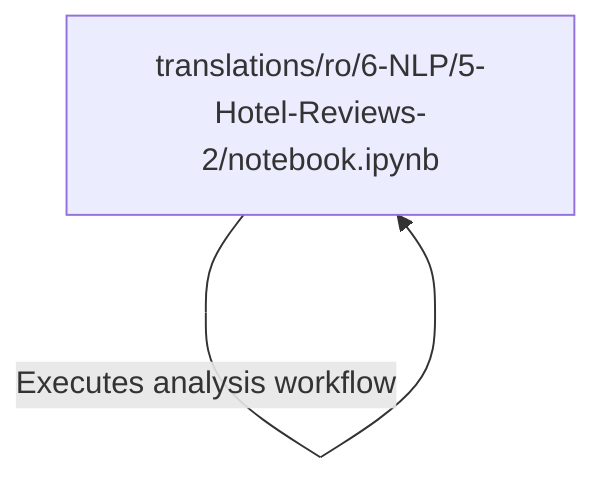

# Tutorial: ML-For-Beginners

This project is an educational resource for learning **Machine Learning**, specifically focusing on **Natural Language Processing (NLP)**. It features a Romanian translation of a lesson that teaches how to perform **Sentiment Analysis** on hotel reviews using the *NLTK* library and the **VADER** scoring tool.

**Source Repository:** [https://github.com/microsoft/ML-For-Beginners](https://github.com/microsoft/ML-For-Beginners)

## Chapters

1. [translations/ro/6-NLP/5-Hotel-Reviews-2/notebook.ipynb](01_translations_ro_6_nlp_5_hotel_reviews_2_notebook_ipynb.md)

---

Generated by [Code IQ](https://github.com/adityasoni99/Code-IQ)