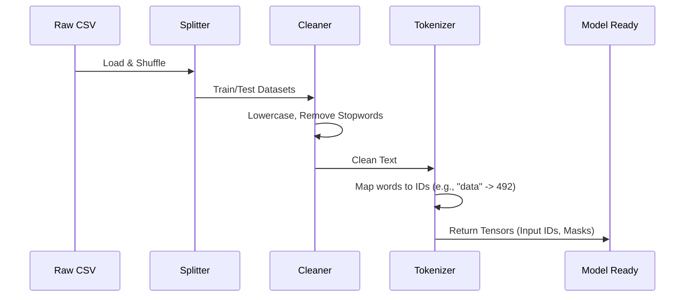

# Chapter 1: Data Processing Pipeline

Welcome to the **Made With ML** project! 

Before we can build intelligent machines, we need to speak their language. This chapter focuses on the **Data Processing Pipeline**.

## The Prep Kitchen Analogy

Imagine you are a chef in a high-end restaurant. You want to cook a delicious meal (train a model). However, your ingredients (data) just arrived from the farm: the potatoes are covered in dirt, the carrots have stems, and everything is in different sizes.

You cannot just throw a dirty potato into the oven. You need a **Prep Kitchen**.

1.  **Extract:** You bring the ingredients into the kitchen.
2.  **Transform:** You wash the dirt off (cleaning) and chop them into uniform cubes (tokenization).
3.  **Load:** You put the prepped ingredients into bowls, ready for the chef to cook.

In Machine Learning, this is often called **ETL** (Extract, Transform, Load). Our goal is to turn raw text files into numerical "tensors" that our model can understand.

---

## Step 1: Extract (Loading Data)

First, we need to load our dataset. We are using a CSV file containing titles, descriptions, and tags for various machine learning projects.

We use a library called `Ray` to load data efficiently, which will help us scale up later.

```python
import ray

# Load the data from a CSV file
ds = ray.data.read_csv("datasets/tags.csv")

# Shuffle the data (randomize the order)
ds = ds.random_shuffle(seed=1234)

# Take a look at the first item
print(ds.take(1))
```
*Result: A raw list of rows containing text and tags.*

## Step 2: Splitting Data

Before we process the data, we must split it. 
*   **Training Set:** The data the model studies to learn.
*   **Test Set:** The data we keep hidden to test how well the model learned (like a final exam).

We use **stratified splitting**. This ensures that if 10% of our data is about "computer-vision", our training set and test set both have exactly 10% "computer-vision" examples.

```python
from madewithml.data import stratify_split

# Split into train (80%) and test (20%)
# Stratify ensures balanced classes based on the "tag" column
train_ds, test_ds = stratify_split(ds, stratify="tag", test_size=0.2)
```

## Step 3: Transform (Cleaning)

Raw text is messy. It contains capitalization, punctuation, and "stopwords" (common words like "the", "and", "is" that don't add unique meaning to the topic).

We need to scrub the text clean.

```python
import re

def clean_text(text):
    # Lowercase everything
    text = text.lower()
    # Remove special characters (keep only alphanumeric)
    text = re.sub("[^A-Za-z0-9]+", " ", text)
    # Remove stopwords (simplified example)
    text = text.replace(" the ", " ")
    return text.strip()

# Example input: "The Great Computer-Vision Project!"
# Example output: "great computer vision project"
```

## Step 4: Transform (Tokenization)

This is the most critical step. Models do not understand words; they understand numbers. **Tokenization** converts words into numerical IDs.

We use a **Tokenizer** (specifically one called BERT). It looks up each word in a massive dictionary and replaces it with a unique ID number.

```python
from transformers import BertTokenizer

# Load a pre-trained tokenizer
tokenizer = BertTokenizer.from_pretrained("allenai/scibert_scivocab_uncased")

# Convert text to numbers
text = "computer vision"
output = tokenizer(text, return_tensors="np")

print(output["input_ids"]) 
# Output might look like: [101, 3452, 8910, 102]
```
*Note: The extra numbers at the start (101) and end (102) are special "start" and "end" markers required by the model.*

## Putting it all together: The Preprocessor

To keep our code clean, we wrap all these steps into a single class called `CustomPreprocessor`. This acts as our "Head Chef" in the prep kitchen, ensuring every piece of data is treated exactly the same way.

The preprocessor handles:
1.  **Feature Engineering:** Combining Title + Description into one text input.
2.  **Cleaning:** Applying the cleaning function.
3.  **Encoding:** Converting text tags (e.g., "computer-vision") into number tags (e.g., Class `0`).
4.  **Tokenization:** Converting text to input IDs.

### How it works (Under the Hood)

Here is what happens when we run our pipeline:



### Implementation Details

In our file `madewithml/data.py`, we define the `preprocess` function which ties the cleaning and tokenization together.

```python
# From madewithml/data.py

def preprocess(df, class_to_index):
    # 1. Feature Engineering: Combine title and description
    df["text"] = df.title + " " + df.description 
    
    # 2. Clean the text
    df["text"] = df.text.apply(clean_text)
    
    # 3. Convert tags to numbers (Label Encoding)
    df["tag"] = df["tag"].map(class_to_index)
    
    # 4. Tokenize
    outputs = tokenize(df)
    return outputs
```

Finally, the `CustomPreprocessor` class manages the whole flow. It learns the tags during `fit` (on training data) and applies the changes during `transform`.

```python
class CustomPreprocessor:
    def fit(self, ds):
        # Learn all unique tags from the dataset
        tags = ds.unique(column="tag")
        # Create a dictionary map: {'computer-vision': 0, 'mlops': 1...}
        self.class_to_index = {tag: i for i, tag in enumerate(tags)}
        return self

    def transform(self, ds):
        # Apply the preprocess function to the dataset
        return ds.map_batches(
            preprocess, 
            fn_kwargs={"class_to_index": self.class_to_index}
        )
```

## Conclusion

Congratulations! You have successfully built a pipeline that takes raw, messy text and converts it into clean, organized numerical data. 

In our kitchen analogy, the ingredients are washed, peeled, chopped, and measured. They are now ready for the Chef.

In the next chapter, we will build the "Chef"—the neural network itself.

👉 **Next Step:** [Model Architecture](02_model_architecture.md)

---

Generated by [Code IQ](https://github.com/adityasoni99/Code-IQ)