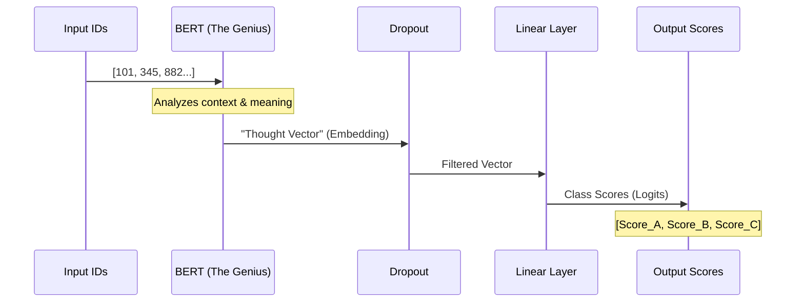

# Chapter 2: Model Architecture

Welcome back! In the previous chapter, **[Data Processing Pipeline](01_data_processing_pipeline.md)**, we acted as prep chefs. We washed, chopped, and organized our ingredients (data) into numerical IDs.

Now, we need a Chef to cook them. We need a "Brain" to process these numbers and make a decision. In Machine Learning, this "Brain" is the **Model Architecture**.

## The "Generic Genius" Analogy

Imagine you want to hire someone to categorize technical documents. You have two options:

1.  **Train a Toddler:** Hire a baby who knows nothing. You have to teach them the alphabet, then words, then grammar, and *finally* machine learning concepts. This takes years.
2.  **Hire a Genius:** Hire a Professor who has read every book in the library. They already understand English perfectly. You just need to give them a brief "handbook" on your specific tags and give them a final exam.

Option 2 is how we build modern AI. We don't start from scratch.

*   **The Genius:** A pre-trained Large Language Model (LLM) called **BERT**. It has read millions of scientific papers.
*   **The Handbook:** A small extra layer we add on top to teach it our specific tags (e.g., "Computer Vision" vs. "Natural Language Processing").

This process is called **Fine-Tuning**.

## The Use Case

Our goal is simple:
*   **Input:** A tensor representing the text "An introduction to CNNs".
*   **The Architecture:** The model processes this.
*   **Output:** A list of scores for each tag (e.g., `Computer Vision: 95%`, `NLP: 5%`).

---

## Building the Model

We will build a class called `FinetunedLLM`. We use **PyTorch**, a popular library for building neural networks.

### Step 1: The Blueprint (`__init__`)

First, we define the parts of our model. We need the pre-trained BERT model and a small linear layer (the "classifier") to produce the final answer.

```python
import torch.nn as nn
from transformers import BertModel

class FinetunedLLM(nn.Module):
    def __init__(self, dropout_p, embedding_dim, num_classes):
        super(FinetunedLLM, self).__init__()
        # The Genius: Load pre-trained BERT
        self.llm = BertModel.from_pretrained("allenai/scibert_scivocab_uncased", return_dict=False)
        
        # The Filter: Dropout helps prevent the model from memorizing answers
        self.dropout = nn.Dropout(dropout_p)
        
        # The Final Exam: Converts BERT's thoughts into our specific classes
        self.fc1 = nn.Linear(embedding_dim, num_classes)
```

**Explanation:**
*   `self.llm`: This downloads the "Genius" (BERT). It already knows English and Science concepts.
*   `self.dropout`: Think of this as randomly temporarily deleting some neurons during training. It forces the model to not rely too heavily on any single word (preventing overfitting).
*   `self.fc1`: This is a "Linear" layer. It connects the output of BERT to our specific number of classes (tags).

### Step 2: The Flow (`forward`)

Next, we define how data moves through these parts. This is called the **Forward Pass**.

```python
    def forward(self, batch):
        # 1. Unpack the inputs
        ids, masks = batch["ids"], batch["masks"]
        
        # 2. Ask the Genius (Pass inputs through BERT)
        # pool gives us a summary vector of the whole sentence
        seq, pool = self.llm(input_ids=ids, attention_mask=masks)
        
        # 3. Apply the filter and the final classifier
        z = self.dropout(pool)
        z = self.fc1(z)
        return z
```

**Explanation:**
1.  We give BERT the IDs (words) and Masks (which tell it which words are real and which are just padding).
2.  BERT thinks about it and returns `pool`. The `pool` variable is a list of numbers (a vector) that represents the *meaning* of the sentence.
3.  We pass that meaning through our `fc1` layer to get `z`. `z` contains the raw scores for each tag.

---

## Under the Hood

What actually happens when we run this model? Let's visualize the flow of data.



1.  **Input:** The numbers `[101, 345...]` represent "Introduction to CNNs".
2.  **BERT:** Reads them. It knows "CNN" is related to images. It outputs a vector (embedding) that captures this meaning.
3.  **Linear Layer:** Looks at that vector. It has learned that "image meaning" usually corresponds to the "Computer Vision" tag.
4.  **Output:** It assigns a high score to Computer Vision.

---

## Implementation Details

In `madewithml/models.py`, we add a few helper functions to make the model easier to use in production.

### Making Predictions
The `forward` function gives us raw scores (logits), like `[2.5, -1.0, 0.3]`. Humans prefer probabilities (percentages) or just the final answer.

```python
import torch.nn.functional as F

# Inside FinetunedLLM class...

    @torch.inference_mode()
    def predict_proba(self, batch):
        self.eval() # Switch to evaluation mode
        z = self(batch) # Run the forward pass
        # Convert raw scores to percentages (probabilities)
        y_probs = F.softmax(z, dim=1).cpu().numpy()
        return y_probs
```

*   `softmax`: A math function that turns raw scores into probabilities that sum to 1.0 (100%).
*   `inference_mode`: Tells PyTorch "we are not training right now," which saves memory and speed.

### Determining the Winner

To get the single best tag, we just look for the highest score.

```python
    @torch.inference_mode()
    def predict(self, batch):
        self.eval()
        z = self(batch)
        # argmax finds the index of the highest score
        y_pred = torch.argmax(z, dim=1).cpu().numpy()
        return y_pred
```

## Summary

We have successfully defined the **Model Architecture**.

1.  We took a **pre-trained BERT model** (our Generic Genius).
2.  We added a **Linear Layer** on top to specialize it for our specific tags.
3.  We defined how data flows from input -> BERT -> Linear -> Output.

However, right now, our "Linear Layer" is initialized with random numbers. The Genius (BERT) is smart, but the handbook (Linear Layer) is currently blank. The model doesn't know *which* patterns map to *which* tags yet.

To fix this, we need to train the model on our data.

👉 **Next Step:** [Distributed Training](03_distributed_training.md)

---

Generated by [Code IQ](https://github.com/adityasoni99/Code-IQ)