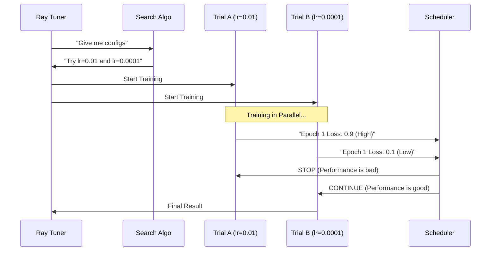

# Chapter 4: Hyperparameter Tuning

Welcome to Chapter 4! In the previous chapter, **[Distributed Training](03_distributed_training.md)**, we built a scalable gym for our model. We successfully trained our "Chef" (the model) using multiple workers to speed up the process.

However, there is a catch. When we set up the training, we arbitrarily picked numbers for settings like **learning rate** (how fast the model learns) and **batch size** (how many examples it sees at once).

How do we know those were the *best* numbers? What if a slightly different learning rate would make the model twice as accurate?

This chapter is about **Hyperparameter Tuning**: the art of finding the perfect settings.

## The Radio Tuner Analogy

Imagine you are driving an old car with an analog radio. You want to listen to your favorite station, but all you hear is static.

To fix this, you have to turn the knobs.
*   **The Knob:** This is a **Hyperparameter**. You can turn it left or right.
*   **The Signal:** This is the **Model Performance**. You want the clearest sound (highest accuracy).
*   **The Process:** You turn the knob a little bit, listen, turn it back, listen again, until you find the "sweet spot."

In Machine Learning:
1.  **Parameters:** The internal weights the model learns *during* training (like the Chef's muscle memory).
2.  **Hyperparameters:** The settings *we* choose *before* training (like the oven temperature).

Doing this manually is tedious. In this chapter, we use a library called **Ray Tune** to automate this. It's like having a robot turn 10 different radios at once to find the perfect frequency for you.

---

## The Use Case

We want to maximize our model's accuracy on the validation set. We are unsure about two specific settings:
1.  **Learning Rate (`lr`):** If too low, training takes forever. If too high, the model fails to learn.
2.  **Dropout (`dropout_p`):** The percentage of neurons to turn off randomly to prevent memorization.

Instead of guessing, we will define a **Range** (e.g., "try anything between 0.001 and 0.1") and let the computer run experiments to find the best value.

---

## Key Concepts

Before looking at the code, let's understand the three pillars of tuning.

### 1. The Search Space
This is the menu of options. Instead of saying "Learning rate is 0.01", we say "Learning rate can be anywhere between 1e-5 and 5e-4".

### 2. The Search Strategy
How do we pick values from that menu?
*   **Random Search:** Close your eyes and pick a number.
*   **Bayesian Optimization:** Be smart. If `0.1` was bad, maybe `0.9` is better? We use a strategy called **HyperOpt** to make intelligent guesses based on previous results.

### 3. The Scheduler
Training models is expensive. If an experiment is doing terribly after the first epoch, we should kill it immediately to save time. This is called **Early Stopping**. We use a scheduler called **AsyncHyperBand** to manage this.

---

## Implementation

We use **Ray Tune** to wrap around our existing training code.

### Step 1: Define the Search Space

We define which knobs we want to turn and how far they can turn.

```python
from ray import tune

# Define the range of values we want to explore
param_space = {
    "train_loop_config": {
        "dropout_p": tune.uniform(0.3, 0.9),      # Pick any decimal between 0.3 and 0.9
        "lr": tune.loguniform(1e-5, 5e-4),        # Pick a value on a logarithmic scale
        "lr_factor": tune.uniform(0.1, 0.9),      # Rate at which we lower LR over time
    }
}
```
*   `tune.uniform`: Suggests a continuous range of numbers. Ray will pick values like `0.45`, `0.82`, etc.

### Step 2: The Intelligent Scheduler

We don't want to waste time on bad models. We set up a scheduler to stop bad runs early.

```python
from ray.tune.schedulers import AsyncHyperBandScheduler

# Stop bad experiments early to save time
scheduler = AsyncHyperBandScheduler(
    max_t=10,          # Max epochs per trial
    grace_period=1     # Train at least 1 epoch before stopping anyone
)
```
*   **Grace Period:** We give every model at least 1 epoch to prove itself. If it's still performing poorly compared to others after that, it gets terminated.

### Step 3: Running the Experiment

We use the `Tuner` class to orchestrate the experiments.

```python
from ray.tune import Tuner

tuner = Tuner(
    trainable=trainer,        # The TorchTrainer from Chapter 3
    param_space=param_space,  # The ranges we defined
    tune_config=tune.TuneConfig(
        metric="val_loss",    # What are we optimizing?
        mode="min",           # We want to MINIMIZE loss
        scheduler=scheduler,  # The "Early Stopper"
        num_samples=5,        # Run 5 different experiments
    ),
)

results = tuner.fit()         # GO!
```
*   `num_samples=5`: Ray Tune will run 5 separate training jobs, each with a different combination of Dropout and Learning Rate.

---

## Under the Hood

What happens when we call `tuner.fit()`? Ray Tune acts as a Conductor managing an orchestra of training runs (Trials).

### The Sequence



1.  **Search Algorithm:** Generates a new set of hyperparameters (a "Config").
2.  **Trial:** Starts a training job with that specific Config.
3.  **Reporting:** The Trial reports its validation loss back to the Tuner.
4.  **Scheduler Decision:** The Scheduler compares the loss to other running trials. If Trial A is doing much worse than Trial B, Trial A is killed to free up resources.

### Internal Code Structure

In our file `madewithml/tune.py`, we wrap all of this into a function called `tune_models`.

We use a tool called `HyperOptSearch`. This remembers the history of previous trials. If `lr=0.01` was bad, it won't suggest numbers near 0.01 again.

```python
from ray.tune.search.hyperopt import HyperOptSearch

# 1. Provide initial guesses to help the model start well
initial_params = [{"train_loop_config": {"dropout_p": 0.5, "lr": 1e-4}}]

# 2. Set up the "Smart" searcher
search_alg = HyperOptSearch(points_to_evaluate=initial_params)

# 3. Limit concurrency (don't run too many at once if limited by hardware)
search_alg = ConcurrencyLimiter(search_alg, max_concurrent=2)
```

Finally, after the experiments finish, we want to know the winner.

```python
# Get the best result from the grid
best_trial = results.get_best_result(metric="val_loss", mode="min")

print("Best Hyperparameters:", best_trial.config["train_loop_config"])
print("Best Loss:", best_trial.metrics["val_loss"])
```
*Result: This prints the specific settings (e.g., `lr=3e-4`) that gave the clearest "signal."*

## Conclusion

We have moved from simply training a model to **optimizing** it. 

*   We defined a **Search Space** (ranges of settings).
*   We used **Ray Tune** to run parallel experiments.
*   We used a **Scheduler** to stop bad experiments early.

Now we have a trained model, and we know it's using the best possible settings for our data. The "Chef" is not only trained but is now using the perfect oven temperature.

But a model sitting in a file is useless. We need to use it to make predictions on new data.

👉 **Next Step:** [Inference & Prediction](05_inference___prediction.md)

---

Generated by [Code IQ](https://github.com/adityasoni99/Code-IQ)