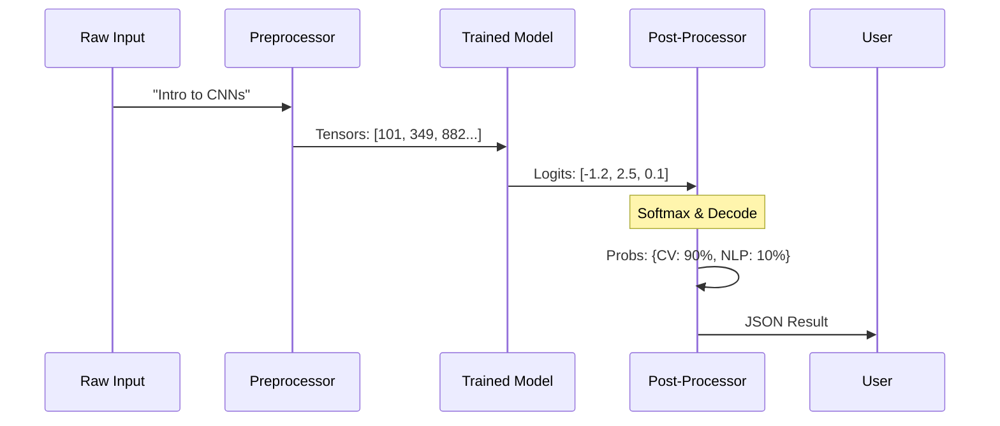

# Chapter 5: Inference & Prediction

Welcome to Chapter 5! In the previous chapter, **[Hyperparameter Tuning](04_hyperparameter_tuning.md)**, we acted as scientists. We ran experiments to find the best possible settings for our model.

Now, we have a winner. We have a trained "Chef" (Model) and a specific set of "Kitchen Tools" (Preprocessor) that work perfectly together.

But a trained model sitting on a hard drive is useless. We need to use it. This chapter covers **Inference**: the process of using a trained model to make predictions on new, unseen data.

## The "Universal Translator" Analogy

Imagine a Sci-Fi Universal Translator.
1.  **Input:** You speak an alien language into it.
2.  **Processing:** The device's internal computer analyzes the sound waves.
3.  **Inference:** It matches patterns based on what it learned previously.
4.  **Output:** It speaks back in English.

In our project, we are building this device.
*   **Input:** A project title and description (e.g., "Intro to CNNs").
*   **Processing:** Cleaning and Tokenization.
*   **Inference:** The Model calculates probabilities.
*   **Output:** The tag (e.g., "Computer Vision").

---

## The Concept: Artifacts

To build this device, we need to load two things we created in previous chapters. We call these **Artifacts**.

1.  **The Model Weights:** The "Brain" of the neural network that we trained in [Distributed Training](03_distributed_training.md).
2.  **The Preprocessor:** The "Translator" that converts text to numbers, which we built in [Data Processing Pipeline](01_data_processing_pipeline.md).

**Crucial Point:** We must use the *exact same* preprocessor during inference that we used during training. If "data" was ID `492` during training, it must be ID `492` now.

---

## Step 1: Finding the Best Model

We ran many experiments in the last chapter. We need to find the specific "Run ID" that performed the best. We use **MLflow** (our experiment tracker) to find this.

```python
import mlflow

def get_best_run_id(experiment_name, metric, mode):
    # Search all runs in our experiment
    sorted_runs = mlflow.search_runs(
        experiment_names=[experiment_name],
        order_by=[f"metrics.{metric} {mode}"], # Sort by error (Ascending)
    )
    
    # Pick the top one
    run_id = sorted_runs.iloc[0].run_id
    return run_id
```
*Explanation: This function looks through our experiment logs and sorts them by "Validation Loss." It grabs the ID of the winner.*

## Step 2: Loading the Checkpoint

Once we have the ID, we need to download the files (the Checkpoint).

```python
from ray.train import Result

def get_best_checkpoint(run_id):
    # Find where the files are stored for this specific run
    artifact_uri = mlflow.get_run(run_id).info.artifact_uri
    
    # Load the results from that folder
    results = Result.from_path(artifact_uri)
    
    # Return the best checkpoint saved during that training run
    return results.best_checkpoints[0][0]
```
*Explanation: A "Checkpoint" is just a folder containing our model file (`model.pt`) and our configuration (`args.json`).*

---

## Step 3: The Predictor Class

We need a clean way to bundle the Preprocessor and the Model together. We create a class called `TorchPredictor`.

This class is responsible for:
1.  Loading the saved preprocessor.
2.  Loading the saved model weights.
3.  Setting the model to "Eval" mode (turning off training features like Dropout).

```python
class TorchPredictor:
    def __init__(self, preprocessor, model):
        self.preprocessor = preprocessor
        self.model = model
        self.model.eval() # Important: Switch to inference mode!

    def __call__(self, batch):
        # Allow the class to be called like a function
        results = self.model.predict(batch)
        return {"output": results}
```
*Explanation: `model.eval()` is critical. It tells PyTorch "Do not learn right now, just predict." If you forget this, your predictions might be inconsistent.*

---

## Step 4: Making a Prediction

Now we can put it all together. We take a raw string, process it, and get a result.

```python
# Create a sample input
title = "Transfer learning with transformers"
description = "Using BERT for classification."
sample_ds = ray.data.from_items([{"title": title, "description": description}])

# Use the predictor
results = predict_proba(ds=sample_ds, predictor=predictor)

# View result
print(results)
```

**Output:**
```json
[
  {
    "prediction": "nlp",
    "probabilities": {
      "computer-vision": 0.02,
      "nlp": 0.95,
      "mlops": 0.03
    }
  }
]
```

---

## Under the Hood: The Inference Pipeline

What happens inside `predict_proba`? Let's visualize the flow of data.



### Internal Implementation

We define this logic in `madewithml/predict.py`. Let's look at the key function `predict_proba`.

### 1. Preprocessing the New Data

We can't just feed the string to the model. We must use the `preprocessor` we loaded from the checkpoint.

```python
# Inside predict_proba()

    # 1. Get the preprocessor from the loaded predictor
    preprocessor = predictor.get_preprocessor()
    
    # 2. Transform the new raw data into numbers
    # This applies the SAME cleaning and tokenization as training
    preprocessed_ds = preprocessor.transform(ds)
```

### 2. Getting Probabilities

We pass the numbers to the model.

```python
    # 3. Run the model
    # map_batches applies the predictor to the data efficiently
    outputs = preprocessed_ds.map_batches(predictor.predict_proba)
    
    # 4. Extract the raw probability arrays
    y_prob = np.array([d["output"] for d in outputs.take_all()])
```
*Result:* `y_prob` is now a list of numbers like `[0.05, 0.90, 0.05]`. The model is 90% sure it's Class Index 1. But what is "Index 1"?

### 3. Decoding (Post-Processing)

The model only knows numbers. Humans want tags. We need to map `1` back to `"nlp"`.

```python
    results = []
    for i, prob in enumerate(y_prob):
        # Find the index with the highest score
        tag_index = prob.argmax()
        
        # Look up the name in the preprocessor's dictionary
        tag = preprocessor.index_to_class[tag_index]
        
        results.append({"prediction": tag})
```
*Explanation: `index_to_class` is a dictionary saved inside the preprocessor (e.g., `{0: "computer-vision", 1: "nlp"}`). We use it to translate the math back into English.*

---

## Conclusion

We have successfully built the **Inference Pipeline**. 

We created a system that:
1.  Loads the best trained "Brain" (Model) and "Translator" (Preprocessor).
2.  Accepts new, messy text from a user.
3.  Cleans and processes it.
4.  Predicts the most likely category.

Now we can classify any machine learning project description instantly! 

But how do we know if our model is actually *good*? Is 90% accuracy enough? Does it fail on specific types of tags? To answer this, we need to perform a thorough audit.

👉 **Next Step:** [Model Evaluation](06_model_evaluation.md)

---

Generated by [Code IQ](https://github.com/adityasoni99/Code-IQ)