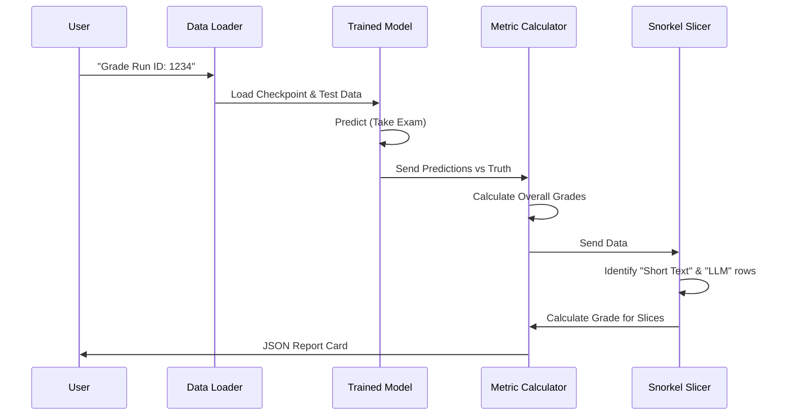

# Chapter 6: Model Evaluation

Welcome to Chapter 6! 

In the previous chapter, **[Inference & Prediction](05_inference___prediction.md)**, we built a "Universal Translator." We successfully loaded our trained model and used it to predict tags for new text.

But here is the big question: **Is our model actually smart, or is it just guessing?**

Just because the model gives an answer doesn't mean it's right. In this chapter, we will act as the **Exam Proctor**. We will give our model a "Final Exam" (a dataset it has never seen before) and grade it rigorously to generate a "Report Card."

## The "Report Card" Analogy

Imagine a student taking a math class.
*   **Accuracy:** The student gets 90% of the questions right. Sounds great, right?

But what if the exam was 90% simple addition and 10% complex calculus? If the student got all the addition right but failed every calculus problem, they aren't actually good at math—they are just good at addition.

To trust a model in the real world, we need a detailed Report Card:
1.  **Overall Grade:** General performance (Precision, Recall, F1).
2.  **Subject Breakdown:** How well does it perform on specific topics? (Per-class metrics).
3.  **Specific Scenarios:** Does it fail when the questions are really long? Or when they contain specific keywords? (Slicing).

---

## Key Metrics: The Grading Rubric

We don't just use "Accuracy." We use three specific metrics to understand *how* the model is right or wrong.

### 1. Precision (Trustworthiness)
*   **Question:** "When the model predicts 'Computer Vision', how often is it actually 'Computer Vision'?"
*   **Why it matters:** If your spam filter has low precision, it deletes important emails because it thinks they are spam.

### 2. Recall (Coverage)
*   **Question:** "Out of all the 'Computer Vision' projects in the world, how many did the model find?"
*   **Why it matters:** If your cancer detection AI has low recall, it misses patients who actually have cancer.

### 3. F1 Score (Balance)
*   **Question:** "What is the harmonic mean of Precision and Recall?"
*   **Why it matters:** This is a single number that balances the two. It prevents a model from cheating by just guessing "Yes" on everything to get perfect Recall.

---

## Step 1: The Setup

To evaluate the model, we use the **Test Set**. This is data we set aside in **[Data Processing Pipeline](01_data_processing_pipeline.md)**. The model has *never* seen this data during training.

We load our best model checkpoint (from Chapter 5).

```python
from madewithml import predict
from madewithml.predict import TorchPredictor

# 1. Load the Test Set (The Exam)
ds = ray.data.read_csv("datasets/test_dataset.csv")

# 2. Load the Student (Best Model)
best_checkpoint = predict.get_best_checkpoint(run_id=run_id)
predictor = TorchPredictor.from_checkpoint(best_checkpoint)
```

## Step 2: Taking the Exam

We run the predictor on the test set. We then extract two lists:
*   `y_true`: The correct answers (from the dataset).
*   `y_pred`: The student's answers (from the model).

```python
import numpy as np

# 1. Get the Answer Key (True Labels)
preprocessor = predictor.get_preprocessor()
preprocessed_ds = preprocessor.transform(ds)
values = preprocessed_ds.select_columns(cols=["targets"]).take_all()
y_true = np.stack([item["targets"] for item in values])

# 2. Get the Student's Answers (Predictions)
predictions = preprocessed_ds.map_batches(predictor).take_all()
y_pred = np.array([d["output"] for d in predictions])
```
*Note: We extract `y_pred` as a simple list of numbers (e.g., `[0, 1, 0...]`) to compare easily with the answer key.*

---

## Step 3: Calculating Grades

Now we calculate the scores. We use a library called `scikit-learn` to do the heavy math.

### Overall Metrics
This gives us the "Class Average."

```python
from sklearn.metrics import precision_recall_fscore_support

def get_overall_metrics(y_true, y_pred):
    # Calculate weighted average of precision, recall, and F1
    metrics = precision_recall_fscore_support(y_true, y_pred, average="weighted")
    
    return {
        "precision": metrics[0],
        "recall": metrics[1],
        "f1": metrics[2],
    }
```

### Per-Class Metrics
This tells us if the model is failing specific subjects.

```python
def get_per_class_metrics(y_true, y_pred, class_to_index):
    # Calculate metrics for EACH class separately (average=None)
    metrics = precision_recall_fscore_support(y_true, y_pred, average=None)
    
    per_class = {}
    for i, _class in enumerate(class_to_index):
        per_class[_class] = {
            "precision": metrics[0][i],
            "recall": metrics[1][i],
            "f1": metrics[2][i],
        }
    return per_class
```

---

## Slicing: The Advanced Analysis

Sometimes, aggregate metrics hide the truth. A model might be great at "NLP", but terrible at "NLP projects that use LLMs."

**Slicing** allows us to programmatically define subsets of data and grade them separately. We use a tool called **Snorkel** to do this easily.

### Defining Slices
A "Slice" is just a Python function that returns `True` if a data row belongs to that group.

**Example 1: Short Text**
Does the model fail when the description is too short?

```python
from snorkel.slicing import slicing_function

@slicing_function()
def short_text(x):
    """Projects with titles/descriptions less than 8 words."""
    return len(x.text.split()) < 8 
```

**Example 2: NLP projects using LLMs**
Does the model struggle with the specific jargon of Large Language Models?

```python
@slicing_function()
def nlp_llm(x):
    """NLP projects that explicitly mention LLMs or BERT."""
    # Check if it is an NLP project
    is_nlp = "natural-language-processing" in x.tag
    
    # Check for keywords
    has_llm_terms = any(term in x.text.lower() for term in ["llm", "bert"])
    
    return is_nlp and has_llm_terms
```

### Measuring Slice Performance
We apply these functions to our dataframe. If a row is "Short Text," we check the model's accuracy on *just* that row.

```python
from snorkel.slicing import PandasSFApplier

def get_slice_metrics(y_true, y_pred, ds):
    # 1. Convert dataset to Pandas for easy manipulation
    df = ds.to_pandas()
    
    # 2. Apply the slice functions
    applier = PandasSFApplier([nlp_llm, short_text])
    slices = applier.apply(df)
    
    # 3. Calculate metrics for each slice
    # (Logic omitted for brevity: we filter y_true/y_pred by the slice mask)
    return slice_metrics
```

---

## Under the Hood: The Evaluation Pipeline

What happens when we run the full evaluation command?



### The Output (JSON Report)

The result is a structured JSON file that we can save or log.

```json
{
  "overall": {
    "precision": 0.94,
    "recall": 0.93,
    "f1": 0.93
  },
  "per_class": {
    "computer-vision": { "f1": 0.98 },
    "mlops": { "f1": 0.75 } 
  },
  "slices": {
    "short_text": { "f1": 0.60 },
    "nlp_llm": { "f1": 0.95 }
  }
}
```
**Interpretation:**
1.  **Overall:** The model is an "A" student (93%).
2.  **Per Class:** It is great at Computer Vision (98%), but struggles with MLOps (75%).
3.  **Slices:** It is terrible at Short Text (60%).

**Actionable Insight:** We need to collect more data examples of "Short Text" and "MLOps" projects to retrain the model and fix these weaknesses.

---

## Conclusion

We have successfully audited our model. We didn't just accept a single accuracy score; we broke it down by class and by specific data slices. 

Now we know exactly where our model is strong and where it is weak. This gives us the confidence to put it into the real world.

But currently, this model only lives in our Python script. If we want to let the whole world use it (like a website or an app), we need to wrap it up as a web service.

👉 **Next Step:** [Model Serving](07_model_serving.md)

---

Generated by [Code IQ](https://github.com/adityasoni99/Code-IQ)