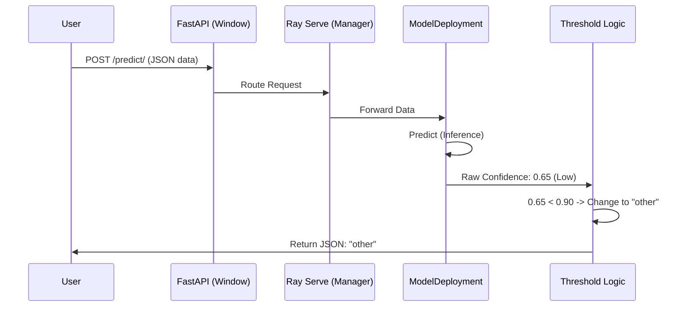

# Chapter 7: Model Serving

Welcome to Chapter 7!

In the previous chapter, **[Model Evaluation](06_model_evaluation.md)**, we audited our model. We graded it on a test set and confirmed that it is accurate enough to be useful.

However, right now, our model is "trapped" inside a Python script. If a web developer wants to use our model for their website, they can't. They don't know how to run Python scripts or load PyTorch weights.

We need to turn our model into a **Service**.

## The Drive-Thru Analogy

Imagine a fast-food restaurant.

1.  **The Kitchen (The Model):** This is where the work happens. Ingredients go in, and a meal comes out.
2.  **The Customer ( The User):** They are hungry but they are not allowed inside the kitchen.
3.  **The Window (The API):** A specific place where the customer can talk to the restaurant.
4.  **The Cashier (The Server):** A person who takes the order, passes it to the kitchen, and hands the meal back to the customer.

**Model Serving** is the process of building this Drive-Thru.
*   **API (Application Programming Interface):** The "Window." It defines how users send data (e.g., via HTTP requests).
*   **Ray Serve:** The "Cashier." It manages the incoming orders and ensures the Kitchen (Model) processes them efficiently.

---

## The Goal

We want to create a web address (URL) like `http://localhost:8000/predict`.

*   **Input:** A user sends a JSON message: `{"title": "Intro to CNNs", "description": "..."}`
*   **Process:** Our server catches this message, runs the model, and checks the confidence score.
*   **Output:** The server replies with JSON: `{"prediction": "computer-vision"}`.

To do this, we use two tools:
1.  **FastAPI:** A modern library for building web APIs in Python.
2.  **Ray Serve:** A library that wraps FastAPI to handle scaling (handling thousands of requests at once).

---

## Step 1: Defining the "Window" (FastAPI)

First, we define the application. This is like setting up the sign at the drive-thru that says "Order Here."

```python
from fastapi import FastAPI

# Define the application
app = FastAPI(
    title="Made With ML",
    description="Classify machine learning projects.",
    version="0.1",
)
```

## Step 2: The Deployment Class

We need a class to hold our model. In previous chapters, we used `TorchPredictor`. Here, we wrap it in a **Ray Serve Deployment**.

This class initializes the model once (when the server starts) so it doesn't have to reload the heavy weights for every single customer request.

```python
from ray import serve
from madewithml import predict

# This decorator transforms the class into a scalable service
@serve.deployment(num_replicas="1", ray_actor_options={"num_cpus": 1})
@serve.ingress(app)
class ModelDeployment:
    def __init__(self, run_id: str, threshold: int = 0.9):
        # Load the best model from our previous training run
        best_checkpoint = predict.get_best_checkpoint(run_id=run_id)
        
        # Load the predictor (Brain + Preprocessor)
        self.predictor = predict.TorchPredictor.from_checkpoint(best_checkpoint)
        self.threshold = threshold
```

*   `@serve.deployment`: Tells Ray "This class will handle web requests."
*   `@serve.ingress(app)`: Connects our FastAPI app to this class.
*   `num_replicas="1"`: Starts 1 copy of the model. If we get too popular, we can increase this number to open more "Drive-Thru windows."

---

## Step 3: Taking Orders (The Endpoint)

Now we define the logic for what happens when a request hits the `/predict/` URL. 

We add a safety check here. If the model is only 50% sure, we shouldn't tell the user "It's Computer Vision." We should say "Other" or "Unsure." This makes our application safer.

```python
    @app.post("/predict/")
    async def _predict(self, request: Request):
        # 1. Read the JSON data from the user
        data = await request.json()
        
        # 2. Convert JSON to the format our Predictor expects
        sample_ds = ray.data.from_items([{
            "title": data.get("title", ""), 
            "description": data.get("description", "")
        }])
        
        # 3. Make the prediction
        results = predict.predict_proba(ds=sample_ds, predictor=self.predictor)
```

### The Safety Logic (Thresholding)

We don't just return the raw result. We apply business logic.

```python
        # 4. Apply custom logic (The "Confidence Check")
        for i, result in enumerate(results):
            pred = result["prediction"]
            prob = result["probabilities"]
            
            # If confidence is too low (e.g., < 90%), return "other"
            if prob[pred] < self.threshold:
                results[i]["prediction"] = "other"

        return {"results": results}
```

---

## Under the Hood: The Request Flow

What happens when a user clicks "Submit" on our website?



1.  **User:** Sends data.
2.  **Ray Serve:** Receives the request and finds a free worker (replica).
3.  **Model:** Runs the inference pipeline from [Inference & Prediction](05_inference___prediction.md).
4.  **Logic:** Sees the confidence is 65%. Since our threshold is 90%, it overrides the answer to "other".
5.  **User:** Receives the safe result.

---

## Implementation Details

The full implementation is in `madewithml/serve.py`. It combines everything we've discussed.

### Starting the Service

To start the restaurant, we need a main block that binds everything together.

```python
# madewithml/serve.py

if __name__ == "__main__":
    # Get arguments (like which Run ID to use)
    parser = argparse.ArgumentParser()
    parser.add_argument("--run_id", help="run ID to use for serving.")
    args = parser.parse_args()

    # Start Ray
    ray.init()
    
    # Launch the deployment
    serve.run(ModelDeployment.bind(run_id=args.run_id))
```

### Testing the Service

Once the script is running, the API is live! We can test it using a tool like `curl` (command line) or Python.

**Input (Terminal):**
```bash
curl -X POST "http://127.0.0.1:8000/predict/" \
     -H "Content-Type: application/json" \
     -d '{"title": "Intro to CNNs", "description": "Processing images with layers."}'
```

**Output:**
```json
{
  "results": [
    {
      "prediction": "computer-vision",
      "probabilities": {
        "computer-vision": 0.98,
        "nlp": 0.01,
        "mlops": 0.01
      }
    }
  ]
}
```

## Conclusion

We have successfully built a **Model Serving** layer.

*   We wrapped our model in a **FastAPI** application.
*   We used **Ray Serve** to manage the application.
*   We added **Business Logic** (thresholding) to ensure high-quality responses.

Now, anyone in the world (or at least on our network) can use our machine learning model just by sending a web request.

However, right now this is running on your laptop. If you close your laptop, the service dies. To make this a real product, we need to move it to the cloud.

👉 **Next Step:** [Infrastructure & Deployment](08_infrastructure___deployment.md)

---

Generated by [Code IQ](https://github.com/adityasoni99/Code-IQ)