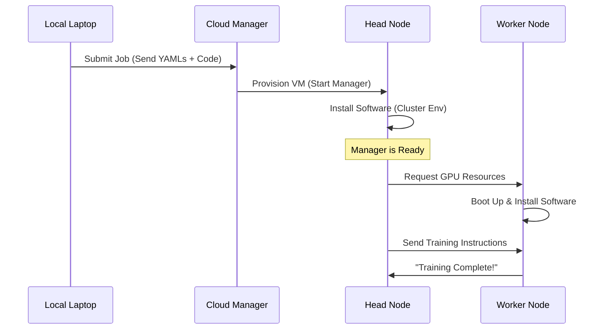

# Chapter 8: Infrastructure & Deployment

Welcome to the final chapter!

In the previous chapter, **[Model Serving](07_model_serving.md)**, we turned our model into a web service. We made it possible for users to send requests and get predictions.

However, right now, everything is running on your laptop (or a single Google Colab notebook).
*   **Problem 1:** If you close your laptop, the app dies.
*   **Problem 2:** If 10,000 users visit at once, your laptop will crash.
*   **Problem 3:** Training the next version of the model takes up all your computer's resources, so you can't watch Netflix while it trains.

We need to move out of your "Home Kitchen" and rent a "Factory." This chapter covers **Infrastructure & Deployment**.

## The Factory Analogy

Building software locally is like cooking at home. It's great for experiments, but you can't feed a whole city from your kitchen. You need a **Factory** (The Cloud).

But you can't just tell the cloud "Here is my code." You need to provide a **Blueprint**.

1.  **The Building (Compute Config):** What kind of machines do you need? Huge industrial ovens (GPUs)? Or just standard tables (CPUs)?
2.  **The Setup (Cluster Environment):** What tools need to be on the tables? Do you need knives, bowls, and mixers (Python libraries)?
3.  **The Instructions (Workloads):** Once the factory is built, what should the workers actually *do*?

In this project, we define these blueprints using **YAML files** (simple text configuration files).

---

## Part 1: The Hardware (Compute Config)

First, we need to rent the machines. In the cloud (AWS, GCP, etc.), machines come in different sizes.

*   **Head Node:** The manager. It coordinates the work.
*   **Worker Nodes:** The employees. They do the heavy lifting (training).

We define this in `deploy/cluster_compute.yaml`.

```yaml
# deploy/cluster_compute.yaml

cloud: aws
region: us-west-2

head_node_type:
  instance_type: m5.2xlarge  # A standard CPU machine for the Manager

worker_node_types:
  - instance_type: g5.4xlarge # A powerful GPU machine for the Workers
    min_workers: 1            # Hire at least 1 worker
    max_workers: 4            # Hire up to 4 if we get busy
```
*   **Instance Type:** This is the model of the computer. `g5` usually means it has a GPU (Graphics Processing Unit), which is essential for fast Deep Learning.
*   **Min/Max Workers:** This is **Auto-Scaling**. If the work piles up, the cloud automatically turns on more machines. When the work is done, it turns them off to save money.

---

## Part 2: The Software (Cluster Environment)

Imagine renting a factory, but the machines arrive empty. No Windows, no Python, no libraries. We need to install everything.

We define this in `deploy/cluster_env.yaml`. This tells the cloud exactly how to set up the environment *before* our code runs.

```yaml
# deploy/cluster_env.yaml

# Start with a standard Ray image (has Python & Ray pre-installed)
base_image: anyscale/ray:2.7.0-py310-cu118

# Install system tools
debian_packages:
  - curl

# Install our specific Python libraries
post_build_cmds:
  - pip install -r requirements.txt
```
*   **Base Image:** Think of this as the "Operating System." We pick one that already has Ray and CUDA (drivers for GPUs) installed.
*   **Post Build Cmds:** These run immediately after the machine turns on. We use this to install `torch`, `pandas`, `fastapi`, etc., listed in our `requirements.txt`.

---

## Part 3: The Job (Workloads)

Now we have the machines (Hardware) and the tools (Software). Finally, we need to tell them what to do.

Do we want to Train? Tune? Serve? We define this in `deploy/jobs/workloads.yaml`.

```yaml
# deploy/jobs/workloads.yaml

name: madewithml-production
project_id: my_project_id

# Link to the configs we defined above
cluster_env: madewithml-cluster-env
compute_config: madewithml-cluster-compute

# The actual command to run
entrypoint: python madewithml/train.py
```
*   **Entrypoint:** This is the command the Manager (Head Node) shouts to start the day. In this case, it starts the training script.

---

## Under the Hood: The Deployment Flow

What happens when we actually press the "Deploy" button (or run the command)?



1.  **Submit:** You send your "Blueprints" (YAMLs) and your code to the Cloud Manager (e.g., Anyscale or a Kubernetes cluster).
2.  **Provision:** The Cloud Manager reads the `Compute Config` and physically turns on the requested servers in a data center (e.g., AWS us-west-2).
3.  **Setup:** The servers read the `Cluster Env` and automatically run `pip install ...`.
4.  **Execute:** Once the environment is ready, the `entrypoint` command runs. The code executes exactly as it did on your laptop, but now it has access to massive power.

---

## Implementation Details

We don't usually write Python code to *deploy* infrastructure. Instead, we use Command Line Interface (CLI) tools provided by our platform (like Ray or Anyscale).

### Submitting a Job

To send our training job to the cloud, we run a command in our terminal.

```bash
# Submit the job using the configuration file
anyscale job submit --config-file deploy/jobs/workloads.yaml
```

### Checking Status

Once the job is running, we can check on it without logging into the machine.

```bash
# Check the status of the job
anyscale job status --name madewithml-production
```
*Result:* It might say `PENDING` (machines are turning on), `RUNNING` (training in progress), or `SUCCEEDED`.

### Serving in Production

For **Model Serving** (the web API), we want the job to run forever, not just finish and stop. We use a "Service" instead of a "Job."

The configuration is almost identical, but the command changes:

```bash
# Deploy the web service
anyscale service deploy deploy/services/serve_config.yaml
```

This ensures that if a machine crashes, the Cloud Manager immediately replaces it with a new one, ensuring our website never goes down.

---

## Conclusion

Congratulations! You have completed the **Made With ML** journey.

Let's recap what you have built:
1.  **[Data Pipeline](01_data_processing_pipeline.md):** You turned raw text into clean tensors.
2.  **[Model Architecture](02_model_architecture.md):** You designed a BERT-based neural network.
3.  **[Distributed Training](03_distributed_training.md):** You scaled training across multiple workers.
4.  **[Hyperparameter Tuning](04_hyperparameter_tuning.md):** You optimized the model's settings.
5.  **[Inference](05_inference___prediction.md):** You built a pipeline to predict on new data.
6.  **[Evaluation](06_model_evaluation.md):** You audited the model's performance rigorously.
7.  **[Serving](07_model_serving.md):** You wrapped the model in a web API.
8.  **Infrastructure:** You deployed the whole system to the cloud using configuration blueprints.

You have gone from a messy CSV file to a production-grade Machine Learning system running in the cloud. You are no longer just training models; you are building ML Systems.

**Happy Building!** 🚀

---

Generated by [Code IQ](https://github.com/adityasoni99/Code-IQ)