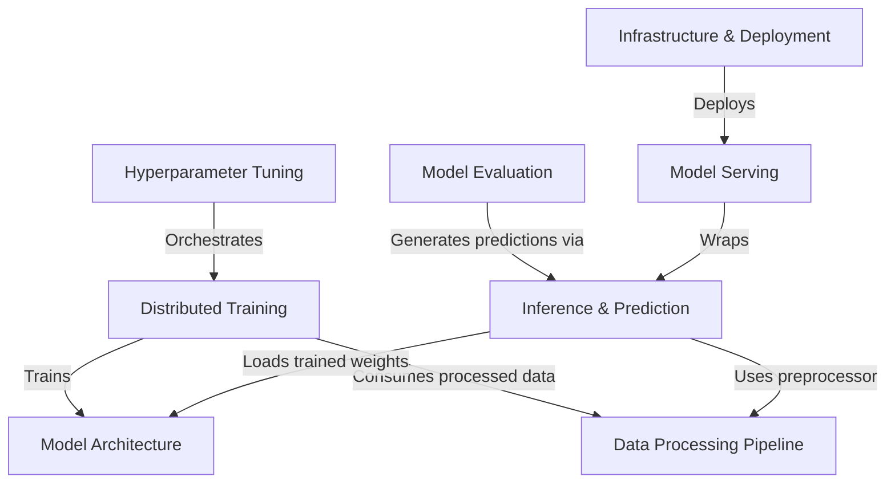

# Tutorial: Made-With-ML

This project is an end-to-end **MLOps** platform designed to classify machine learning projects using a **Large Language Model (BERT)**. It demonstrates the complete lifecycle of an AI application, from processing raw text data and performing *distributed training* and *hyperparameter tuning* to evaluating performance and **serving** the trained model via a scalable web API.

**Source Repository:** [https://github.com/GokuMohandas/Made-With-ML](https://github.com/GokuMohandas/Made-With-ML)

## Chapters

1. [Data Processing Pipeline](01_data_processing_pipeline.md)
2. [Model Architecture](02_model_architecture.md)
3. [Distributed Training](03_distributed_training.md)
4. [Hyperparameter Tuning](04_hyperparameter_tuning.md)
5. [Inference & Prediction](05_inference___prediction.md)
6. [Model Evaluation](06_model_evaluation.md)
7. [Model Serving](07_model_serving.md)
8. [Infrastructure & Deployment](08_infrastructure___deployment.md)

---

Generated by [Code IQ](https://github.com/adityasoni99/Code-IQ)