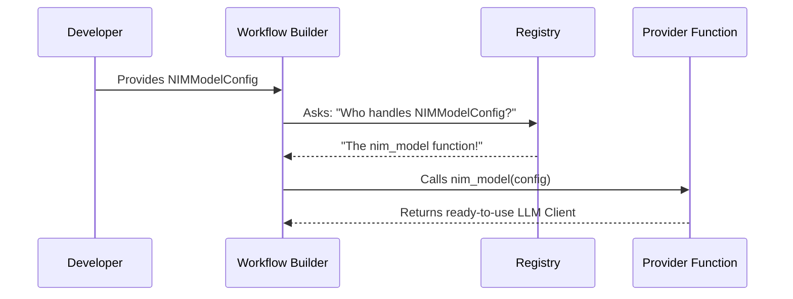

# Chapter 1: LLM Provider Abstraction

Welcome to the **NeMo Agent Toolkit (NAT)** tutorial! 

In this first chapter, we are going to explore the **LLM Provider Abstraction**. This is the foundation of any AI agent—the "brain" that processes information and generates responses.

## Motivation: The "Brain Swap" Problem

Imagine you have built a fantastic AI assistant using OpenAI's GPT-4. It works perfectly. But later, your requirements change:
1.  **Cost:** You want to switch to a smaller, open-source model like Llama 3 to save money.
2.  **Privacy:** You need to run the model on your own servers (like NVIDIA NIM) instead of the public cloud.

**The Problem:** Without a good abstraction, switching from OpenAI to another provider usually means rewriting a lot of code. You have to change authentication headers, API endpoint URLs, and how you parse the results.

**The Solution:** The **LLM Provider Abstraction**. It acts like a universal adapter. You write your agent logic once, and you can swap the "brain" (the LLM) just by changing a configuration file.

## Key Concepts

To understand how this works, let's break it down into two simple concepts:

1.  **The Universal Config:** A standard way to describe *what* model you want (e.g., "I want OpenAI" or "I want NVIDIA NIM") and its settings (temperature, API keys).
2.  **The Registry:** A lookup system that reads your config and automatically loads the correct code to talk to that model.

Think of it like a **Universal Power Adapter** for travel. It doesn't matter what shape the wall socket is (the LLM Provider); your appliance (the Agent) plugs into the adapter the same way every time.

## Solving the Use Case

Let's see how we can solve the "Brain Swap" problem using this toolkit.

### 1. Defining an OpenAI "Brain"

First, here is how you define a configuration for OpenAI. This isn't the code that runs the model; it's just the settings.

```python
from nat.llm.openai_llm import OpenAIModelConfig

# Create the configuration for OpenAI
openai_config = OpenAIModelConfig(
    model_name="gpt-4o",
    api_key="sk-proj-...",  # Your secret key
    temperature=0.7
)
```

**Explanation:** 
We import a specific configuration class `OpenAIModelConfig`. We create an instance of it, specifying which model we want and our credentials. This object is now a standard "blueprint" the toolkit understands.

### 2. Swapping to NVIDIA NIM

Now, let's say you want to switch to a Llama 3 model hosted on NVIDIA NIM. You don't change your agent's code; you just create a different config object.

```python
from nat.llm.nim_llm import NIMModelConfig

# Create the configuration for NVIDIA NIM
nim_config = NIMModelConfig(
    model_name="meta/llama-3.1-405b-instruct",
    base_url="https://integrate.api.nvidia.com/v1",
    max_tokens=1024
)
```

**Explanation:**
Notice the pattern is almost identical. We switched to `NIMModelConfig` and updated the `model_name` and `base_url`. The toolkit will handle the differences in how to connect to these services behind the scenes.

> **Note:** We will see how to actually *run* these configurations in the [Workflow Builder](02_workflow_builder.md) chapter. For now, understand that these config objects are the keys to swapping brains.

## Under the Hood: How It Works

How does the toolkit turn a simple configuration object into a working AI client? It uses a **Registration System**.

When you ask the toolkit to build an agent with `nim_config`, the following happens:

1.  The toolkit looks at the **type** of the config (e.g., `nim`).
2.  It checks its **Registry** to find the function associated with "nim".
3.  It calls that function to initialize the actual connection.

Here is a simplified view of the process:



### Internal Implementation Details

Let's look at the actual code that makes this magic happen.

#### The Base Configuration
Every LLM provider inherits from a common base. This ensures they all look similar to the rest of the system.

```python
# packages/nvidia_nat_core/src/nat/data_models/llm.py

class LLMBaseConfig(TypedBaseModel, BaseModelRegistryTag):
    """Base configuration for LLM providers."""
    
    # Common field for all LLMs
    api_type: APITypeEnum = Field(default=APITypeEnum.CHAT_COMPLETION)
```

**Explanation:** 
`LLMBaseConfig` is the parent class. It enforces that every LLM configuration has basic shared traits.

#### The Provider Implementation
Here is how the toolkit defines the NVIDIA NIM provider. Notice the `@register_llm_provider` decorator.

```python
# packages/nvidia_nat_core/src/nat/llm/nim_llm.py

@register_llm_provider(config_type=NIMModelConfig)
async def nim_model(llm_config: NIMModelConfig, _builder: Builder):
    
    # Logic to setup the NIM client goes here...
    
    yield LLMProviderInfo(config=llm_config, description="NIM model")
```

**Explanation:**
The decorator `@register_llm_provider` is the critical part. It tells the toolkit: *"Whenever you see a `NIMModelConfig`, use this function (`nim_model`) to set it up."*

#### Standardized Behaviors (Mixins)
You might have noticed the configurations inherit from things like `RetryMixin`.

```python
class NIMModelConfig(LLMBaseConfig, RetryMixin, ...):
    max_retries: int = Field(default=10)
```

**Explanation:**
This abstraction doesn't just handle connection details. It also standardizes behavior. Whether you use OpenAI or NIM, the toolkit provides a unified way to handle **Retries** (trying again if the network fails) or **Thinking Tags** (internal monologue for the AI). You don't have to write retry logic for every different provider.

## Summary

In this chapter, we learned:
*   **The Problem:** Hard-coding LLM providers makes it hard to switch models later.
*   **The Solution:** The **LLM Provider Abstraction** creates a standard interface for configurations.
*   **The Mechanism:** A **Registry** maps these configurations to the specific code needed to run them.

By using this abstraction, your agent becomes "model agnostic"—it doesn't care if it's running on GPT-4 today or Llama 3 tomorrow.

Now that we have defined *what* model we want to use, how do we combine it with tools and logic to create an agent?

[Next Chapter: Workflow Builder](02_workflow_builder.md)

---

Generated by [Code IQ](https://github.com/adityasoni99/Code-IQ)