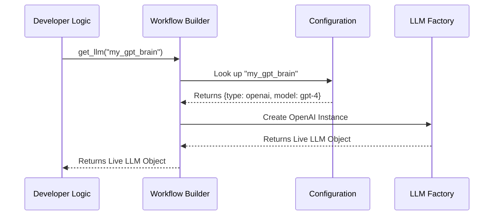

# Chapter 2: Workflow Builder

In the previous [LLM Provider Abstraction](01_llm_provider_abstraction.md) chapter, we learned how to create "blueprints" (configurations) for our models. We have the settings, but we don't have a running application yet.

Now, we need to turn those blueprints into a real, functioning structure. This is the job of the **Workflow Builder**.

## Motivation: The "IKEA" Problem

Imagine you just bought a complex piece of furniture from IKEA.
1.  **The Config:** This is the instruction manual. It tells you what parts you have.
2.  **The Components:** These are the screws, wooden boards, and hinges (in our case: LLMs, Tools, and Memory).

**The Problem:** The manual doesn't assemble the furniture for you. If you were building an AI agent manually in Python, you would have to write code like this:

```python
# The "Manual" Way - Messy and Hard to Change
auth = AuthProvider(api_key="...")
llm = OpenAIClient(auth=auth, model="gpt-4")
database = PostgresDB(host="localhost")
# Manually passing dependencies everywhere...
agent = Agent(brain=llm, memory=database)
```

If you change the database or the LLM, you have to rewrite all this wiring code.

**The Solution:** The **Workflow Builder**. It acts like an automatic assembly robot. You feed it the instruction manual (Config), and it automatically creates the LLM, connects the database, and hands you a finished `Workflow` object.

## Key Concepts

To understand the Builder, we need to understand three simple ideas:

1.  **The Factory:** The Builder is a factory. You don't create objects yourself; you ask the Builder to do it.
2.  **Dependency Injection:** This is a fancy term for "automatic wiring." If your Agent needs an LLM, the Builder finds the correct LLM and plugs it in for you.
3.  **The Workflow:** This is the final product. It is a container that holds your running application, ready to accept user input.

## Solving the Use Case

Let's see how we use the Builder to assemble an agent without manually wiring everything.

### 1. The Configuration (The Blueprint)
First, recall that we have a YAML configuration (or Python object) defining our parts.

```yaml
# config.yaml
llms:
  my_gpt_brain:
    _type: openai
    model_name: "gpt-4o"

workflow:
  llm_name: my_gpt_brain
```

### 2. The Builder in Action
When writing your agent's logic, you don't import `OpenAI`. Instead, you ask the `builder` for the component by name.

```python
# This function defines your agent's logic
async def my_agent_logic(user_input: str, builder: Builder):
    
    # ASK the builder for the LLM defined in config
    llm = await builder.get_llm("my_gpt_brain")
    
    # Now use it!
    response = await llm.generate(user_input)
    return response
```

**Explanation:**
Notice `builder.get_llm("my_gpt_brain")`. We didn't specify API keys or URLs here. The Builder looks at the config, sees "my_gpt_brain", initializes the OpenAI client, and gives it to us.

### 3. Creating the Workflow
Finally, the system wraps your logic into a `Workflow` object. This object holds the instructions (`my_agent_logic`) and all the live tools needed to run it.

```python
# Abstract representation of what happens internally
workflow = await builder.set_workflow(
    entry_point=my_agent_logic,
    config=my_config
)
```

Now, `workflow` is a complete, executable package.

## Under the Hood: How It Works

How does the Builder know how to create these objects?

1.  **Lookup:** You request a component (e.g., "my_gpt_brain").
2.  **Config Resolution:** The Builder looks in the configuration dictionary to find the definition of "my_gpt_brain".
3.  **Factory Call:** Based on the `_type` (e.g., `openai`), it calls the specific provider function (which we registered in [LLM Provider Abstraction](01_llm_provider_abstraction.md)).
4.  **Caching:** If you ask for "my_gpt_brain" again, the Builder gives you the *same* instance (it's a singleton within the session).

Here is the flow:



### Internal Implementation Details

The `Builder` class is an abstract base class that defines the "contracts" for fetching components.

#### The Builder Interface
Here is a simplified look at the `Builder` class definition.

```python
# packages/nvidia_nat_core/src/nat/builder/builder.py

class Builder(ABC):
    
    @abstractmethod
    async def get_llm(self, llm_name: str, wrapper_type: str) -> Any:
        """
        Finds the config for 'llm_name', instantiates it, 
        and returns the object.
        """
        pass
```

**Explanation:** 
The `Builder` defines standard methods like `get_llm`, `get_tool`, and `get_memory_client`. This ensures that no matter how complex your agent is, the way you retrieve components is always the same.

#### The Workflow Object
The result of the build process is a `Workflow`.

```python
# packages/nvidia_nat_core/src/nat/builder/workflow.py

class Workflow:
    def __init__(self, entry_fn, llms, tools, ...):
        self._entry_fn = entry_fn  # Your main logic function
        self.llms = llms           # The created LLM objects
        self.functions = tools     # The created Tool objects
```

**Explanation:**
The `Workflow` acts as a container. It holds:
1.  **`_entry_fn`**: The code logic you wrote (what the agent *does*).
2.  **`llms` / `functions`**: The dictionary of instantiated objects (what the agent *uses*).

This separation is crucial. It means your logic (`_entry_fn`) is pure code, while the heavy components (`llms`) are managed and stored separately by the container.

## Summary

In this chapter, we learned:
*   **The Problem:** Manually connecting components (LLMs, Tools, DBs) creates messy, hard-to-maintain code.
*   **The Solution:** The **Workflow Builder** acts as a central factory.
*   **The Usage:** We use methods like `builder.get_llm("name")` to ask for components, allowing the Builder to handle the initialization details.
*   **The Result:** The Builder produces a `Workflow` object, which contains everything needed to run the application.

We now have a `Workflow` object—a fully assembled car with an engine and wheels. But a car doesn't move unless someone gets in the driver's seat and turns the key.

In the next chapter, we will learn how to start the engine and process user requests.

[Next Chapter: Runtime Session & Runner](03_runtime_session___runner.md)

---

Generated by [Code IQ](https://github.com/adityasoni99/Code-IQ)