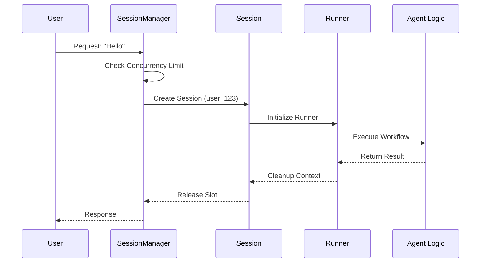

# Chapter 3: Runtime Session & Runner

In the previous [Workflow Builder](02_workflow_builder.md) chapter, we built our agent. We have a "vehicle" (the Workflow) containing the engine (LLM) and wheels (Tools).

However, a vehicle sitting in a garage isn't useful. We need to drive it. Furthermore, if we are building a web application, we might have **thousands** of users trying to drive their own vehicles at the same time.

This brings us to the **Runtime Session & Runner**.

## Motivation: The "Busy Airport" Problem

Imagine you are running an AI service.
1.  **Concurrency:** 500 users send a message at the exact same second. If you process them all instantly, your server might crash.
2.  **Isolation:** User A asks "What is my bank balance?". User B asks "Tell me a joke." You absolutely cannot let User B's joke logic access User A's bank data.
3.  **State:** You need to remember that User A is logged in, while User B is anonymous.

**The Solution:**
*   The **SessionManager** acts like an **Airport Control Tower**. It manages traffic, ensures planes don't crash into each other, and assigns pilots to planes.
*   The **Session** is the **Cockpit** assigned to a specific user. It contains the controls and user-specific data.
*   The **Runner** is the **Pilot**. It takes the flight plan (the Workflow), handles the controls (Inputs), flies the route (Execution), and lands safely (Outputs).

## Key Concepts

Let's break down the hierarchy:

1.  **SessionManager:** The boss. It lives as long as your server runs. It holds the global configuration and limits how many agents run at once (concurrency).
2.  **Session:** Created *per request*. When a user sends a message, the Manager creates a Session. It creates a safe "bubble" for that specific user.
3.  **Runner:** The worker. Inside a Session, the Runner actually executes the Python code of your agent.

## Solving the Use Case

Let's look at how to take the `Workflow` we built in the last chapter and actually run it for a user.

### 1. Initialize the Manager (The Control Tower)

First, we create the `SessionManager`. This usually happens once when your application starts.

```python
from nat.runtime.session import SessionManager

# We use the builder and config from Chapter 2
manager = SessionManager(
    config=my_config,
    shared_builder=my_builder,
    max_concurrency=10  # Only allow 10 agents to run at once
)
```

**Explanation:**
We tell the manager which Builder to use (to make agents) and set a `max_concurrency` limit. If the 11th user tries to connect, they will wait until a slot opens up.

### 2. Creating a Session (The Cockpit)

When a request comes in (e.g., via a Flask or FastAPI route), we ask the manager for a session.

```python
# Create a session for a specific user
async with manager.session(user_id="user_123") as session:
    
    # Inside this block, we are in a safe, isolated bubble
    # Specifically for "user_123"
    print(f"Session ready for: {session.user_id}")
```

**Explanation:**
The `manager.session(...)` context manager handles all the setup. It checks for available slots (semaphores) and sets up context variables so "user_123" data doesn't leak to others.

### 3. Running the Agent (The Pilot)

Inside the session, we launch the `Runner` to execute our logic.

```python
    # Prepare the input
    user_input = "Hello, help me fix my router."

    # Launch the runner
    async with session.run(user_input) as runner:
        
        # Wait for the result
        result = await runner.result()
        print(f"Agent Replied: {result}")
```

**Explanation:**
1.  `session.run(input)`: Prepares the runner with the input data.
2.  `runner.result()`: Actually executes the workflow steps (LLM calls, tools, etc.) and returns the final answer.

## Under the Hood: How It Works

What actually happens when you call `runner.result()`? It's not just running a function; it's managing a lifecycle.

1.  **Context Restoration:** The Runner ensures that variables (like Request ID or Auth Tokens) are correctly set for the current thread.
2.  **Input Conversion:** It converts your raw text into the data type the agent expects.
3.  **Execution:** It runs the workflow logic.
4.  **Events:** It emits events (like "Thinking...", "Tool Called") for observability.

Here is the sequence of a single request:



### Internal Implementation Details

Let's look at the actual code in the toolkit to see how this magic is implemented.

#### The Session Manager & Concurrency
The `SessionManager` uses Python's `asyncio.Semaphore` to limit how many agents run at the same time.

```python
# packages/nvidia_nat_core/src/nat/runtime/session.py

class SessionManager:
    def __init__(self, max_concurrency: int = 8, ...):
        # Create a semaphore to limit simultaneous flights
        if max_concurrency > 0:
            self._semaphore = asyncio.Semaphore(max_concurrency)
        else:
            self._semaphore = nullcontext()
```

**Explanation:**
If `max_concurrency` is 8, the semaphore has 8 "tokens". Every time a session starts, it takes a token. If 0 tokens are left, the next request waits. This prevents your server from being overwhelmed.

#### The Runner & Events
The `Runner` wraps your agent's function. Notice how it sets up identifiers (`workflow_run_id`) before running your code. This is crucial for tracing and debugging.

```python
# packages/nvidia_nat_core/src/nat/runtime/runner.py

class Runner:
    async def result(self):
        # 1. Generate unique IDs for this run
        workflow_run_id = str(uuid.uuid4())
        self._context_state.workflow_run_id.set(workflow_run_id)

        # 2. Emit "Start" Event
        self._emit_event(IntermediateStepType.WORKFLOW_START)

        # 3. RUN YOUR CODE
        result = await self._entry_fn.ainvoke(self._input_message)
        
        # 4. Emit "End" Event
        self._emit_event(IntermediateStepType.WORKFLOW_END)
        return result
```

**Explanation:**
The `Runner` handles the "sandwich" work. It places the "bread" (ID generation, logging, event emission) around the "meat" (your actual agent logic). This ensures that every execution is traceable without you writing logging code inside your agent.

#### Streaming Results
Sometimes you don't want to wait for the whole answer. You want the text to appear as it is generated (like ChatGPT). The `Runner` supports this via `result_stream`.

```python
    # Streaming example usage
    async with session.run(user_input) as runner:
        async for chunk in runner.result_stream():
            print(chunk, end="", flush=True)
```

## Summary

In this chapter, we learned:
*   **The Problem:** Running agents requires managing user context and server load (concurrency).
*   **The Solution:** The **SessionManager** controls traffic, and the **Runner** executes the flight plan.
*   **Usage:** We use `manager.session()` to isolate users and `runner.result()` to execute logic.
*   **The Mechanism:** The Manager uses semaphores to prevent overload, while the Runner wraps execution with tracing and event logging.

Now we have a running agent that can handle multiple users safely! However, our agent is currently isolated in a bubble. What if it needs to access external data, files, or talk to the browser securely?

In the next chapter, we will learn how to connect our agent to the outside world using a standardized protocol.

[Next Chapter: Model Context Protocol (MCP) Integration](04_model_context_protocol__mcp__integration.md)

---

Generated by [Code IQ](https://github.com/adityasoni99/Code-IQ)