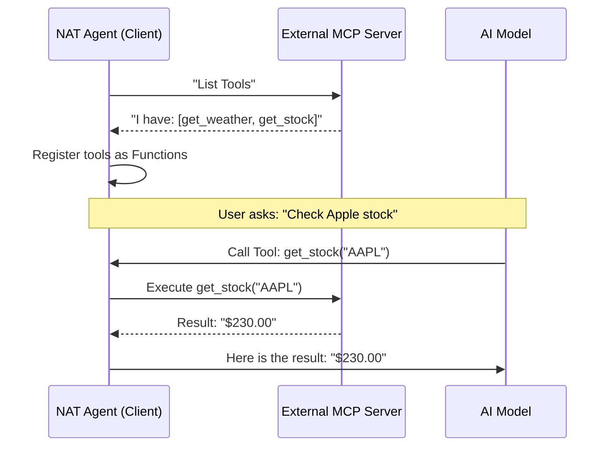

# Chapter 4: Model Context Protocol (MCP) Integration

In the previous [Runtime Session & Runner](03_runtime_session___runner.md) chapter, we learned how to run our agent and manage user sessions. We have a running application, but right now, it lives in a bubble. It can't read files, check stock prices, or update databases.

To make our agent truly useful, it needs "hands" to interact with the world. This brings us to **Model Context Protocol (MCP) Integration**.

## Motivation: The "Universal USB" Problem

Imagine you want your AI agent to:
1.  Read a PDF file on your computer.
2.  Send a message to a Slack channel.
3.  Query a PostgreSQL database.

**The Problem:** Without a standard, you have to write specific code for every single integration. You need a "Slack Handler," a "PDF Handler," and a "Database Handler." It's like having a drawer full of different, tangled charger cables.

**The Solution:** **MCP** is an open standard, similar to a **USB port**.
*   If a tool (like a database or file system) speaks "MCP," your agent can plug into it immediately.
*   You don't need to write custom code; you just connect them.

In the **NeMo Agent Toolkit**, we support this in two ways:
1.  **As a Client:** Your agent connects to external tools (e.g., "Hey Database, give me data").
2.  **As a Server:** Your agent becomes a tool for others (e.g., "I am the Math Agent, ask me to calculate things").

## Key Concepts

To understand MCP, we just need to know two roles:

1.  **MCP Server (The Tool Box):** This is a program running somewhere (on your laptop or a server) that says, *"I have these tools: `read_file`, `write_file`."*
2.  **MCP Client (The Agent):** This is your NAT agent. It connects to the Server, sees the list of tools, and asks the LLM to use them when needed.

## Solving the Use Case

Let's solve two scenarios: consuming tools from the outside world, and exposing our agent to the world.

### 1. The Agent as a Client (Using External Tools)

Imagine you want your agent to search the web. You have a "Search MCP Server" running at `http://localhost:8080`.

To give your agent these "eyes," you just add an entry to your configuration file.

```yaml
# config.yaml
functions:
  internet_search:
    _type: mcp
    server:
      url: "http://localhost:8080/sse"
      transport: sse
```

**Explanation:**
*   `_type: mcp`: Tells the toolkit to use the MCP Client implementation.
*   `url`: The address where the external tools live.
*   The toolkit automatically connects, downloads the list of available tools (like `google_search`), and gives them to your LLM.

### 2. The Agent as a Server (Sharing Your Agent)

Now, imagine you built a specialized "Financial Analyst Agent" using this toolkit. You want to let *other* agents (like Claude Desktop or another NAT agent) use it.

You can turn your entire agent into an MCP Server using the command line:

```bash
# This command starts your agent as an MCP Server
nat mcp serve --config_file my_agent_config.yaml
```

**Explanation:**
*   The toolkit takes all the functions your agent knows.
*   It wraps them in the MCP protocol.
*   It exposes them at a URL (e.g., `http://localhost:8000/mcp`).
*   Now, your agent *is* the tool.

## Under the Hood: How It Works

How does the toolkit magically know which tools are available? It performs a **Handshake**.

When your agent starts up and connects to an MCP Server, a conversation happens behind the scenes:

1.  **Connect:** Agent connects to the Server URL.
2.  **List Tools:** Agent asks, "What can you do?"
3.  **Register:** Agent converts those tools into NAT Functions.
4.  **Execute:** When the LLM calls a tool, the Agent forwards the request to the Server.



### Internal Implementation Details

Let's look at the code that makes this seamless.

#### 1. Dynamic Function Registration (The Client)
When you define `_type: mcp`, the toolkit runs the `mcp_client_function_group` function. This code connects to the server and creates Python functions on the fly.

```python
# packages/nvidia_nat_mcp/src/nat/plugins/mcp/client/client_impl.py

@register_function_group(config_type=MCPClientConfig)
async def mcp_client_function_group(config, _builder):
    # 1. Connect to the MCP Server
    client = MCPStreamableHTTPClient(url=str(config.server.url), ...)
    
    async with client:
        # 2. Ask the server what tools it has
        all_tools = await client.get_tools()

        # 3. Convert tools into NAT Functions
        for tool_name, tool in all_tools.items():
            # Create a wrapper function that calls the remote server
            group.add_function(name=tool_name, ...)
            
    yield group
```

**Explanation:**
The `client.get_tools()` method does the heavy lifting of the handshake. The loop iterates through every tool found and registers it so your [Workflow Builder](02_workflow_builder.md) can use it just like a local function.

#### 2. Session Isolation (Safety)
If multiple users are using your agent, we don't want User A to control User B's database connection. The toolkit uses a `MCPFunctionGroup` with session tracking.

```python
# packages/nvidia_nat_mcp/src/nat/plugins/mcp/client/client_impl.py

class MCPFunctionGroup(FunctionGroup):
    
    async def _get_session_client(self, session_id: str):
        # Check if we already have a connection for this user
        if session_id in self._sessions:
            return self._sessions[session_id].client
            
        # If not, create a NEW, isolated client for this session
        new_client = await self._create_session_client(session_id)
        self._sessions[session_id] = new_client
        return new_client
```

**Explanation:**
This ensures that when `user_123` triggers an MCP tool, they use a connection specifically tagged for `user_123`. This is critical for security and data privacy.

#### 3. Exposing Tools (The Server)
When acting as a server, the toolkit automatically wraps your logic using `FastMCP`.

```python
# packages/nvidia_nat_fastmcp/src/nat/plugins/fastmcp/server/tool_converter.py

def register_function_with_mcp(mcp: FastMCP, function_name: str, ...):
    
    # Create a wrapper that runs the function inside our Runner
    async def wrapper_func(**kwargs):
        async with session_manager.run(kwargs) as runner:
            return await runner.result()

    # Register it with the FastMCP library
    mcp.tool(name=function_name)(wrapper_func)
```

**Explanation:**
The wrapper ensures that even when an external system calls your function, it still runs through the [Runtime Session & Runner](03_runtime_session___runner.md). This preserves all your logging, guardrails, and context.

## Summary

In this chapter, we learned:
*   **The Problem:** Connecting to external tools requires too much custom code.
*   **The Solution:** **MCP** acts as a universal "USB port" for AI tools.
*   **The Mechanism:**
    *   **As Client:** The toolkit performs a handshake to discover and register remote tools automatically.
    *   **As Server:** The toolkit wraps your agent's functions to let others use them.

We now have an agent that is intelligent, scalable, and connected to the outside world. However, connecting to the outside world brings risks. What if the user tries to trick the agent into deleting files? Or what if the LLM generates harmful content?

We need a way to protect our agent.

[Next Chapter: Middleware & Defense](05_middleware___defense.md)

---

Generated by [Code IQ](https://github.com/adityasoni99/Code-IQ)