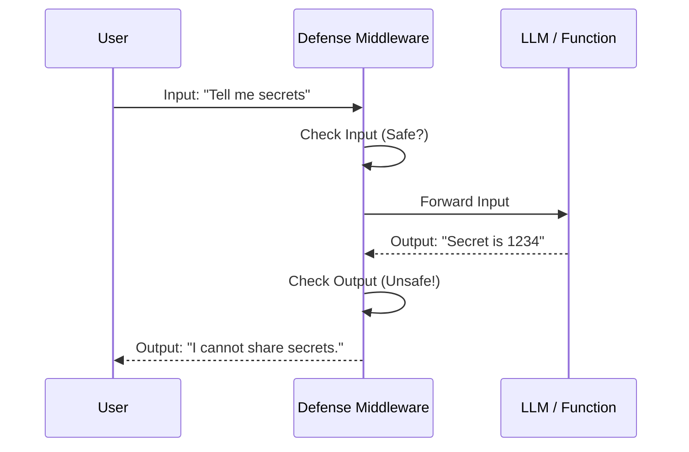

# Chapter 5: Middleware & Defense

In the previous [Model Context Protocol (MCP) Integration](04_model_context_protocol__mcp__integration.md) chapter, we gave our agent "hands" to interact with the outside world. It can now read files, search the web, and query databases.

But with great power comes great responsibility. What if your agent accidentally reads a file containing passwords and sends it to the user? What if a user tricks your agent into being rude?

This brings us to **Middleware & Defense**.

## Motivation: The "Airport Security" Problem

Imagine your agent is an international airport.
1.  **Passengers (Data):** They come in (Inputs) and fly out (Outputs).
2.  **The Risk:** Most passengers are safe, but one might carry a "dangerous item" (a prompt injection attack or a toxic response).

**The Problem:** If you check every passenger manually inside the plane (inside your agent logic), your code becomes messy. You would have `if is_safe(message):` scattered everywhere.

**The Solution:** **Middleware**. It acts like the **Security Checkpoint**.
*   It sits *outside* your agent's core logic.
*   It scans everything coming in and going out.
*   If it finds something bad, it stops it immediately, before it ever reaches the plane.

## Key Concepts

To understand Defense Middleware, we need to understand three simple concepts:

1.  **The Interceptor:** Middleware wraps around a function. It pauses execution to inspect data.
2.  **The Policy (Configuration):** This defines *what* to look for (e.g., "Stop PII leakage") and *where* to look (e.g., "Only check the output").
3.  **The Action:** What happens if a threat is found?
    *   **Refusal:** Block the request ("I cannot answer that").
    *   **Redirection:** Change the response (e.g., mask a credit card number like `****-****`).

## Solving the Use Case

Let's say we are building a Customer Support Agent. We want to ensure it **never leaks customer email addresses** in its output.

### 1. Defining the Defense Configuration

Instead of writing Python code to check for emails, we define a "Defense" rule in our YAML configuration.

```yaml
# config.yaml
middleware:
  email_protector:
    _type: pii_defense        # A specific defense type
    action: redirection       # Don't crash, just fix it
    target_location: output   # Check what the agent SAYS
    target_field: "$.response.body" # Only check the body text
```

**Explanation:**
*   **`action: redirection`**: Tells the system to sanitize the data (replace emails with `[REDACTED]`) rather than throwing an error.
*   **`target_location: output`**: We are worried about what leaves the system.
*   **`target_field`**: We use a specific path so we don't accidentally redact internal system logs.

### 2. Applying the Defense

In the **NeMo Agent Toolkit**, you don't need to manually attach this middleware to every function. The toolkit reads your config and wraps the relevant functions automatically.

If a user asks: *"What is Alice's email?"*
And the LLM tries to reply: *"It is alice@example.com"*

The Middleware intercepts the result:

```text
Original Output: "It is alice@example.com"
Middleware Scan: [Email Detected!] -> [Redacting...]
Final Output:    "It is [EMAIL REDACTED]"
```

Your agent logic doesn't even know this happened. It just generated the text, and the middleware cleaned it up.

## Under the Hood: How It Works

How does the toolkit wrap these functions? It uses a pattern often called the "Onion" or "Decorator" pattern.

When you call a function, you aren't calling the function directly. You are calling the **Middleware Layer**.

1.  **Request:** The user sends input.
2.  **Middleware (Pre-hook):** Can inspect input (Defense against Prompt Injection).
3.  **Execution:** The actual Agent/LLM runs.
4.  **Middleware (Post-hook):** Inspects output (Defense against PII/Toxicity).
5.  **Response:** The user gets the safe result.



### Internal Implementation Details

Let's look at the base class that makes this possible: `DefenseMiddleware`.

#### The Base Class
Every defense tool inherits from this standard structure. It holds the configuration and access to the Builder.

```python
# packages/nvidia_nat_core/src/nat/middleware/defense/defense_middleware.py

class DefenseMiddleware(FunctionMiddleware):
    def __init__(self, config: DefenseMiddlewareConfig, builder):
        super().__init__(is_final=False)
        self.config = config
        self.builder = builder
        
        # 'action' determines if we Block or Redact
        print(f"Defense initialized with action: {config.action}")
```

**Explanation:**
This class prepares the middleware. It knows *how* to react (`config.action`) based on your YAML settings.

#### Targeted Application (`_should_apply_defense`)
You might have 50 functions in your agent, but you only want to defend the `generate_email` function. The middleware checks if it should run for the current step.

```python
    def _should_apply_defense(self, context_name: str) -> bool:
        target = self.config.target_function_or_group

        # If no target is set in config, defend EVERYTHING
        if target is None:
            return True

        # Otherwise, only run if names match
        return context_name == target
```

**Explanation:**
Before scanning data, the middleware asks: *"Is this the function I am supposed to guard?"* This saves performance by not scanning internal utility functions unnecessarily.

#### Precision Targeting with JSONPath
Sometimes, the output is a complex JSON object. We don't want to scan the whole thing, just specific fields. The toolkit uses **JSONPath** (like `$.data.message`) to find the exact text to check.

```python
    def _extract_field_from_value(self, value: Any):
        # If the user specified a specific field (e.g., "$.response")
        if self.config.target_field:
            # Use JSONPath to find just that part of the data
            jsonpath_expr = parse(self.config.target_field)
            matches = jsonpath_expr.find(value)
            
            # Return only the extracted text for scanning
            return [match.value for match in matches]
            
        return value # Otherwise, scan everything
```

**Explanation:**
This method extracts the needle from the haystack. If your agent returns a 5MB JSON object, but only one field contains text, this ensures the defense system focuses only on that one field, making it fast and accurate.

## Summary

In this chapter, we learned:
*   **The Problem:** Connecting agents to the world introduces risks like data leakage and toxicity.
*   **The Solution:** **Defense Middleware** acts as a security checkpoint wrapping your agent.
*   **Usage:** We configure defenses in YAML, specifying an `action` (Block/Redact) and a `target` (Specific functions or fields).
*   **The Mechanism:** The middleware intercepts traffic before and after the agent runs, using **JSONPath** to surgically inspect specific data fields.

Now our agent is smart, connected, and safe. But how do we know how well it is performing? Is it slow? Is it getting confused?

We need to see inside the brain of the agent.

[Next Chapter: Observability & Profiling](06_observability___profiling.md)

---

Generated by [Code IQ](https://github.com/adityasoni99/Code-IQ)