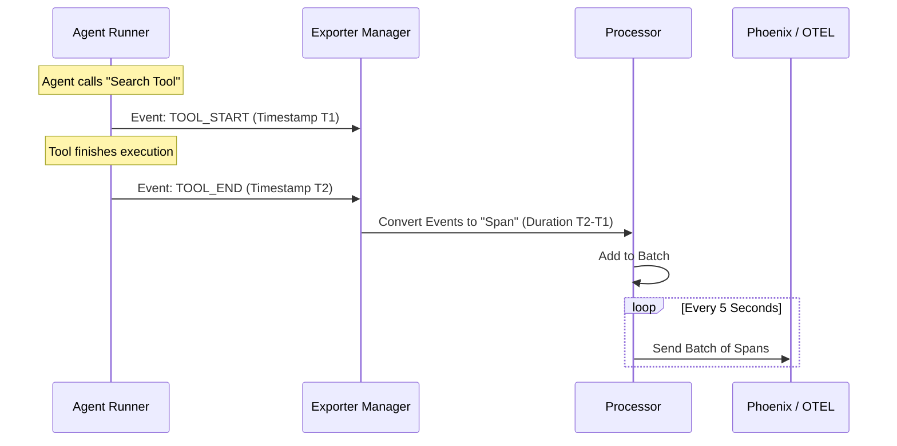

# Chapter 6: Observability & Profiling

In the previous [Middleware & Defense](05_middleware___defense.md) chapter, we secured our agent against bad inputs and data leaks. Our agent is now safe and functional.

But imagine this scenario: A user reports, *"The agent took 30 seconds to answer and then gave me the wrong information!"*

You look at your code. It looks fine. You look at the database. It looks fine. **What actually happened during those 30 seconds?** Without visibility, your agent is a "Black Box"—you put input in, get output out, but have no idea what happened inside.

This brings us to **Observability & Profiling**.

## Motivation: The "Flight Recorder" Problem

Building an agent is like building an airplane.
1.  **The Crash:** If something goes wrong, you need a "Black Box" (Flight Recorder) to replay the events.
2.  **The Efficiency:** You need a dashboard showing fuel usage (Tokens) and speed (Latency) to know if your plane is flying efficiently.

**The Problem:** Manually adding `print("Start function A")` and `print("End function A")` everywhere is tedious and creates messy logs that are hard to read.

**The Solution:**
*   **Observability (Tracing):** Automatically records a timeline of every step the agent takes (e.g., "Thought for 2s", "Called Google", "Parsed Result").
*   **Profiling (Metrics):** Automatically calculates statistics like "Average Token Cost" or "Requests per Second."

## Key Concepts

To understand how the toolkit handles this, we need to know three terms:

1.  **Span (The Event):** A single block of time. Example: *"The LLM generation started at 10:00:01 and ended at 10:00:03."*
2.  **Exporter (The Broadcaster):** A background worker that takes these Spans and sends them to a visualization tool (like **Phoenix** or **OpenTelemetry**).
3.  **Profiler (The Analyst):** A tool that looks at a batch of past executions and generates a report (e.g., "99% of your requests finish in under 2 seconds").

## Solving the Use Case

Let's set up our agent to send data to **Phoenix** (a popular UI for visualizing AI agents) and then generate a performance report.

### 1. Configuring the Exporter

First, we tell the system *where* to send the data. We do this in our configuration, just like we did for LLMs and Tools.

```yaml
# config.yaml
observability:
  exporters:
    my_phoenix_exporter:
      _type: phoenix       # Use the Phoenix plugin
      project_name: "my_agent_project"
      endpoint: "http://localhost:6006" # Where Phoenix is running
```

**Explanation:**
We define an exporter named `my_phoenix_exporter`. We specify the type (`phoenix`) and the URL where the Phoenix server is listening.

### 2. Starting the Recorder

In your application code, you need to start the `ExporterManager`. This manager runs in the background, collecting events from the [Runtime Session & Runner](03_runtime_session___runner.md).

```python
from nat.observability.exporter_manager import ExporterManager

# Load your config and create the manager
manager = ExporterManager.from_exporters(my_config.observability.exporters)

# Start the background tasks
async with manager.start():
    # Run your agent logic here!
    # All events are now being recorded automatically.
    await run_my_agent_session()
```

**Explanation:**
The `async with manager.start():` block ensures that the background workers are active. As your agent runs, every tool call and LLM generation is silently captured and shipped to Phoenix.

### 3. Profiling Performance

After running your agent for a while, you might want to analyze the data. Is the LLM getting slower? Are we using too many tokens? The `ProfilerRunner` answers this.

```python
from nat.profiler.profile_runner import ProfilerRunner

# Assume 'traces' is a list of steps collected from previous runs
profiler = ProfilerRunner(config=profiler_config, output_dir="./stats")

# Generate the report
results = await profiler.run(traces)

print(f"95% of requests finish in: {results.workflow_runtime_metrics.p95}s")
```

**Explanation:**
The `ProfilerRunner` takes raw execution data (`traces`) and performs heavy math. It calculates things like **P95 Latency** (the time within which 95% of requests complete), which is crucial for understanding user experience.

## Under the Hood: How It Works

How does a simple Python function call turn into a beautiful graph on a dashboard?

1.  **Event Emission:** When the [Runtime Session & Runner](03_runtime_session___runner.md) executes a step, it emits an internal event (e.g., `LLM_START`).
2.  **Conversion:** The toolkit converts this internal event into a standard **Span**.
3.  **Processing:** The `Exporter` batches these spans together (so we don't spam the network).
4.  **Export:** The batch is sent to the external system (Phoenix/OTEL).

Here is the flow of data:



### Internal Implementation Details

Let's look at the code that makes this happen.

#### The Exporter Manager
The `ExporterManager` is responsible for managing the lifecycle of these background workers.

```python
# packages/nvidia_nat_core/src/nat/observability/exporter_manager.py

class ExporterManager:
    async def start(self):
        # Start all exporters in background tasks
        for name, exporter in self._exporter_registry.items():
            task = asyncio.create_task(self._run_exporter(name, exporter))
            self._tasks[name] = task
            
        # Wait for them to be ready before letting the agent run
        await asyncio.gather(*[e.wait_ready() for e in exporters])
        yield self
```

**Explanation:**
This code ensures that your observability layer is fully up and running before your agent processes a single request. This prevents "lost data" at the start of an application.

#### The OpenTelemetry Exporter
The toolkit relies heavily on OpenTelemetry (OTEL), an industry standard. The `OtelSpanExporter` handles the translation.

```python
# packages/nvidia_nat_opentelemetry/src/nat/plugins/opentelemetry/otel_span_exporter.py

class OtelSpanExporter(SpanExporter):
    def __init__(self, ...):
        # Add a processor that converts NAT Spans -> OTEL Spans
        self.add_processor(SpanToOtelProcessor())
        
        # Add a processor that batches them for network efficiency
        self.add_processor(OtelSpanBatchProcessor(batch_size=100))
```

**Explanation:**
This follows a "Pipeline" pattern. Data flows through a series of processors. First, it's translated to the OTEL format. Then, it's buffered into batches of 100 to reduce network overhead.

#### The Profiler Logic
The `ProfilerRunner` uses statistical math to analyze your agent's history.

```python
# packages/nvidia_nat_core/src/nat/profiler/profile_runner.py

def _compute_llm_latency_confidence_intervals(self):
    latencies = []
    # Loop through every recorded step
    for req_data in self.all_steps:
        # Calculate time between START and END
        if event_type == "LLM_END":
             latencies.append(ts - previous_llm_start_time)

    # Calculate statistics (Mean, P90, P99)
    return self._compute_confidence_intervals(latencies, "LLM Latency")
```

**Explanation:**
The profiler doesn't just look at averages (which can be misleading). It calculates **Confidence Intervals** and **Percentiles**. This helps you answer questions like, *"I know the average speed is 2s, but how slow is the slowest 1% of requests?"*

## Summary

In this chapter, we learned:
*   **The Problem:** An agent without monitoring is a "Black Box"—hard to debug and optimize.
*   **The Solution:** **Observability** (recording what happened) and **Profiling** (analyzing performance stats).
*   **The Components:**
    *   **ExporterManager:** The background system that ships data to tools like Phoenix.
    *   **ProfilerRunner:** The tool that generates statistical reports on latency and cost.
*   **The Benefit:** We can now visualize execution traces and mathematically prove our agent's performance.

At this point, we have built a fully functional, safe, connected, and observable agent. But there is one final piece of the puzzle. How do we know if the agent is actually *smart*? Does it give high-quality answers?

In the final chapter, we will look at how to grade our agent's homework.

[Next Chapter: Evaluation Engine](07_evaluation_engine.md)

---

Generated by [Code IQ](https://github.com/adityasoni99/Code-IQ)