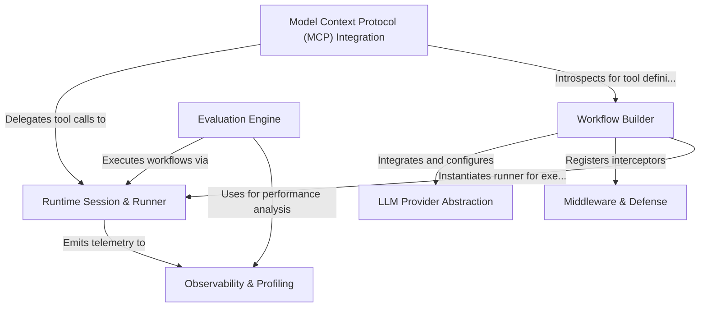

# Tutorial: NeMo-Agent-Toolkit

The **NeMo Agent Toolkit** is a modular framework designed for building, deploying, and evaluating intelligent **Generative AI agents**. It features a central **Workflow Builder** to assemble components like LLMs and tools, a robust **Runtime Engine** to manage stateful user sessions, and integration with the **Model Context Protocol (MCP)** for external connectivity, all underpinned by comprehensive **Observability** and **Evaluation** layers to ensure performance and safety.

**Source Repository:** [https://github.com/NVIDIA/NeMo-Agent-Toolkit](https://github.com/NVIDIA/NeMo-Agent-Toolkit)

## Chapters

1. [LLM Provider Abstraction](01_llm_provider_abstraction.md)
2. [Workflow Builder](02_workflow_builder.md)
3. [Runtime Session & Runner](03_runtime_session___runner.md)
4. [Model Context Protocol (MCP) Integration](04_model_context_protocol__mcp__integration.md)
5. [Middleware & Defense](05_middleware___defense.md)
6. [Observability & Profiling](06_observability___profiling.md)
7. [Evaluation Engine](07_evaluation_engine.md)

---

Generated by [Code IQ](https://github.com/adityasoni99/Code-IQ)