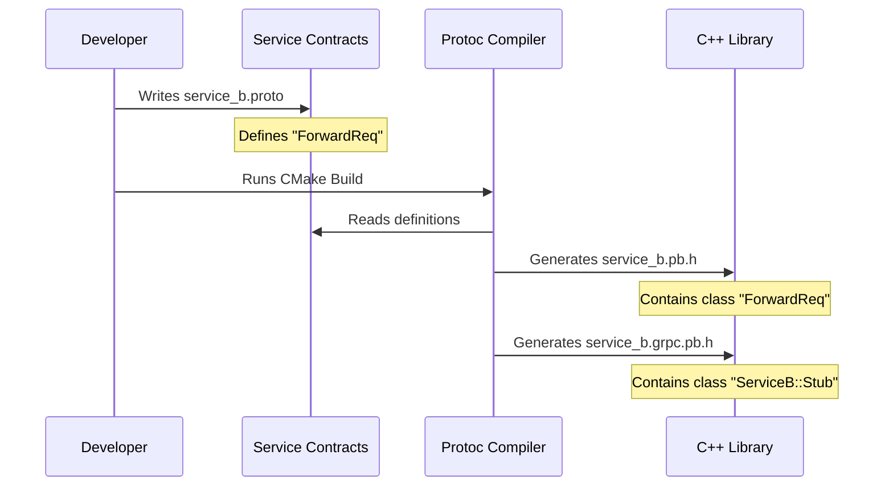

# Chapter 1: Service Contracts (Protobuf)

Welcome to the **PQC** project! 

In this first chapter, we are going to lay the foundation for how our software components talk to each other. Before we can send secure messages or perform complex calculations, we need to agree on a common language.

## The Motivation: Why do we need a Contract?

Imagine you walk into a restaurant in a foreign country. You speak English, but the chef speaks Italian. If you shout random words, you won't get the dinner you want. You need a **Menu**—a document that translates "I want pasta" into something the chef understands.

In the world of microservices (small programs that work together), this "Menu" is called a **Service Contract**.

Our project has two main parts: **Service A** and **Service B**. They are strict about how they communicate. They don't just send raw text; they use a structured format to prevent errors. We use a tool called **Protobuf** (Protocol Buffers) to write these contracts.

**The Goal:** We want Service A to send a specific request to Service B, and Service B to reply with a result and some Post-Quantum Cryptography (PQC) group information.

## Concept 1: The Message (The Payload)

A "Message" in Protobuf is like a form you fill out. It defines exactly what data fields exist and what type they are (text, numbers, etc.).

Let's look at `service_b.proto`. This file defines the contract for Service B. First, we define what a request looks like.

```protobuf
syntax = "proto3";
package pqc.serviceb;

// The request form
message ForwardReq {
  string payload = 1;
}
```

**Explanation:**
1.  `syntax = "proto3"`: Tells the compiler we are using version 3 of the language.
2.  `package`: Organizes our code so names don't clash.
3.  `message ForwardReq`: Defines a data structure named `ForwardReq`.
4.  `string payload = 1`: This message has one field, text, labeled as position 1.

Now, let's look at what Service B sends back.

```protobuf
// The response form
message ForwardResp {
  string result = 1;
  string service_a_group = 2;
  string service_b_group = 3;
}
```

**Explanation:**
*   When Service B replies, it sends back three pieces of text: a `result` and two group names (used for our crypto settings later).
*   The numbers `= 1`, `= 2`, `= 3` are unique tags for identifying fields efficiently.

## Concept 2: The Service (The Action)

Now that we have the data structures (the nouns), we need to define the action (the verb). This is done using an `rpc` (Remote Procedure Call).

Think of an RPC as a function that runs on a different computer.

```protobuf
// The waiter service
service ServiceB {
  // A function that takes a Request and returns a Response
  rpc ForwardRequest(ForwardReq) returns (ForwardResp);
}
```

**Explanation:**
*   `service ServiceB`: This groups our available actions.
*   `rpc ForwardRequest`: This is the function name.
*   `(ForwardReq)`: The input.
*   `returns (ForwardResp)`: The output.

This one line is powerful. It strictly enforces that you *cannot* call `ForwardRequest` without providing a `ForwardReq` message.

## Concept 3: Generating the C++ Code

Here is the magic trick. C++ doesn't understand `.proto` files natively. We use a build system called **CMake** to translate these contracts into C++ code that we can actually compile.

In our `proto/CMakeLists.txt`, we find the instructions for this translation.

### Step 1: Finding the Translator
First, CMake looks for the tools installed on your computer.

```cmake
cmake_minimum_required(VERSION 3.22)
project(pqc_proto)

# Find the gRPC library and tools
find_package(gRPC REQUIRED)
```

### Step 2: The Translation Command
We use a command called `protoc` (Protobuf Compiler) to generate C++ files.

```cmake
# Rule to generate standard C++ classes (like std::string wrappers)
add_custom_command(
  OUTPUT "${proto_name}.pb.cc" "${proto_name}.pb.h"
  COMMAND protobuf::protoc
    --cpp_out=${CMAKE_CURRENT_BINARY_DIR}
    ${proto_file}
  # ... (other arguments skipped for brevity)
)
```

**Explanation:**
*   `OUTPUT`: Tells CMake this command creates a `.cc` (source) and `.h` (header) file.
*   `protobuf::protoc`: The compiler tool.
*   `--cpp_out`: We want C++ output.

### Step 3: Generating gRPC Stubs
We also need code for the network communication (the gRPC part).

```cmake
# Rule to generate network logic (gRPC)
add_custom_command(
  OUTPUT "${proto_name}.grpc.pb.cc" "${proto_name}.grpc.pb.h"
  COMMAND protobuf::protoc
    --grpc_out=${CMAKE_CURRENT_BINARY_DIR}
    --plugin=protoc-gen-grpc=$<TARGET_FILE:gRPC::grpc_cpp_plugin>
    ${proto_file}
)
```

**Explanation:**
*   This looks similar to the previous block, but it adds a `--plugin`.
*   This plugin generates the "Server" and "Client" code that handles sending data over the network for us.

## Under the Hood: The Abstraction Flow

How does this abstraction decouple the logic? It means you can change the underlying C++ code completely, but as long as the `.proto` file stays the same, Service A and Service B can still talk.

Here is what happens when you build the project:



1.  **Definition**: You define the "Interface" in a simple text file.
2.  **Generation**: The compiler creates complex C++ code automatically.
3.  **Usage**: In your C++ logic (which we will see in later chapters), you simply include the generated header: `#include "service_b.grpc.pb.h"`.

## Solving the Use Case

Let's look at `service_a.proto` to see the complete picture of our system's contracts.

```protobuf
message DataRequest {
  string payload = 1;
}

message DataResponse {
  string result = 1;
  string negotiated_group = 2;
}

service ServiceA {
  rpc ProcessData(DataRequest) returns (DataResponse);
}
```

**How to use this:**
When we implement Service A in C++, we don't have to write code to parse bytes from the network. We will simply get an object of type `DataRequest`. We can access the data like this (pseudocode):

```cpp
// This is how easy it will be to use the contract
std::string my_data = request->payload(); 
```

We have successfully abstracted away the complexity of network formatting!

## Conclusion

In this chapter, we defined the **Service Contracts**. We established a strict agreement between Service A and Service B using Protobuf files. We also set up CMake to automatically translate these agreements into usable C++ code.

However, having a contract isn't enough. We need to send these messages securely so no one can intercept them. To do that, we need credentials.

In the next chapter, we will build the factory that creates these security keys.

[Next Chapter: TLS Credentials Factory](02_tls_credentials_factory.md)

---

Generated by [Code IQ](https://github.com/adityasoni99/Code-IQ)