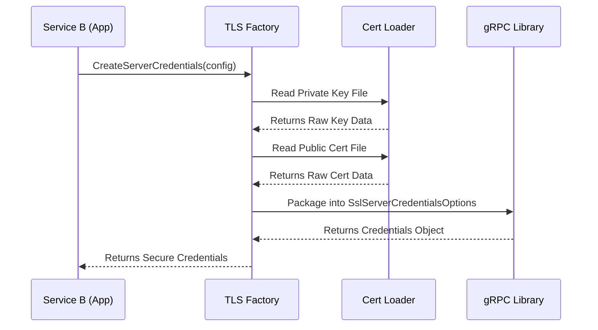

# Chapter 2: TLS Credentials Factory

Welcome back! 

In the previous chapter, [Service Contracts (Protobuf)](01_service_contracts__protobuf_.md), we defined the "Menu" so our services speak the same language.

Now, we need to make sure that when Service A orders from that menu, no one else is listening in. We need to secure the connection.

## The Motivation: The "Secure Envelope" Machine

Imagine you want to send a letter with top-secret instructions.
1.  **Plaintext (No TLS):** You write the instructions on a postcard. Anyone handling the mail can read it.
2.  **TLS:** You put the instructions in a heavy-duty, locked steel briefcase. Only the person with the right key can open it.

In computer programming, setting up that "locked briefcase" (TLS security) is usually very complicated. You have to configure ciphers, load certificates, check validities, and handle OpenSSL errors.

**The Solution:** We create a **TLS Credentials Factory**.

Instead of writing 50 lines of security code every time we start a server, we build a "Factory" (a helper function). We simply give the Factory our ID badge (Certificate), and it hands us back a fully secured, locked briefcase ready for travel.

## Concept 1: The Inputs (CertConfig)

Before the factory can work, it needs raw materials. In TLS (Transport Layer Security), these materials are files on your hard drive:
1.  **Private Key:** Your secret signature.
2.  **Cert Chain:** Your public ID card.
3.  **Root CA:** The master ID of the authority that trusts you.

We group these file paths into a simple structure called `CertConfig`.

*(Note: We will learn how to load these paths automatically in [Certificate Loader](03_certificate_loader.md), but for now, just know they exist.)*

## Concept 2: Server vs. Client (Channel) Credentials

Our factory makes two types of products:

1.  **Server Credentials:** Used by the Service receiving the call (like Service B). It tells the server: "Require everyone to show an ID, and use this key to unlock messages."
2.  **Channel Credentials:** Used by the Service making the call (like Service A). It tells the client: "Here is my ID to show the server."

This setup creates **mTLS (Mutual TLS)**, where *both* sides must prove who they are.

## Solving the Use Case

Let's look at how a developer uses this factory. The interface is defined in `common/include/common/tls_config.h`.

We want to start Service B securely. Instead of dealing with OpenSSL directly, we just call our factory.

### Using the Factory (Header Definition)

```cpp
namespace pqc_common {

// The Factory Function for Servers
std::shared_ptr<grpc::ServerCredentials> CreateServerCredentials(
    const CertConfig& config, 
    bool pqc_enabled = true
);

}
```

**Explanation:**
*   **Input:** `config` (Where are my keys?) and `pqc_enabled` (Should we use post-quantum crypto?).
*   **Output:** A smart pointer (`std::shared_ptr`) to gRPC credentials.
*   **Simplicity:** We don't see any complex crypto math here. It's just a request for credentials.

## Under the Hood: How it Works

What happens inside the factory when we ask for credentials?



1.  **Request:** The App asks for security.
2.  **Loading:** The Factory reads the raw text files (keys and certs) from the disk.
3.  **Packaging:** The Factory stuffs these keys into a gRPC settings object.
4.  **Result:** The App gets a ready-to-use security object.

### The Implementation Code

Let's peek inside `common/src/tls_config.cpp` to see how we implement this. We use a helper function `LoadFileContents` (which we will build in [Certificate Loader](03_certificate_loader.md)) to read the text files.

#### Step 1: Loading the Keys (Server Side)

```cpp
// Inside CreateServerCredentials...

grpc::SslServerCredentialsOptions::PemKeyCertPair pair;

// 1. Load the secret key
pair.private_key = LoadFileContents(config.private_key_path);

// 2. Load the public certificate
pair.cert_chain = LoadFileContents(config.cert_chain_path);
```

**Explanation:**
*   We create a `PemKeyCertPair`. Think of this as a folder holding your ID and your signature.
*   We read the files from the paths provided in the config.

#### Step 2: Enforcing Mutual Security

```cpp
// We force the server to CHECK the client's ID
grpc::SslServerCredentialsOptions opts(
    GRPC_SSL_REQUEST_AND_REQUIRE_CLIENT_CERTIFICATE_AND_VERIFY
);

opts.pem_root_certs = LoadFileContents(config.ca_cert_path);
opts.pem_key_cert_pairs.push_back(std::move(pair));
```

**Explanation:**
*   `GRPC_SSL_REQUEST...`: This is the most strict setting. It means "If the client doesn't show a valid ID, hang up immediately."
*   `pem_root_certs`: This is the "Master List" of valid IDs the server trusts.

#### Step 3: PQC and Returning the Result

```cpp
// Create the final object
return grpc::SslServerCredentials(opts);

// Note: (void)pqc_enabled is used to silence compiler warnings 
// because OpenSSL 3.5 handles PQC defaults automatically!
```

**Explanation:**
*   We wrap the options into `SslServerCredentials` and return it.
*   **The PQC Magic:** You might wonder, "Where is the Post-Quantum code?" In this project, we rely on the underlying **OpenSSL 3.5** library. By simply using standard TLS 1.3, OpenSSL automatically negotiates the PQC algorithms (like Kyber/ML-KEM) if the environment is configured correctly. Our factory acts as the gateway to let OpenSSL do its job.

### Client Side Implementation

The client (Channel) side is very similar. It bundles the keys into a slightly different object called `SslCredentialsOptions`.

```cpp
std::shared_ptr<grpc::ChannelCredentials> CreateChannelCredentials(...) {
    grpc::SslCredentialsOptions opts;
    
    // Load the Trusted Root so we know we are talking to the real Server
    opts.pem_root_certs = LoadFileContents(config.ca_cert_path);
    
    // Load our own ID to show the server
    opts.pem_private_key = LoadFileContents(config.private_key_path);
    opts.pem_cert_chain = LoadFileContents(config.cert_chain_path);

    return grpc::SslCredentials(opts);
}
```

## Conclusion

We have successfully isolated our security logic! 

*   **Before:** Our main application code would be cluttered with file reading and SSL configuration flags.
*   **Now:** We just call `CreateServerCredentials`.

This factory ensures that every service in our **PQC** project uses the exact same high-security standards (TLS 1.3 with PQC) without the developer having to remember the details.

But wait—where does that `LoadFileContents` function come from? How do we actually read those certificates from the disk safely?

In the next chapter, we will build the utility that handles the file system.

[Next Chapter: Certificate Loader](03_certificate_loader.md)

---

Generated by [Code IQ](https://github.com/adityasoni99/Code-IQ)