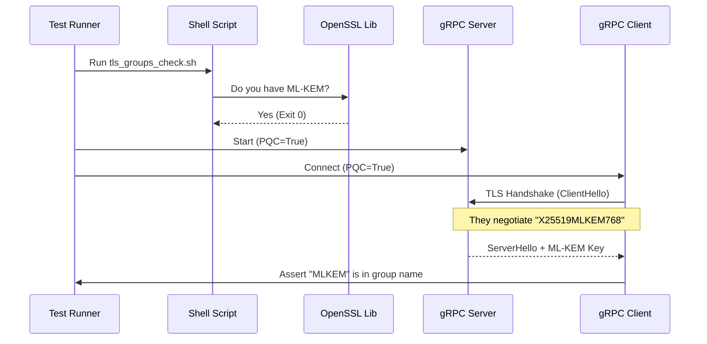

# Chapter 4: PQC Validation Suite

Welcome to Chapter 4!

In the previous chapter, [Certificate Loader](03_certificate_loader.md), we built a utility to find and load our cryptographic keys from the disk. Before that, in [TLS Credentials Factory](02_tls_credentials_factory.md), we built the machinery to create secure connections.

We have the lock, and we have the key. But here is the scary question: **Is the door actually locked?**

## The Motivation: Trust but Verify

In cryptography, it is very easy to *think* you are secure when you are not.
*   Maybe you installed the wrong version of OpenSSL.
*   Maybe the server silently fell back to older, weaker encryption because of a typo.
*   Maybe the "Post-Quantum" features aren't actually turned on.

We need a **Quality Assurance (QA) Layer**. We call this the **PQC Validation Suite**.

It is a collection of scripts and tests that act like a safety inspector. It pokes and prods our system to prove that we are actually using **ML-KEM (Kyber)** or **ML-DSA (Dilithium)** algorithms on the wire.

## Concept 1: The Pre-Flight Checklist

Before we even run our code, we need to check our environment. Post-Quantum Cryptography is new. It requires **OpenSSL 3.5+**. If you try to run this on an old laptop with OpenSSL 1.1, it won't work.

We use a script called `tls_groups_check.sh` to verify the "engine" of our car before we start the engine.

### The Check Script
This script asks OpenSSL: "Do you know how to speak PQC?"

```bash
# From scripts/tls_groups_check.sh

# 1. Check Version (Must be >= 3.5.0)
openssl version

# 2. Check for Key Encapsulation Mechanisms (KEM)
# We look for "mlkem", "kyber", or "ml-kem"
openssl list -kem-algorithms | grep -iE 'mlkem|kyber'
```

**What this does:**
*   If the output is empty, the script fails.
*   If it sees `ml-kem-768` or similar, it gives us a green light.

## Concept 2: The Integration Test (The Simulation)

Now that we know the environment is good, we need to test our C++ code.

We write an **Integration Test** using Google Test. This test spins up a real Server and a real Client *inside* the test memory. They talk to each other, and we check the transcript.

### The Hybrid Handshake

We want to prove that when Client connects to Server, they negotiate a **Hybrid Group** (Classical X25519 + Post-Quantum ML-KEM).

Let's look at `tests/test_tls_handshake.cpp`.

#### Step 1: Setting up the Server
We use the Factory we built in Chapter 2.

```cpp
// Inside the test body
pqc_common::CertConfig config = GetTestConfig(); // Helper to get paths

// Create credentials with PQC enabled (true)
auto server_creds = pqc_common::CreateServerCredentials(config, true);

grpc::ServerBuilder builder;
builder.AddListeningPort("localhost:50551", server_creds);
// ... Start the server ...
```

#### Step 2: The Client Connects
The client also uses our Factory.

```cpp
// Create client credentials, also PQC enabled
auto channel_creds = pqc_common::CreateChannelCredentials(config, true);

// Dial the server
auto channel = grpc::CreateChannel("localhost:50551", channel_creds);
auto stub = pqc::servicea::ServiceA::NewStub(channel);
```

#### Step 3: Verifying the Evidence
After the client sends a message ("hello-pqc"), the server replies. The critical part is checking *how* they talked.

```cpp
// The server sends back the group name it used
// We expect something like "X25519MLKEM768" (Hybrid)
EXPECT_FALSE(response.negotiated_group().empty());

if (response.negotiated_group() != "unknown") {
    // Verify it contains the magic PQC words
    EXPECT_TRUE(response.negotiated_group().find("MLKEM") != std::string::npos);
}
```

**Explanation:**
If this test passes, we have mathematical proof that our C++ code is correctly instructing the underlying library to use Post-Quantum algorithms.

## Concept 3: The Fallback Scenario (The Safety Net)

What happens if an old client (who doesn't understand PQC) tries to connect? We don't want the server to crash or reject them (unless we want strict security). We want **Backward Compatibility**.

We test this in `tests/test_fallback.cpp`.

```cpp
// Create Client credentials with PQC DISABLED (false)
auto old_client_creds = pqc_common::CreateChannelCredentials(config, false);

// Connect to the SAME PQC-enabled server
auto channel = grpc::CreateChannel("localhost:50551", old_client_creds);
```

**The Expectation:**
The connection should succeed, but the `negotiated_group` should be "Classical" (like X25519 or secp256r1), *not* ML-KEM.

## Under the Hood: The Validation Flow

How does the suite orchestrate all this?



## Concept 4: Wire Verification (Real World Inspection)

Unit tests are great, but sometimes we want to see the "wire" traffic ourselves. For this, we use the `scripts/validate_tls.sh` tool.

This script acts like a hacker or a network inspector. It uses the `openssl s_client` command-line tool to inspect the handshake from the outside.

### The Inspector Script

```bash
# Inside scripts/validate_tls.sh

# Connect to our running server and verify the groups
openssl s_client -connect localhost:50051 \
    -groups X25519MLKEM768:x25519 \
    -CAfile certs/ca.pem
```

The script then scans the text output for a specific line:
`Server Temp Key: X25519MLKEM768`

*   **If found:** Success! The server is serving PQC.
*   **If not found:** Failure. The server fell back to standard crypto.

## Solving the Use Case

Let's put it all together. You are a developer deploying this system. How do you ensure it's working?

1.  **Build the project** (which compiles the C++ tests).
2.  **Run the Validation Suite:**

```bash
# 1. Check tools
./scripts/tls_groups_check.sh
# Output: "All checks passed"

# 2. Run C++ Integration Tests
./build/tests/test_tls_handshake
# Output: "[  PASSED  ] 1 test."

# 3. Run Wire Verification
./scripts/validate_tls.sh
# Output: "validate_tls: hybrid PQC group negotiated (Server Temp Key): X25519MLKEM768"
```

If you see these three checks pass, you can sleep soundly knowing your application is quantum-resistant.

## Conclusion

In this chapter, we built the **PQC Validation Suite**. We learned that implementing crypto isn't enough; we must verify it.

1.  We checked our dependencies with `tls_groups_check.sh`.
2.  We verified the handshake logic with `test_tls_handshake.cpp`.
3.  We tested backward compatibility with `test_fallback.cpp`.
4.  We inspected the wire traffic with `validate_tls.sh`.

Now that we know our system is secure and running, we need to know how *well* it is running. Is the encryption slowing us down? How many bytes are we sending?

In the next chapter, we will build a system to watch the performance.

[Next Chapter: TLS Metrics Observer](05_tls_metrics_observer.md)

---

Generated by [Code IQ](https://github.com/adityasoni99/Code-IQ)