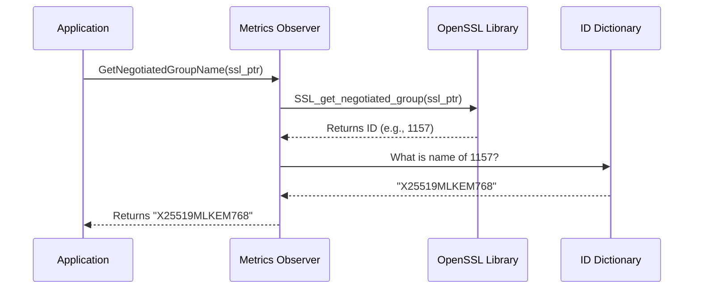

# Chapter 5: TLS Metrics Observer

Welcome to Chapter 5!

In the previous chapter, [PQC Validation Suite](04_pqc_validation_suite.md), we acted like a car mechanic. We ran tests in the garage to prove that our engine *could* run at high speeds (Post-Quantum security).

Now, we are taking the car out on the highway. We need a **Speedometer**.

## The Motivation: Peeking Under the Hood

When a client (Service A) connects to a server (Service B) using TLS, the encryption happens automatically inside a "Black Box" (OpenSSL).

Usually, your application just knows: "We are connected."

**The Problem:**
In the world of Quantum Safety, "connected" isn't enough. We need to answer specific questions for every single request:
1.  Did this specific user negotiate a **Post-Quantum** key?
2.  Or did they fall back to a weaker, classical key?

If we don't measure this, we are flying blind. We might *think* we are secure, but we might actually be using old encryption.

**The Solution:**
We build a **TLS Metrics Observer**. This component acts like a probe. It inserts itself into the active connection, extracts the technical details of the cryptography, and translates them into a human-readable string.

## Concept 1: The Opaque Handle (`SSL*`)

In C++ and OpenSSL, a secure connection is represented by a pointer called `SSL*`.

Think of this pointer as a **Claim Check** at a coat check.
*   You hold the ticket (the pointer).
*   The actual coat (the connection details) is hidden behind the counter.
*   You cannot see the coat directly. You have to ask the attendant to describe it for you.

Our Metrics Observer is that attendant.

## Concept 2: The Numeric ID (NID)

Computers don't like long strings like "X25519MLKEM768". They prefer numbers. OpenSSL assigns a unique ID number (called a **NID**) to every cryptographic algorithm.

*   ID `1034` might mean "X25519".
*   ID `1157` might mean "Kyber-768".

Our Observer needs to do two things:
1.  Ask OpenSSL for the ID of the current connection.
2.  Translate that ID into a text name we can read in our logs.

## Solving the Use Case

Let's see how we use this in our application. We want to log exactly which cryptographic group is protecting our data.

The interface is defined in `common/include/common/tls_metrics.h`.

### The Interface

```cpp
// The function asks the connection for its status
std::string GetNegotiatedGroupName(SSL* ssl);

// A helper to print it directly to the console
void LogNegotiatedGroup(SSL* ssl);
```

### Usage Example
Imagine we are inside the C++ code that handles a new connection. We have the `ssl` object (the claim check).

```cpp
// 1. We have an active connection object
SSL* current_connection = ...; 

// 2. Ask the observer what is happening
std::string group = GetNegotiatedGroupName(current_connection);

// 3. Check the result
if (group == "X25519MLKEM768") {
    std::cout << "Safe! Using Post-Quantum Crypto." << std::endl;
} else {
    std::cout << "Warning: Using classical " << group << std::endl;
}
```

**What happens here?**
We successfully peeked inside the black box. Instead of just knowing we are secure, we know *exactly* how we are secure.

## Under the Hood: Implementation

How does the Observer extract this information? It uses the OpenSSL library functions.

Let's look at the flow:



### The Code Logic
This logic is implemented in `common/src/tls_metrics.cpp`.

#### Step 1: Safety Checks
First, we must ensure the connection actually exists.

```cpp
std::string GetNegotiatedGroupName(SSL* ssl) {
    // If the claim check is blank, we can't find the coat
    if (!ssl) return "unknown";
    
    // ... continue ...
}
```

#### Step 2: Get the ID
We call the specific OpenSSL function to get the Group ID (NID).

```cpp
    // Ask OpenSSL for the Numeric ID (NID)
    int group_nid = SSL_get_negotiated_group(ssl);

    // If ID is 0, it means no group was used (or error)
    if (group_nid == 0) return "unknown";
```

#### Step 3: Translate to Text
Finally, we convert the number to a human-readable name.

```cpp
    // Convert NID (Number) to SN (Short Name)
    const char* name = OBJ_nid2sn(group_nid);

    // Return it as a standard string
    return name ? std::string(name) : "unknown";
}
```

**Explanation:**
*   `SSL_get_negotiated_group`: This is the core OpenSSL function. It looks at the "Server Hello" message of the handshake to see what was agreed upon.
*   `OBJ_nid2sn`: Stands for "Object **N**umeric **ID** to **S**hort **N**ame". It turns `1157` into `X25519MLKEM768`.

## Interpreting the Metrics

When you run this observer, you will see output like this:

`[TLS-METRICS] Negotiated group: X25519MLKEM768`

What does this string actually mean? It represents a **Hybrid** key exchange.

1.  **X25519:** This is standard, classical Elliptic Curve cryptography. It is fast and trusted, but vulnerable to Quantum Computers.
2.  **MLKEM768:** This is **Module-Lattice-Based Key Encapsulation Mechanism** (formerly Kyber). It is the new NIST standard for Post-Quantum security.

**Why both?**
By using a hybrid group, we get the best of both worlds. If MLKEM turns out to have a bug, the X25519 part still protects us against traditional hackers. If a Quantum Computer attacks us, the MLKEM part protects us.

## Conclusion

In this chapter, we built the **TLS Metrics Observer**.

We moved beyond simply "hoping" our configuration works. We created a tool to verify, in real-time, that every single connection is using the robust **Hybrid Post-Quantum** standards we expect.

We now have:
1.  **Contracts** to define messages.
2.  **Factory** to build security.
3.  **Loader** to read keys.
4.  **Validator** to test the engine.
5.  **Observer** to watch the speed.

We have written all the code we need! But... this code relies on a lot of external libraries (OpenSSL, gRPC, Protobuf). If you try to compile this on a random computer, it will likely fail because of missing dependencies.

In the final chapter, we will wrap everything in a container to ensure it runs everywhere.

[Next Chapter: PQC Dependency Environment](06_pqc_dependency_environment.md)

---

Generated by [Code IQ](https://github.com/adityasoni99/Code-IQ)